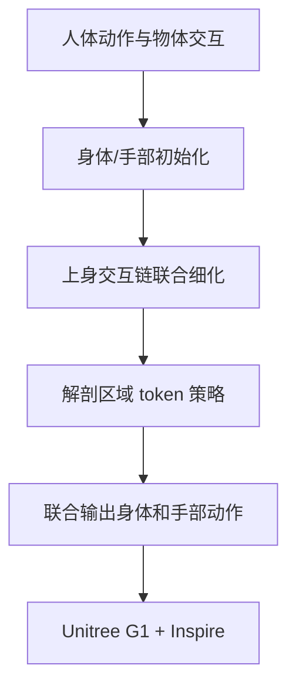

# DexWeave：从人体示范学习灵巧人形移动操作

## 一句话定义

DexWeave 将身体、手腕、手指和物体交互共同重定向，再以解剖区域注意力策略学习全身灵巧移动操作。

## 英文缩写速查

| 缩写 | 英文全称 | 说明 |
|---|---|---|
| WBC | Whole-Body Control | 全身协调控制 |
| RL | Reinforcement Learning | 强化学习策略训练 |
| G1 | Unitree G1 Humanoid | 相关论文的真机平台 |

## 流程总览

## 方法与证据

论文先做两阶段交互一致重定向：身体与手部分别用专用求解器初始化（含接触感知的手腕融合），再沿「手臂—手腕—手指」上身交互链联合细化，同时保持下肢支撑可行。随后以解剖区域 token 和定向遮罩注意力（directed masked attention）表达身体部位依赖，物体信息只注入上身通路；单一策略网络联合输出身体与灵巧手动作，用 PPO 单阶段训练（actor 用含噪声/延迟的物体观测，critic 用特权状态），不依赖预训练跟踪器、teacher–student 蒸馏或后续残差优化。

## 实验与评测

- **平台与流程**：Unitree G1 + Inspire 灵巧手；策略在 IsaacLab 训练，MuJoCo 做 sim-to-sim 评测，并部署到真机做 sim-to-real（真机部分为定性展示）。
- **数据集**：LAFAN1（纯身体动作）、OMOMO（全身物体交互，无手指参考）、GRAB 与 HUMOTO（精细手—物交互）。
- **重定向（LAFAN1 / OMOMO，论文报告）**：对比 OmniRetarget、GMR、SOMA，DexWeave 穿透最低、足滑接近 0；OMOMO 上接触持续比例 0.999、接触距离 2.944 cm（最强接触基线 GMR 为 0.879 / 7.677 cm），穿透持续比例 0.002。
- **精细交互重定向（GRAB / HUMOTO，论文报告）**：对比 OmniRetarget + DexPilot/SBR + 手臂 IK，主指尖（拇指/食指）误差降到 4.342 mm / 7.198 mm（最佳 IK 变体 14.925 / 29.999 mm），穿透持续比例与掌法向误差均最低；次指尖误差 HUMOTO 第一、GRAB 第二。
- **身体动作跟踪（LAFAN1，MuJoCo sim-to-sim，论文报告）**：完成率 100%（与 BeyondMimic 持平；Any2Track 72.82%、GMT 69.86%）；相对 BeyondMimic，身体位置误差 2.82→2.62 cm，锚点位置 5.19→4.82 cm，锚点旋转 2.48°→2.34°。
- **灵巧移动操作（5 条参考，论文报告）**：成功率 97.5%（同参数量 Object MLP 85.0%，InterMimic 57.74%）；身体位置误差 4.93 cm、物体位置误差 3.43 cm 均最低，但物体旋转误差 6.83° 略逊于 MLP 的 6.16°；训练收敛约比 MLP 快 2×。
- **协议说明**：每条参考动作训练一个策略；表 3 结果在 5 条跟踪动作与 5 条移动操作参考上平均，规模较小；消融见论文附录 E。

## 与其他工作对比

| 对照 | 区别 | 取舍 |
|---|---|---|
| [OmniRetarget](./paper-hrl-stack-03-omniretarget.md) / [GMR](../methods/motion-retargeting-gmr.md) / SOMA | 全身重定向主要约束身体运动学，不联合优化手指与物体几何 | DexWeave 在穿透、足滑与接触保持上更好，但需物体网格与更重的联合优化 |
| OmniRetarget + DexPilot / SBR + IK | 身体与手分阶段重定向，再用 IK 调手腕、手指保持不变 | DexWeave 把手臂—手腕—手指当一条交互链细化，指尖误差大幅降低；流程耦合度更高 |
| [BeyondMimic](../methods/beyondmimic.md) / [Any2Track](../methods/any2track.md) / [GMT](./paper-gmt.md) | 通用身体动作跟踪，无物体与灵巧手条件 | 纯跟踪下 DexWeave 精度略优，但每条参考单独训练，不是通用跟踪器 |
| [InterMimic](./paper-bfm-15-intermimic.md) | 人体（SMPL-X）物体交互模仿，论文按其官方人体模型设置作跨具身参照 | 成功率差距大（97.5% vs 57.74%），但具身不同，非严格同条件对比 |
| Object MLP（同参数量） | 同观测/奖励/预算，只把解剖 Transformer 换成 MLP | 成功率与收敛速度提升，物体旋转误差略高于 MLP |
| [CoorDex](./paper-coordex-dexterous-humanoid-loco-manipulation.md) / [FALCON](./paper-loco-manip-161-109-falcon.md)（相关工作，未做定量对比） | 分别依赖蒸馏的身体/手先验 + 残差 RL，或上下身双 agent 分解 | DexWeave 单网络单阶段 RL，免去先验预训练，但依赖高质量逐条重定向参考 |

## 局限与风险

结果依赖训练覆盖、机器人配置、传感器和论文中的任务协议。策略按参考动作逐条训练，定量评测只覆盖少量参考且在 MuJoCo 中完成；真机结果为定性展示，代码开放状态应以官方项目页为准。

## 结论

- 跨具身迁移时，手腕放置与手指姿态要沿上身交互链联合重定向，否则局部最优会相互矛盾。
- 解剖区域 token + 定向遮罩注意力作为结构先验，在同参数量下比 MLP 成功率更高、收敛更快（论文报告约 2×）。
- 定量结论来自仿真 sim-to-sim 与逐参考训练，真机仅为定性证据，不代表通用灵巧移动操作能力。

## 关联页面

- [移动操作任务](../tasks/loco-manipulation.md)
- [ViLoMan：视觉—本体移动操作](./paper-viloman.md)

## 参考来源

- [来源档案](../../sources/papers/dexweave_arxiv_2609_34724.md)
- [arXiv:2609.34724](https://arxiv.org/abs/2609.34724)

## 推荐继续阅读

- [Day 4：移动操作](../overview/humanoid-motion-intelligence-day4-loco-manipulation.md)
