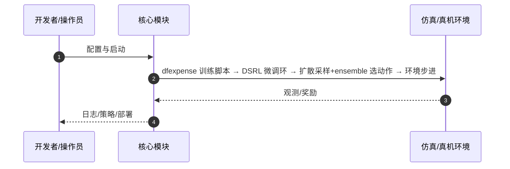

# DF-ExpEnse（arXiv:2606.19656）

**DF-ExpEnse**（Calvin Luo, Chen Sun, Shuran Song；Stanford University; Brown University；[arXiv:2606.19656](https://arxiv.org/abs/2606.19656)，[项目页](https://df-expense.github.io/)）— 在扩散/flow 预训练策略上做 RL 微调时，用策略自身多模态采样构造候选动作集，再用 critic ensemble 在「执行质量」与「探索兴趣」间选动作，显著提升在线样本效率。

## 一句话定义

在扩散/flow 预训练策略上做 RL 微调时，用策略自身多模态采样构造候选动作集，再用 critic ensemble 在「执行质量」与「探索兴趣」间选动作，显著提升在线样本效率。

## 英文缩写速查

| 缩写 | 英文全称 | 简要说明 |
|------|----------|----------|
| DF-ExpEnse | Diffusion Filtered Exploration via Ensembles | 本文探索框架 |
| RL | Reinforcement Learning | 在线微调范式 |
| DP | Diffusion Policy | 典型被微调生成式策略 |
| DSRL | Diffusion Steering RL | 底层微调策略示例（仓库集成） |

## 为什么重要

盲目扰动预训练扩散策略浪费样本；DF-ExpEnse 把扩散的多模态性变成可评估的候选集，并用 ensemble 不确定性驱动探索，适合 fleet 并行采集。

## 核心原理（方法）

每步：(1) 扩散策略采样多条动作候选；(2) critic ensemble 估计价值与不确定性；(3) 选探索兴趣最高的动作执行；fleet 间可同步归一化兴趣分数。

## 实验与评测

操作与运动任务上相对默认微调与替代动作选择方案持续更高样本效率。

## 结论

DF-ExpEnse 把「扩散采样 + ensemble 评分」嵌进在线推理环，几乎不增额外模块，是生成式策略 RL 微调值得优先试的探索层。

- 候选动作来自扩散策略本身，保留行为先验可行性
- critic ensemble 同时看质量与不确定性，避免盲目高方差探索
- fleet 协同归一化探索兴趣，适合并行真机/仿真采集
- 可叠在 DSRL 等现有微调栈上，改动集中在动作选择

## 源码运行时序图

官方入口见 frontmatter `code` / 项目页。运行时主干：

- **最短路径：** 克隆官方仓库 → 按 README 安装依赖 → 运行训练/采集/部署入口脚本。

## 局限与风险

依赖已有 critic ensemble 与可微/可采样扩散头；极稀疏奖励任务仍需任务设计配合。

## 与其他工作对比

相对 ε-greedy 或纯高斯扰动，利用扩散多模态而非破坏先验流形。

## 关联页面

- [diffusion-policy](../methods/diffusion-policy.md)
- [paper-dice-rl](./paper-dice-rl.md)
- [realab-14-papers-technology-map-2026](../overview/realab-14-papers-technology-map-2026.md)
- [REALab 14 篇技术地图](../overview/realab-14-papers-technology-map-2026.md)

## 参考来源

- [df_expense_arxiv_2606_19656.md](../../sources/papers/df_expense_arxiv_2606_19656.md)
- [wechat_shenlan_realab_14_papers_2026.md](../../sources/blogs/wechat_shenlan_realab_14_papers_2026.md)

## 推荐继续阅读

- 论文：<https://arxiv.org/abs/2606.19656>
- 项目页：<https://df-expense.github.io/>
