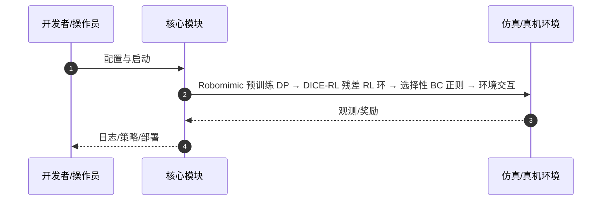

# From Prior to Pro（arXiv:2603.10263）

**From Prior to Pro**（Zhanyi Sun, Shuran Song；Stanford University；[arXiv:2603.10263](https://arxiv.org/abs/2603.10263)，[项目页](https://zhanyisun.github.io/dice.rl.2026/)）— 把 RL 微调看成在预训练生成式策略周围「收缩」动作分布：高价值状态保留先验，低价值区放大已观测高回报模式，稳定地把 Prior 练成 Pro。

## 一句话定义

把 RL 微调看成在预训练生成式策略周围「收缩」动作分布：高价值状态保留先验，低价值区放大已观测高回报模式，稳定地把 Prior 练成 Pro。

## 英文缩写速查

| 缩写 | 英文全称 | 简要说明 |
|------|----------|----------|
| DICE-RL | Distribution Contractive Reinforcement Learning | 本文框架 |
| BC | Behavior Cloning | 扩散/flow 预训练阶段 |
| RL | Reinforcement Learning | 在线分布收缩微调 |
| DP | Diffusion Policy | 典型先验形态 |

## 为什么重要

直接 RL 微调易灾难性遗忘；纯 BC 难达极高成功率。DICE-RL 在保留多样性的同时用在线反馈放大成功模式。

## 核心原理（方法）

扩散/flow BC 先验 + 残差 off-policy RL；选择性行为正则（高价值状态贴先验）；价值引导动作选择抑制低价值采样。

## 实验与评测

Robomimic Can/Square/Tool Hang 等；像素输入仿真与真机长周期操作均显著提升成功率与收敛速度。

## 结论

DICE-RL 给出一条可复现的「生成式先验 → 分布收缩 RL」配方，适合已有扩散 BC、需要冲高成功率的 manipulation 栈。

- 早停 BC 保留动作多样性，是后续 RL 探索的基础
- 选择性正则抑制策略漂移，避免遗忘先验
- 价值引导过滤低价值扩散样本，训练更稳
- 真机与仿真均验证长周期技能掌握
- 初始先验未覆盖子空间时仍可能局部最优

## 源码运行时序图

官方入口见 frontmatter `code` / 项目页。运行时主干：

- **最短路径：** 克隆官方仓库 → 按 README 安装依赖 → 运行训练/采集/部署入口脚本。

## 局限与风险

强依赖预训练先验覆盖；flow/diffusion 推理成本仍高于 MLP 策略。

## 与其他工作对比

相对 naive RL fine-tune 与纯 BC，强调分布收缩而非全盘替换先验。

## 关联页面

- [diffusion-policy](../methods/diffusion-policy.md)
- [paper-df-expense](./paper-df-expense.md)
- [manipulation](../tasks/manipulation.md)
- [REALab 14 篇技术地图](../overview/realab-14-papers-technology-map-2026.md)

## 参考来源

- [dice_rl_arxiv_2603_10263.md](../../sources/papers/dice_rl_arxiv_2603_10263.md)
- [wechat_shenlan_realab_14_papers_2026.md](../../sources/blogs/wechat_shenlan_realab_14_papers_2026.md)

## 推荐继续阅读

- 论文：<https://arxiv.org/abs/2603.10263>
- 项目页：<https://zhanyisun.github.io/dice.rl.2026/>
