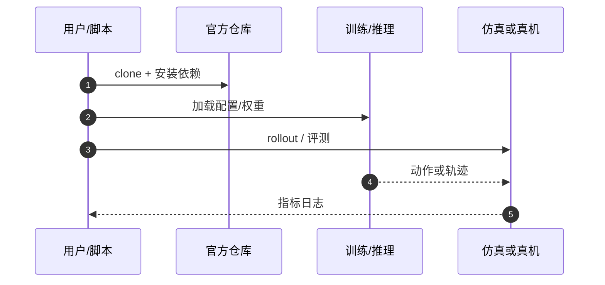

# DIDO（arXiv:2609.15570）

**DIDO**（*DIDO: Distilling Interaction-Centric Dynamics into One-Step Denoising for World Action Models*，[arXiv:2609.15570](https://arxiv.org/abs/2609.15570)，[项目页](https://loveju1y.github.io/DIDO/)，[代码](https://github.com/LoveJu1y/DIDO-WAM)）来自 [具身智能小站 12 篇盘点](../../sources/blogs/wechat_embodied_station_12_papers_vla_deploy_2026-09-16.md)。

## 一句话定义

**把多步 WAM 去噪蒸馏为一步，用交互实体 bbox token + DINOv3 对齐，避免背景保留、接触动态丢失。**

## 英文缩写速查

| 缩写 | 英文全称 | 简要说明 |
|------|----------|----------|
| DIDO | Distilling Interaction-Centric Dynamics into One-Step | 本文一步蒸馏 WAM |
| WAM | World Action Model | 世界预测与动作联合建模 |
| DiT | Diffusion Transformer | 扩散 Transformer 骨干 |
| LIBERO | Lifelong Robot Learning Benchmark | 操作基准套件 |

## 为什么重要

- WAM 迭代去噪侵蚀闭环频率；简单截断易保留场景结构、丢掉夹爪—物体交互动态。
- 开源结论：**已开源**（步骤 2.5，2026-09-16）。
- 与 [12 篇技术地图](../overview/vla-deploy-12-papers-technology-map.md) 中同类工作可横向对照。

## 核心机制

| 项 | 内容 |
|----|------|
| **arXiv** | [2609.15570](https://arxiv.org/abs/2609.15570) |
| **开源** | **已开源** |
| **要点** | 分布匹配外，对夹爪/目标物/交互区域做 bbox 推理 token；DINOv3 特征对齐目标物表征。 |
| **文内指标** | LIBERO 99.0%、LIBERO-Plus 76.6%、RoboTwin 92.0%（作者报告）；含真机长程与泛化实验。 |

## 源码运行时序图

## 实验与评测

- LIBERO 99.0%、LIBERO-Plus 76.6%、RoboTwin 92.0%（作者报告）；含真机长程与泛化实验。
- **读法：** 清单摘要；逐项对照与 baseline 以原文 PDF 为准。

## 与其他工作对比

- 横向索引见 [12 篇技术地图](../overview/vla-deploy-12-papers-technology-map.md)；与同 arXiv 节点不重复造页。

## 结论

**DIDO 证明一步 WAM 可行前提是蒸馏目标盯住交互实体，而非只对齐全局像素分布。**

1. 开源边界：**已开源** — 以项目页实际链接为准（入库日 2026-09-16）。
2. 核心机制：分布匹配外，对夹爪/目标物/交互区域做 bbox 推理 token；DINOv3 特征对齐目标物表征。…
3. 部署前核对任务协议与硬件条件，勿直接横比公众号摘录数字。

## 关联页面

- [world-action-models](../concepts/world-action-models.md)
- [generative-world-models](../methods/generative-world-models.md)
- [manipulation](../tasks/manipulation.md)
- [paper-wm-loco](./paper-wm-loco.md)

## 参考来源

- [dido-wam_arxiv_2609_15570.md](../../sources/papers/dido-wam_arxiv_2609_15570.md)
- [wechat_embodied_station_12_papers_vla_deploy_2026-09-16.md](../../sources/blogs/wechat_embodied_station_12_papers_vla_deploy_2026-09-16.md)
- [arXiv:2609.15570](https://arxiv.org/abs/2609.15570)

## 推荐继续阅读

- [arXiv PDF](https://arxiv.org/pdf/2609.15570)
- [项目页](https://loveju1y.github.io/DIDO/)
- [https://github.com/LoveJu1y/DIDO-WAM](https://github.com/LoveJu1y/DIDO-WAM)

