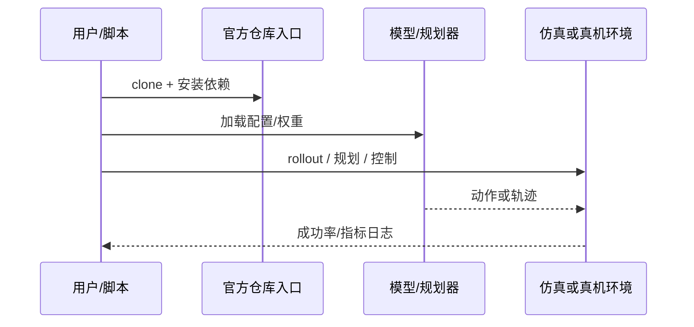

# Differentiable Charts IK Planning（arXiv:2609.10905）

**Differentiable Charts IK Planning**（[Planning along Differentiable Charts of Constraint Manifolds with the Inverse Function Theorem](https://arxiv.org/abs/2609.10905)）来自 [具身智能小站 14 篇盘点](../../sources/blogs/wechat_embodied_station_14_papers_dexterous_wm_humanoid_2026-09-11.md)。增广正运动学 + 逆函数定理从黑盒 IK 恢复梯度，接入可微约束流形规划。

## 一句话定义

**让解析 IK 也能进入可微规划链路，在约束流形上直接求梯度。**

## 英文缩写速查

| 缩写 | 英文全称 | 简要说明 |
|------|----------|----------|
| VLA | Vision-Language-Action | 视觉-语言-动作策略 |
| VLM | Vision-Language Model | 视觉-语言多模态模型 |
| WM | World Model | 预测未来观测或表征的动力学模型 |
| IL | Imitation Learning | 模仿学习 |
| RL | Reinforcement Learning | 强化学习 |
| DoF | Degrees of Freedom | 自由度 |

## 为什么重要

- 纳入本期 **灵巧手 / 世界模型 / 人形控制 / VLA** 主线之一。
- 开源状态：**已开源**（步骤 2.5 核查，2026-09-11）。
- 与 [14 篇技术地图](../overview/dexterous-wm-humanoid-14-papers-technology-map.md) 中同类工作可横向对照。

## 核心机制

| 项 | 内容 |
|----|------|
| **arXiv** | [2609.10905](https://arxiv.org/abs/2609.10905) |
| **项目页** | https://cohnt.github.io/inverse-function-theorem-parameterization/ |
| **代码/资源** | https://github.com/cohnt/constraint-manifold-charts-ift |
| **开源** | **已开源** |
| **文内指标** | 数值实验与下游运动规划任务验证几何规划路径。 |

## 源码运行时序图

## 实验与评测

| 项 | 文内口径 |
|----|----------|
| 要点 | 数值实验与下游运动规划任务验证几何规划路径。 |

- **读法：** 本页为索引级摘要，上表取自 [公众号盘点](../../sources/blogs/wechat_embodied_station_14_papers_dexterous_wm_humanoid_2026-09-11.md) 与项目页；具体对照方法、任务集与逐项指标以 **原文 PDF** 为准（[参考来源](#参考来源)）。

## 与其他工作对比

- **数值 IK（雅可比迭代 / 优化求解）** — 本身可微但每次求解要迭代、解的分支不稳定；本文直接用 **解析/黑盒 IK** 的解，再用增广正运动学 + 逆函数定理 **恢复梯度**。
- **把 IK 当黑盒、只在外层做无梯度搜索** — 规划器拿不到梯度，只能采样；本文让黑盒 IK **接入可微规划链路**，在约束流形上直接求梯度。
- **[RL 求解逆运动学的五条路](../comparisons/rl-inverse-kinematics-five-approaches.md)** — 那五条路用学习型近似替代求解器；本文保留既有 IK 求解器，只补上 **微分结构**，无需训练。
- **[路径规划五范式分类](../comparisons/robot-path-planning-five-paradigms-taxonomy.md)** — 该页给出采样式/优化式/学习式的坐标；本文落在 **优化式 + 流形约束** 一格，用图册（chart）参数化约束流形。
- **[轨迹优化 vs 强化学习](../comparisons/trajectory-opt-vs-rl.md)** — 本文属轨迹优化一侧的可微性基础设施，文内以数值实验与下游运动规划任务验证几何路径。

- **读法：** 以上为知识库内 **路线级** 对照；与原文 baseline 的逐项定量比较与数值实验设置以 **原文 PDF** 为准（[参考来源](#参考来源)）。

## 结论

**Differentiable Charts IK Planning 适合作为本期「已开源」边界下的快速索引页，部署前请核对仓库/README 可运行性。**

1. 核心贡献：让解析 IK 也能进入可微规划链路，在约束流形上直接求梯度。
2. 开源结论：**已开源** — 以项目页实际链接为准（入库日 2026-09-11）。
3. 横向对照见 [14 篇技术地图](../overview/dexterous-wm-humanoid-14-papers-technology-map.md)，避免与同 arXiv 重复造页。

## 关联页面

- [14 篇技术地图](../overview/dexterous-wm-humanoid-14-papers-technology-map.md)
- [VLA（Vision-Language-Action）](../methods/vla.md)
- [Generative World Models](../methods/generative-world-models.md)
- [Manipulation](../tasks/manipulation.md)

## 参考来源

- [differentiable-charts-constraint-manifolds_arxiv_2609_10905.md](../../sources/papers/differentiable-charts-constraint-manifolds_arxiv_2609_10905.md)
- [wechat 14篇盘点](../../sources/blogs/wechat_embodied_station_14_papers_dexterous_wm_humanoid_2026-09-11.md)
- [arXiv:2609.10905](https://arxiv.org/abs/2609.10905)

## 推荐继续阅读

- [arXiv PDF](https://arxiv.org/pdf/2609.10905)
- [项目页/资源](https://cohnt.github.io/inverse-function-theorem-parameterization/)
- [代码/资源](https://github.com/cohnt/constraint-manifold-charts-ift)
