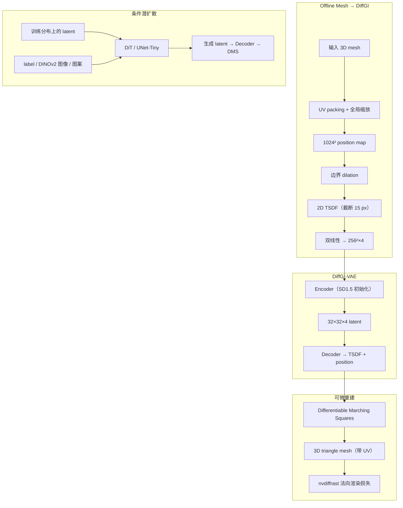

# DiffGI（Differentiable Geometry Images · ECCV 2026）

**DiffGI**（*DiffGI: Differentiable Geometry Images for High-Fidelity Thin-Shell 3D Generation*，[arXiv:2607.13365](https://arxiv.org/abs/2607.13365)，[项目页](https://ejshim.github.io/diffgi/)，CLO Virtual Fashion，ECCV 2026）面向 **薄壳 / 非流形 / 开边界** 几何（服装、家具框架等）：用 **连续 2D TSDF** 替换旧 geometry image 的二值 occupancy，再以 **Differentiable Marching Squares（DMS）** 把网格提取纳入计算图，使 3D 表面损失可反传到 2D 潜空间。DiffGI-VAE 将表面压到 **\(32\times32\times4\)**，其上训练标签 / 单视图 / 缝纫图案条件潜扩散；相对 TRELLIS 系体素基础模型与 GarmageNet，在 GarmageSet 上边界更锐、网格更紧凑，并可在消费级 GPU / CPU 上秒级推理。

## 一句话定义

**把 3D 薄壳写成可微的 2D TSDF geometry image，再用 DMS 把表面损失端到端传回超紧凑潜空间，专攻服装等非封闭网格生成。**

## 英文缩写速查

| 缩写 | 英文全称 | 简要说明 |
|------|----------|----------|
| DiffGI | Differentiable Geometry Image | 本文连续 TSDF + DMS 的可微 geometry-image 表示与生成框架 |
| TSDF | Truncated Signed Distance Function | 截断符号距离；本文定义在 **2D UV 平面** 而非 3D 体素 |
| DMS | Differentiable Marching Squares | 可微 Marching Squares，从 2D TSDF 提取 3D 网格并反传 |
| GI | Geometry Image | 把曲面参数化到规则 2D 栅格（常 multi-chart UV） |
| VAE | Variational Autoencoder | DiffGI-VAE：\(256^2\times4\to32^2\times4\) 几何压缩 |
| DiT | Diffusion Transformer | 标签 / 图像条件潜扩散骨干（相对 U-Net） |
| CD | Chamfer Distance | 表面点云形状误差主指标 |
| BCD | Boundary Chamfer Distance | 仅在开边界点上的 CD，衡量薄壳边界质量 |
| NC | Normal Consistency | 多视角法向图一致性（越高越好） |

## 为什么重要

- **封闭体假设的盲区：** 机器人布料操作、数字服装与部分家具资产生成需要 **开边界薄壳 + UV**；体素 SDF / occupancy 往往加厚或粘连，且 Marching Cubes 网格难直接进物理/材质管线。
- **Geometry image 的可微闭环：** 先前 Omages / GarmageNet 仍用二值 mask，边界台阶化且重建后处理断梯度；DiffGI 用 TSDF + DMS 把「表示—重建—损失」连成一条图。
- **工程轻量：** \(32\times32\) 潜扩散在 RTX 4070 约 **1.2 s / 3.2 GB**，MacBook M4 CPU 约 **8.5 s**，相对 TRELLIS-image 显存与时延更友好。
- **选型提醒：** 截至 **2026-07-27** 项目页 **Code (soon)**，官方仓仅站点静态资源——可读方法与数字，**不能**当已开源复现基线。

## 核心信息

| 项 | 内容 |
|----|------|
| **机构** | 科洛虚拟时尚（CLO Virtual Fashion） |
| **Venue** | ECCV 2026 |
| **表示** | \(256\times256\times4\) DiffGI（RGB 位置 + 1ch TSDF）→ VAE \(32\times32\times4\) |
| **数据** | ABO（家具开结构）、GarmageSet（~14.8k 可仿真服装）、WARDROBE（零样本 RGB 定性） |
| **条件任务** | 类别标签 / 单视图（DINOv2）/ 2D 缝纫图案占用 |
| **开源** | **待发布** — 项目页 Code (soon)；[`EJShim/diffgi`](https://github.com/EJShim/diffgi) 仅 `docs/` |

## 流程总览

## 核心原理

### 方法栈

| 模块 | 机制 | 要点 |
|------|------|------|
| **连续 GI** | 二值 occupancy → 2D TSDF | 固定栅格下保留子像素边界；抗激进下采样 |
| **DMS** | \(x=\phi_A/(\phi_A-\phi_B+\epsilon\,\mathrm{sgn}(\cdot))\) | 顶点 UV 对 \(\phi\) 可微；再采样 position map 得 3D |
| **法向损失** | \(\|\mathcal{R}(\hat M)-\mathcal{R}(M^*)\|_1\) | 仅靠像素 L1 不够保褶皱/锐边 |
| **VAE** | SD1.5 扩通道零初始化 | 消融显示最终保真主要来自 TSDF+DMS，预训练主要加速收敛 |
| **扩散** | flow-matching + DiT（图案条件用 UNet-Tiny） | 几何连通性偏全局注意力；图案任务保留局部 skip |

### 与体素可微等值面的差别

DMTet / FlexiCubes 等在 **3D 网格** 上可微提面，内存立方增长且不天然带 UV。DiffGI 把可微等值面搬到 **2D UV 栅格**，用 \(O(N^2)\) 换薄壳友好与工业 UV 兼容——对「要进布料仿真」的资产管线比「只要封闭好看网格」更对口。

## 源码运行时序图

**不适用**（截至 **2026-07-27**）：项目页 **Code (soon)**；公开仓 [`EJShim/diffgi`](https://github.com/EJShim/diffgi) 仅含项目页 `docs/` 静态资源，**无** train / eval / checkpoint 入口。代码发布后应补本节 `sequenceDiagram` 并对齐 [`sources/repos/diffgi.md`](../../sources/repos/diffgi.md)。

## 工程实践

| 项 | 建议 |
|----|------|
| 选型场景 | 需要 **开边界薄壳 + UV** 的服装/框架生成；不要用封闭体素模型硬扛薄片 |
| 表示分辨率 | 论文工作分辨率 **256²** DiffGI；VAE 潜空间 **32²×4** |
| 损失权重 | 同时开 \(\mathcal{L}_{Pos}/\mathcal{L}_{TSDF}/\mathcal{L}_{Normal}/\mathcal{L}_{KL}\)；消融表明 TSDF 对 CD/JSD 更根本，法向损失拉高 NC |
| 条件骨干 | 标签 DiT-B/2；单视图 DiT-L/2 + DINOv2-L；图案 UNet-Tiny |
| 增强 | UV chart 级 90° 旋转与重打包，改布局不改 chart 内几何 |
| 开源边界 | **勿假设可复现**；跟踪项目页 Code 与仓内是否出现训练脚本 |
| 源码运行时序图 | **不适用**（无可运行官方实现） |

## 实验与评测

### DiffGI-VAE 重建（Table 1，节选）

| 方法 | Rep. Size | Garmage CD↓ | Garmage NC↑ | ABO CD↓ |
|------|-----------|-------------|-------------|---------|
| Omages | \(64\times64\times4\) | 1.31 | 0.95 | 0.89 |
| GarmageNet (Official) | \(N\times72\) | 1.89 | 0.90 | — |
| **DiffGI-VAE** | **\(32\times32\times4\)** | **0.46** | **0.96** | **0.83** |

CD 为 \(\times10^{-3}\) 量级（与论文表一致）。ABO 上 NC 略低于未压缩 Omages，作者归因于 \(8\times\) 空间压缩对平坦家具法向的损失。

### 表示 × 法向损失消融（GarmageSet，Table 2）

| Rep. | \(\mathcal{L}_{Normal}\) | CD↓ | NC↑ |
|------|--------------------------|-----|-----|
| Occ | ✗ | 1.503 | 0.906 |
| Occ | ✓ | 1.313 | 0.947 |
| TSDF | ✗ | 0.595 | 0.921 |
| **TSDF** | **✓** | **0.461** | **0.961** |

### Image-to-3D（GarmageSet，Table 5）

| 方法 | #Vert.↓ | CD↓ | F1↑ | BCD↓ |
|------|---------|-----|-----|------|
| TRELLIS | 109K | 3.44 | 0.28 | N/A |
| TRELLIS.2 | 380K | 11.01 | 0.27 | 12.44 |
| GarmageNet | 526K | 4.31 | 0.20 | 5.64 |
| **DiffGI** | **23K** | **1.35** | **0.48** | **2.91** |

作者强调：TRELLIS 为大规模多类基础模型，本表意在突出 **表面中心表示对薄壳服装** 的实务优势，而非宣称全域碾压。

### 推理效率（Table 3，节选）

| 方法 | 硬件 | Peak VRAM↓ | Time↓ |
|------|------|------------|-------|
| TRELLIS-image | A6000 Ada | 16.28 GB | 4.52 s |
| Omages | A6000 Ada | 2.49 GB | 52.0 s |
| DiffGI-Image | A6000 Ada | 3.22 GB | 0.80 s |
| DiffGI-Image | RTX 4070 | 3.22 GB | 1.21 s |
| DiffGI-Image | MacBook M4 CPU | — | 8.52 s |

## 结论

**薄壳 3D 生成的关键瓶颈往往不是更大的封闭体素基础模型，而是「边界可微 + UV 友好」的表面表示；DiffGI 用 2D TSDF 与 DMS 把这件事做进端到端潜扩散，并在服装基准上用更少顶点换更好边界。**

1. **真影响指标读 BCD / CD / 顶点数，而不是只看视觉封闭感** — Table 5 上 DiffGI 以 ~23K 顶点同时压低 CD 与 BCD。
2. **表示选择优先于损失补丁** — 消融中 TSDF 无 NC 损失仍在 CD/JSD 上优于 Occ+NC；法向损失主要抬高 NC。
3. **下游若要仿真，先检查 chart 接缝** — 作者自承 DMS 按 chart 独立提面可能开缝，指标好看≠物理网格可直接跑。
4. **部署读法：轻量推理已验证，复现代码未发布** — 可引用延迟/显存数字做选型预研，但训练栈需等 Code 落地。
5. **与 sim-ready 资产线互补** — DiffGI 强在薄壳几何与 UV；关节/材质/碰撞字段仍需 PhysForge / Articraft / EmbodiedGen 等路线。

## 局限与风险

- **锐棱圆角：** TSDF 线性插值对极端尖角机械件可能局部 round。
- **无纹理/PBR：** 当前只生成几何。
- **跨 chart 接缝：** 影响物理仿真连续性；作者列为未来工作。
- **开源风险：** 项目页宣称 soon，入库日无可运行入口——避免在复现清单中写成「已开源」。

## 与其他工作对比

| 路线 | 代表 | 相对 DiffGI |
|------|------|-------------|
| 体素/隐式基础模型 | TRELLIS / TRELLIS.2 | 封闭偏好、网格更密；薄壳边界与 BCD 较弱 |
| Occupancy geometry image | Omages / GarmageNet | 同属 GI 族；二值边界与不可微后处理是 DiffGI 主要对照 |
| 可微 3D 等值面 | DMTet / FlexiCubes | 可微提面思想同源，但是 3D 网格、无天然 UV |
| 布料神经仿真 | [ClothTransformer](./paper-clothtransformer-unified-latent-cloth-simulation.md) | 下游动力学；DiffGI 提供上游薄壳网格生成 |
| Sim-ready 资产 | [PhysForge](./paper-physforge-physics-grounded-3d-assets.md) / [Articraft](./articraft.md) | 关节与物理字段；DiffGI 偏表面几何保真 |
| 减法式部件生成 | [SCULPT](./paper-sculpt-subtractive-3d-part-generation.md) | TRELLIS.2 latent recurrent split；纹理部件分解，非薄壳 GI |
| 文本引导 mesh 编辑 | [RADmesh](./paper-radmesh.md) | 同属 ECCV 2026 显式网格；RADmesh 从已有 mesh **形变+remesh**，DiffGI 从 GI **生成**薄壳 |

## 关联页面

- [ClothTransformer](./paper-clothtransformer-unified-latent-cloth-simulation.md) — 统一潜空间布料仿真；需要高质量薄壳 mesh 输入时与 DiffGI 上下游对照。
- [RADmesh](./paper-radmesh.md) — ECCV 2026 Oral 文本引导 remesh-aware 网格形变；与 DiffGI 互补（编辑 vs 生成）。
- [PhysForge](./paper-physforge-physics-grounded-3d-assets.md) — 学习式仿真就绪关节资产生成。
- [Articraft](./articraft.md) — Agent + SDK 程序化可关节资产。
- [EmbodiedGen V2](./paper-embodiedgen-v2-sim-ready-world-engine.md) — sim-ready 世界引擎与资产接口。
- [Differentiable Simulation](../concepts/differentiable-simulation.md) — 可微物理总览；与本文「可微等值面」区分。
- [Sim2Real](../concepts/sim2real.md) — 资产几何/碰撞一致性总提醒。
- [Manipulation](../tasks/manipulation.md) — 可变形体 / 服装操作任务语境。

## 参考来源

- [DiffGI 论文归档（arXiv:2607.13365）](../../sources/papers/diffgi_arxiv_2607_13365.md)
- [DiffGI 项目页归档](../../sources/sites/ejshim-diffgi-github-io.md)
- [EJShim/diffgi 仓归档（待发布实现）](../../sources/repos/diffgi.md)

## 推荐继续阅读

- 论文：<https://arxiv.org/abs/2607.13365>
- 项目页：<https://ejshim.github.io/diffgi/>
- PDF：<https://arxiv.org/pdf/2607.13365>
