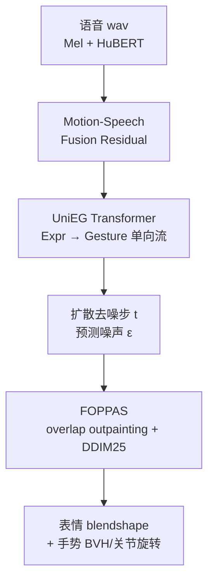
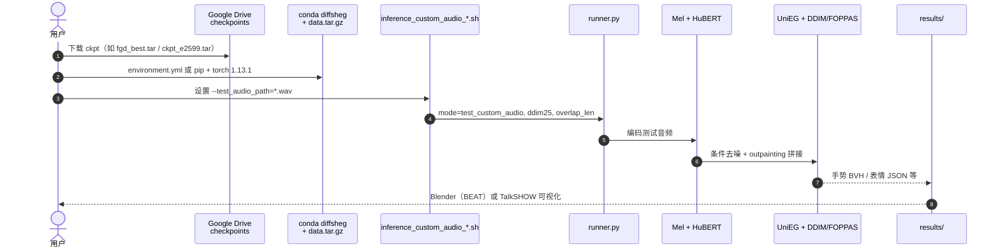

# DiffSHEG（语音驱动整体 3D 表情与手势扩散生成）

**DiffSHEG**（*A Diffusion-Based Approach for Real-Time Speech-driven Holistic 3D Expression and Gesture Generation*，[arXiv:2401.04747](https://arxiv.org/abs/2401.04747)，**CVPR 2024**；**Chen 等** · [香港科技大学（HKUST）](https://www.ust.hk/) + [国际数字经济学院（IDEA）](https://www.idea.edu.cn/)；[项目页](https://jeremycjm.github.io/proj/DiffSHEG/)，[代码](https://github.com/JeremyCJM/DiffSHEG)）用 **统一扩散去噪网络** 同时生成与语音对齐的 **3D 表情（blendshape）** 与 **手势（关节轴角）**，并以 **FOPPAS** 在测试时做任意长、近实时流式采样——面向数字人 / 具身交互代理，而非直接输出可执行机器人关节指令。

## 一句话定义

**用扩散 + UniEG-Transformer（表情→手势单向条件流）联合建模共语 3D 表情与手势，再用 FOPPAS（outpainting + DDIM）实现任意长、实时语音驱动生成。**

## 英文缩写速查

| 缩写 | 英文全称 | 简要说明 |
|------|----------|----------|
| DiffSHEG | Diffusion-based Speech-driven Holistic Expression and Gesture | 本文框架：语音→表情+手势联合扩散生成 |
| UniEG | Uni-directional Expression-Gesture (Transformer) | 表情→手势单向信息流的去噪骨干 |
| FOPPAS | Fast Outpainting-based Partial Autoregressive Sampling | 测试时 outpainting 任意长采样策略 |
| DDIM | Denoising Diffusion Implicit Models | 少步确定性采样；本工作常用 25 步 |
| HuBERT | Hidden-Unit BERT | 冻结高阶语音表征；与 Mel 并行 |
| BEAT | Body-Expression-Audio-Text dataset | 多模态共语手势/表情数据（15 fps） |
| SHOW | Talking-face SHOW / TalkSHOW 设定数据 | SMPLX 表情+手势（30 fps）评测集 |
| FMD / FGD / FED | Fréchet Motion / Gesture / Expression Distance | 分布匹配主指标（越低越好） |

## 为什么重要

- **补上「表情+手势一起生成」的缺口：** 多数共语工作只做手势或只做 talking head；拆开训再拼容易破坏联合分布。DiffSHEG 显式在同一扩散过程里对齐二者。
- **工程上可跑、可流式：** FOPPAS 不在训练时锁死历史条件，重叠长度可调；报告单卡 RTX 3090 约 **31.5 FPS**（含 Mel+HuBERT），适合数字人实时管线。
- **开源完整：** [JeremyCJM/DiffSHEG](https://github.com/JeremyCJM/DiffSHEG)（BSD-3-Clause）含 BEAT/SHOW 训推脚本、自定义 `.wav` 推理与 Google Drive checkpoint。
- **对人形研究的定位：** 产出是 **人体/角色级 3D 动作资产**；进真机还需 retarget + 跟踪（对照 [Semantic Co-Speech → G1](./paper-notebook-semantic-co-speech-gesture-synthesis-and-real-ti.md) 与 [WBT](../overview/hub-wbt.md)）。

## 核心原理（方法）

### 问题形式化

对 \(N\) 帧 clip：音频特征 \(\mathbf{A}\)，手势 \(\mathbf{G}\)（轴角，\(\mathbf{g}_i\in\mathbb{R}^{3J}\)），表情 \(\mathbf{E}\)（blendshape，\(\mathbf{e}_i\in\mathbb{R}^{C_{exp}}\)），整体运动 \(\mathbf{M}=\mathrm{Concat}(\mathbf{G},\mathbf{E})\)。训练目标是在音频条件下重建 \(\mathbf{M}\)（MIMO）；推理时对任意长/流式音频输出平滑衔接的 clip。

### UniEG-Transformer

| 模块 | 作用 |
|------|------|
| 语音编码 | Mel-Spectrogram（低层）+ 冻结 **HuBERT**（高层）→ 共享 mid-level Transformer |
| Motion-Speech Fusion Residual | 通道维拼接运动与语音（及可选文本等），LN+MLP 预测残差，天然时序对齐 |
| Style-aware Transformer | AdaIN 注入 **person ID** 与扩散步 \(t\)；线性注意力加速推理 |
| 单向条件流 | 由预测噪声还原 \(\hat{x}_{0(t)}^{E}\)，**detach** 后条件到手势分支，避免手势梯度干扰唇形 |

经验上：朴素拼接、反向条件（手势→表情）、或不 detach，都会在 FMD/FED/FGD 上弱于完整 UniEG（论文 Table 1 ablation）。

### 训练损失

噪声预测 \(\mathcal{L}_t\) + 速度损失 \(\mathcal{L}_v\) + Huber 重建 \(\mathcal{L}_\delta\)，加权 \(\lambda_t{=}10,\ \lambda_v{=}1,\ \lambda_\delta{=}1\)。

### FOPPAS（任意长采样）

1. 首 clip：重叠长度可为 0（无需 seed motion）。
2. 后续 clip：固定与上一 clip 尾部重叠的帧，用 **Repaint 式 outpainting** 生成剩余帧。
3. **DDIM 25 步**替代 1000 步 DDPM；末两步对重叠区做线性 blending。
4. Transformer 可丢弃多余位置编码，支持短于训练窗的尾 clip。

### 流程总览

## 核心信息

| 字段 | 内容 |
|------|------|
| 机构 | 香港科技大学（HKUST）；国际数字经济学院（IDEA） |
| 会议 | CVPR 2024 |
| arXiv | <https://arxiv.org/abs/2401.04747> |
| 项目页 | <https://jeremycjm.github.io/proj/DiffSHEG/> |
| 代码 | <https://github.com/JeremyCJM/DiffSHEG>（BSD-3-Clause） |
| 权重 | [Google Drive](https://drive.google.com/file/d/1JPoMOcGDrvkFt7QbN6sEyYAPOOWkVN0h/view) |
| 数据 | BEAT；SHOW / TalkSHOW（SMPLX） |
| 开源结论 | **已开源**（训推代码 + checkpoint；原始数据集走上游） |

## 开源状态

**已开源**（截至 **2026-07-31**，对照项目页与仓库 README）：

| 产物 | 状态 |
|------|------|
| 论文 | [arXiv:2401.04747](https://arxiv.org/abs/2401.04747) |
| 代码 | [JeremyCJM/DiffSHEG](https://github.com/JeremyCJM/DiffSHEG) · **BSD-3-Clause** |
| 权重 | Google Drive checkpoint 包 |
| 自定义音频推理 | `inference_custom_audio_beat.sh` / `inference_custom_audio_show.sh` |
| 原始 BEAT / SHOW 数据 | **外部数据集**（仓内 `assets/data.tar.gz` 为统计量，非完整 mocap） |

## 源码运行时序图

节点对齐 [`sources/repos/diffsheg.md`](../../sources/repos/diffsheg.md)（`runner.py` + 自定义音频脚本）。

- **最短复现：** 装环境 → untar `assets/data.tar.gz` → 放 checkpoint → 改 `--test_audio_path` → 跑对应 `inference_custom_audio_*.sh`。
- **训练入口：** `runner.py --dataset_name beat|talkshow`（多卡 `multiprocessing-distributed`）；详见仓库 README。
- **实时口径：** README 注释 BEAT 路径约 30+ FPS@3090 / 55+ FPS@A100（`jump_n_sample` 等开关可再提速）。

## 工程实践

| 项 | 实践要点 |
|----|----------|
| 音频格式 | 自定义推理要求 **`.wav`**；脚本里改 `--test_audio_path` |
| 数据集切换 | BEAT：`n_poses 34`；SHOW：`n_poses 88` + 常用 `--classifier_free` |
| 采样加速 | `--ddim --timestep_respacing ddim25`；可选 `--jump_n_sample` |
| 重叠长度 | BEAT 自定义脚本默认 `overlap_len 4`；SHOW 默认 `10`——影响边界平滑与吞吐 |
| 可视化 | BEAT：本地 Blender 打开 `assets/beat_visualize.blend`；SHOW：按 TalkSHOW 流程 |
| 机器人迁移 | 输出为人形/角色 3D 运动，**不是**机器人策略；需 retarget + tracker（见 [WBT](../overview/hub-wbt.md)） |

## 实验与评测

| 轴 | 报告口径（以论文为准） |
|----|------------------------|
| BEAT 设定 | 4 受试者划分；训/验 34 帧；测集约 1 分钟长序列；15 fps；轴角表示 |
| SHOW 设定 | SMPLX；训/验 88 帧；30 fps；对照 TalkSHOW / LS3DCG |
| 分布匹配 | BEAT：FMD **324.67**、FED **331.72**、FGD **438.93**（优于 LDA 等） |
| SHOW FMD | DiffSHEG **0.00184** vs TalkSHOW\* 0.00219 / LS3DCG\* 0.00230 |
| 用户研究 | 22 人；realism / 手势–语音同步 / 表情–语音同步 / diversity 均主导偏好 |
| 运行时 | 900 帧（1 min@15 fps）约 **28.6 s** @ RTX 3090 ≈ **31.5 FPS**（含音频编码） |

> Div / BA 对抖动敏感：论文强调 Fréchet 距离与用户研究更可靠；高 Div 的基线可能来自抖动而非真多样性。

## 结论

**DiffSHEG 的真贡献是「在统一扩散里用表情→手势单向流抓住联合分布，并用测试时 FOPPAS 把任意长采样做成实时」——它是数字人共语动作生成器，不是人形控制器。**

1. **联合分布 > 拼接两套模型：** UniEG + detach 比朴素拼接 / 反向条件更稳，主证据是 FMD/FED/FGD 与用户偏好，而非单一 BA/Div。
2. **FOPPAS 是产品化关键：** 训练不绑死历史条件，重叠可调 + DDIM25，才把扩散从「离线渲染」推到 ~30 FPS 流式。
3. **开源落地清晰：** BSD-3-Clause 仓 + Drive 权重 + 自定义 wav 脚本；原始 BEAT/SHOW 数据仍需自行准备。
4. **适用边界：** 上半身共语表演、数字人/元宇宙；下半身虽称可扩展，评测与基线对齐上半身设定。
5. **选型判据：** 要 **开源、语音→3D 表情+手势、实时任意长** 用本页；要 **语义检索→Unitree G1 真机手势** 转 [Semantic Co-Speech Gesture](./paper-notebook-semantic-co-speech-gesture-synthesis-and-real-ti.md)；要 **物理可行人体扩散** 对照 [PhysDiff](./paper-notebook-physdiff-physics-guided-human-motion-diffusion-m.md)。

## 与其他工作对比

| 对照对象 | 生成对象 | 关键机制 | 与本页关系 |
|----------|----------|----------|-----------|
| DiffGesture / DiffuseStyleGesture / LDA | 主要为手势 | 扩散；长序列常需训练期历史/seed | 本文联合表情+手势，FOPPAS 测试时 outpainting |
| TalkSHOW / LS3DCG | 表情+手势 | VQ-VAE / 确定性 CNN | SHOW 主对照；本文强调联合分布与多样性 |
| CaMN | 多条件 LSTM | 确定性 | BEAT 基线；更平滑但更慢、多样性弱 |
| [Semantic Co-Speech → G1](./paper-notebook-semantic-co-speech-gesture-synthesis-and-real-ti.md) | 语义手势→真机 | 检索+生成+GMR+RL 跟踪 | 下游执行链路；本页停在人体/角色资产 |
| [PhysDiff](./paper-notebook-physdiff-physics-guided-human-motion-diffusion-m.md) | 人体运动 | 采样中插物理投影 | 物理可行性；本页无物理仿真约束 |

**选型第一判据：** 要 **实时语音驱动的整体 3D 表情+手势资产** 选本页；要 **真机共语手势控制** 走语义生成 + retarget + 跟踪，而不是直接部署 DiffSHEG 输出。

## 局限与风险

- **非机器人策略：** 无接触、力矩或本体感受闭环；不可当作 locomotion / loco-manip 控制器。
- **数据与风格绑定：** 依赖 BEAT/SHOW 受试者与 person ID；跨身份/跨语言泛化需自测。
- **上半身评测惯例：** 与多数基线一致聚焦上半身手势；全身可用性未作为主榜设定。
- **指标陷阱：** Div/BA 可被抖动抬高；部署应以用户观感与 Fréchet 类指标交叉验证。
- **依赖栈偏旧：** README 钉 `torch==1.13.1+cu117`；新 GPU/驱动上需自行适配。
- **复现成本：** 完整训练需多卡与自备数据集；快速路径是 checkpoint + 自定义 wav。

## 关联页面

- [Diffusion-based Motion Generation](../methods/diffusion-motion-generation.md) — 扩散运动生成方法谱系
- [扩散模型](../concepts/diffusion-model.md) — DDPM/DDIM 与采样器基础
- [Semantic Co-Speech Gesture（PNB）](./paper-notebook-semantic-co-speech-gesture-synthesis-and-real-ti.md) — 共语手势→G1 真机流水线对照
- [PhysDiff](./paper-notebook-physdiff-physics-guided-human-motion-diffusion-m.md) — 物理引导人体运动扩散
- [Human Motion 分类索引](../overview/paper-notebook-category-14-human-motion.md) — 人体运动笔记入口
- [WBT 枢纽](../overview/hub-wbt.md) — 参考运动如何进入物理跟踪

## 参考来源

- [DiffSHEG 论文摘录](../../sources/papers/diffsheg_arxiv_2401_04747.md)
- [DiffSHEG 官方仓库](../../sources/repos/diffsheg.md)
- [DiffSHEG 项目页](../../sources/sites/diffsheg.md)

## 推荐继续阅读

- Chen et al., *DiffSHEG*, CVPR 2024 — <https://arxiv.org/abs/2401.04747>
- 官方代码 — <https://github.com/JeremyCJM/DiffSHEG>
- 项目页与演示视频 — <https://jeremycjm.github.io/proj/DiffSHEG/>
