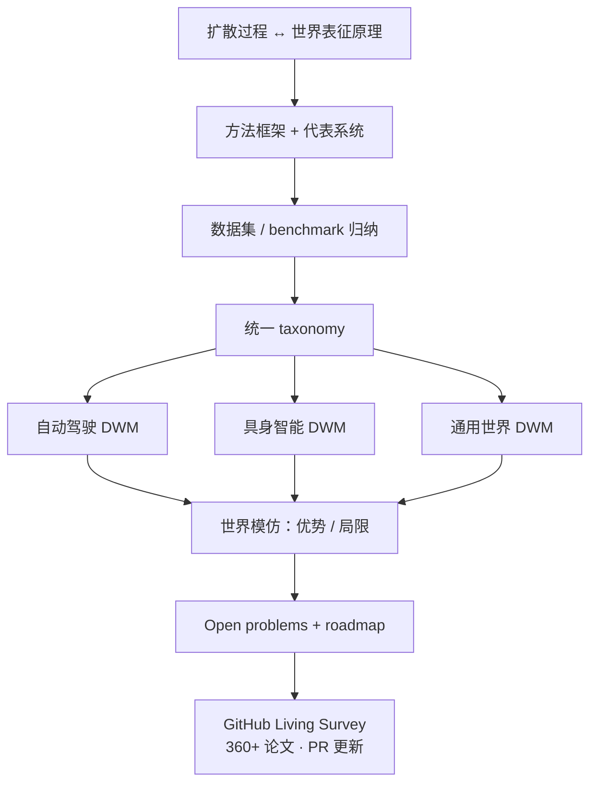
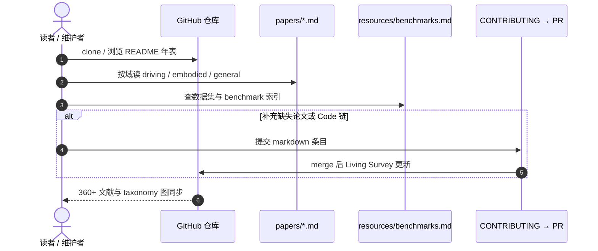

# Diffusion-Based World Models: A Survey

**Diffusion-Based World Models: A Survey**（Gang Wang、Zhen Liu、Mingliang Zhou、Ziying Song、Yugui Zhang、Lei Yang、Yuanyan Tang、Zheng Zhu、Lin Gu、Guang Yang；**Preprints.org** manuscript 202609.1022，[DOI:10.20944/preprints202609.1022.v1](https://doi.org/10.20944/preprints202609.1022.v1)）是社区首篇 **专门面向扩散范式世界模型** 的结构化综述；配套 [**Living Survey** GitHub](https://github.com/energy588/Diffusion-based-World-Models) 维护 **360+** 文献（2016–2026）、三分域清单与数据集索引。

## 一句话定义

**把「扩散生成」当作世界模型的主实现路径来读：先对齐扩散过程与内部世界表征，再按自动驾驶 / 具身 / 通用世界三域挂代表系统，最后用统一 taxonomy 讲清高保真条件生成的收益与长程一致、算力、评测等硬瓶颈。**

## 英文缩写速查

| 缩写 | 英文全称 | 简要说明 |
|------|----------|----------|
| WM | World Model | 学习环境内部模拟器以预测/想象未来 |
| DWM | Diffusion-based World Model | 以扩散模型为生成核心的世界模型 |
| BEV | Bird's-Eye View | 驾驶 WM 常见表征与预测空间 |
| VLA | Vision-Language-Action | 具身域常与扩散 WM 级联或联合 |
| AGI | Artificial General Intelligence | 摘要语境：WM 为自主智能体基础组件之一 |

## 为什么重要

- **填补切片空白：** 泛 WM 综述很多，但缺少 **只谈 diffusion-WM** 的 consolidated reference + roadmap（摘要明确动机）。
- **机器人读者需要「生成机制索引」：** 本库 [机器人 WM 训练闭环地图](../overview/robot-world-models-training-loop-taxonomy.md) 讲 **策略怎么用 WM**；本文讲 **扩散 WM 文献怎么分域、用什么数据** — 二者正交互补。
- **Living Survey 可维护：** GitHub 按年论文表 + `papers/*.md` 分域，比一次性 PDF 更适合 fast-moving 领域（2026 条目已含 Ctrl-World、WMPO、Cosmos 等）。

## 核心信息

| 项 | 内容 |
|----|------|
| **类型** | Survey / Review（Preprints.org v1，2026） |
| **手稿** | [preprints.org/manuscript/202609.1022](https://www.preprints.org/manuscript/202609.1022) |
| **配套仓** | [energy588/Diffusion-based-World-Models](https://github.com/energy588/Diffusion-based-World-Models) |
| **文献规模** | **360+**（仓库 README，2016–2026） |
| **开源** | **已开源（策展型）** — markdown 论文表、图资产、`CONTRIBUTING.md`；**非**统一训练代码 |

## 核心原理

### 扩散 ↔ 世界建模（摘要结构）

世界模型通过 **内部表征** 支撑感知、理解、推理；扩散模型凭 **高保真生成 + 灵活条件建模** 成为 **representation-based WM** 的重要路线。综述依次：

1. 总结 **扩散过程与世界建模原理** 的对应关系；
2. 梳理 **主流方法框架** 与跨场景代表系统；
3. 综合进展、内在特性、**常用数据集**；
4. 给出 **统一 taxonomy** 定位已有工作；
5. 深度评估 **世界模仿（world imitation）** 的优势与局限；
6. 提炼 **open problems** 与未来方向。

### 优势 vs 局限（摘要 + survey-notes）

| 优势 | 局限 |
|------|------|
| 多模态假设覆盖 | 计算低效 |
| 条件可控生成 | 长程一致性难 |
| 高保真未来合成 | 误差累积 |
| 灵活不确定性建模 | 评测 / 验证瓶颈 |

### 三分域 taxonomy（GitHub Living Survey）

| 域 | 典型任务与代表方向 |
|----|-------------------|
| **Autonomous Driving** | 场景生成、轨迹条件仿真、occupancy/BEV 预测、闭环规划、长尾场景合成 |
| **Embodied Intelligence** | 动作条件预测、操作、VLA 推理、策略学习、sim2real、交互想象 |
| **General-purpose Worlds** | 长视频、数字孪生、游戏式仿真、3D/4D 世界、规模化 world foundation models |

**能力横切主题：** 长程演化、多模态融合、交互性、时空一致、环境多样化。

**Open problems（仓库对齐）：** 效率、可控性、因果推理、物理 grounding、评测与验证、实时交互。

## 流程总览

## 源码运行时序图

**已开源（策展维护流）** — 非训练 pipeline；节点对齐 [`diffusion_based_world_models_survey_github.md`](../../sources/repos/diffusion_based_world_models_survey_github.md)。

## 工程实践

| 项 | 建议 |
|----|------|
| 选型先定域 | 驾驶闭环 vs 具身动作条件 vs 通用视频 — 三分域 **数据与评测口径不同** |
| 别只用开环 FVD | 与 [训练闭环地图](../overview/robot-world-models-training-loop-taxonomy.md) 一致：问 **策略/规划是否受益** |
| 长程任务 | 优先查 README 2025–2026 **long-horizon / AR / state-space** 条目（如 Orbis、Statespacediffuser 等） |
| 具身落地 | 从 `papers/embodied-intelligence.md` 跳到 Ctrl-World、DiWA、NWM 等 **Code** 链，而非只读综述 |
| 维护跟进 | Star/watch GitHub；大领域变迁时 **PR 补链** 比 fork 静态表格可持续 |
| 源码运行时序图 | 见上 — **策展 PR**；训练复现走各论文官方仓 |

## 实验与评测

- **本文为综述，无单一系统 benchmark 表。** 贡献是 taxonomy + 对 diffusion **世界模仿** 的利弊分析 + 数据集 hub（nuScenes / Waymo / Open X-Embodiment / LIBERO / WebVid 等分域列举于 GitHub）。
- **读法：** 用本文 **定域 + 定机制**；用各被引论文原文 **定数值**；用 [EWMBench](../entities/ewmbench.md)、[WorldScore](../entities/paper-worldscore.md) 等本库评测页 **定闭环口径**。

## 结论

**扩散世界模型的价值在「多模态、高保真、条件可控的未来合成」，真正的工程分水岭是能否在长程、因果与闭环决策里不被算力与误差累积拖垮。**

1. **先读机制切片，再读泛 WM 综述** — 本文专讲 **diffusion-WM**；机器人闭环坐标仍看 [2605.00080 机器人 WM 综述](./paper-sa-2605-00080-world-model-for-robot-learning-a-comprehensive-s.md) 与本库 [训练闭环地图](../overview/robot-world-models-training-loop-taxonomy.md)。
2. **三分域选型** — 驾驶重 **BEV/occupancy/闭环仿真**；具身重 **动作条件与 sim2real**；通用重 **foundation WM 与 3D/4D**。
3. **优势要兑现为条件接口** — 多模态与可控性只有变成 **规划/策略可用的条件** 才有机器人意义。
4. **长程与一致性是硬门槛** — 摘要与 survey-notes 反复强调；开环短视频 demo 不足以证明 WM 可用。
5. **评测瓶颈是社区问题** — 需结合决策-centric 评测（参见本库 [WM 评测 position 页](./paper-sa-2606-15032-how-should-world-models-be-evaluated-for-embodie.md) 类条目）。
6. **Living Survey 当入口** — [GitHub](https://github.com/energy588/Diffusion-based-World-Models) 360+ 表优于孤立 PDF 书签。
7. **复现走子仓库** — 本仓 **不提供** 统一 `train.py`；Cosmos、NWM、MagicDrive 等各自 Code 链。

## 与其他工作对比

| 维度 | 本文（Diffusion-WM Survey 2026） | [Robot WM Learning Survey（2605.00080）](./paper-sa-2605-00080-world-model-for-robot-learning-a-comprehensive-s.md) | [Generative WM 方法页](../methods/generative-world-models.md) |
|------|----------------------------------|------------------------------------------------------|----------------------------------------------------------------|
| 切片 | **扩散生成范式** 专综述 | 机器人学习 **全谱 WM** + 训练栈 | 本库 **工程折中与代表系统** |
| 组织轴 | 驾驶 / 具身 / 通用 + diffusion taxonomy | 策略内预测 / 学习型模拟器 / 可控视频 | DWM、Being-H0.7、产业模拟器等 |
| 维护 | **Living GitHub** | NTUMARS Awesome 等 | wiki 节点 + 外链 |
| 代码 | 策展 markdown | 指向各论文仓 | 指向各论文仓 |

## 局限与风险

- **Preprints 非同行评审终稿：** v1 可能大幅修订；引用需注明版本与日期。
- **机构信息未入库：** Crossref 无 affiliation；curator 后续可从 PDF 补 `schema/institutions.json` tag。
- **GitHub 无 license API 返回：** 二次分发图资产前请读仓库 License 文件。
- **360+ 列表非穷尽：** Living Survey 依赖社区 PR；遗漏不代表不重要。

## 关联页面

- [机器人世界模型：训练闭环与三线 taxonomy](../overview/robot-world-models-training-loop-taxonomy.md)
- [Generative World Models](../methods/generative-world-models.md)
- [Model-Based RL](../methods/model-based-rl.md)
- [World Action Models](../concepts/world-action-models.md)
- [Functional Taxonomy of World Models](../concepts/functional-taxonomy-world-models.md)

## 参考来源

- [`diffusion_wm_survey_preprints_202609_1022.md`](../../sources/papers/diffusion_wm_survey_preprints_202609_1022.md)
- [`diffusion_based_world_models_survey_github.md`](../../sources/repos/diffusion_based_world_models_survey_github.md)
- Wang et al., *Diffusion-Based World Models: A Survey*, Preprints.org 202609.1022, 2026

## 推荐继续阅读

- [GitHub Living Survey](https://github.com/energy588/Diffusion-based-World-Models)
- [Preprints 手稿页](https://www.preprints.org/manuscript/202609.1022)
- [World Model for Robot Learning（arXiv:2605.00080）](https://arxiv.org/abs/2605.00080) — 机器人语境互补综述
