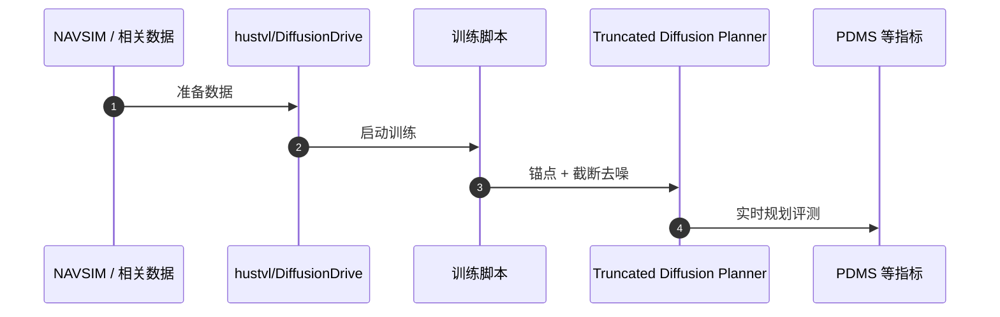

# DiffusionDrive（DiffusionDrive: Truncated Diffusion Model for End-to-End Autonomous Driving · arXiv:2411.15139）

**DiffusionDrive**（*DiffusionDrive: Truncated Diffusion Model for End-to-End Autonomous Driving*，[2411.15139](https://arxiv.org/abs/2411.15139)，CVPR 2025 Highlight）由 **华中科技大学 hustvl（HUST）等** 提出，收录于深蓝AI《端到端自动驾驶：十大前沿算法盘点》**截断扩散实时规划** 线索代表作。

## 一句话定义

先预测多模态锚点轨迹再截断扩散去噪，把去噪步数压到约 2 步，在 NAVSIM 上冲高 PDMS 并达约 45 FPS。

## 英文缩写速查

| 缩写 | 英文全称 | 简要说明 |
|------|----------|----------|
| DiffusionDrive | Truncated Diffusion Driving Planner | 截断扩散端到端规划器 |
| PDMS | Predictive Driver Model Score | NAVSIM 综合分 |
| NAVSIM | Non-reactive Autonomous Vehicle Simulation | 规划评测基准 |
| FPS | Frames Per Second | 实时帧率 |
| DDPM | Denoising Diffusion Probabilistic Model | 被截断加速的扩散族 |

## 为什么重要

- 扩散策略擅长多模态动作，但数十步去噪无法上车实时。
- 截断扩散证明生成式规划可以同时要质量与帧率。
- 与站内 [paper-s-squared-vla](./paper-s-squared-vla.md) 等 NAVSIM 对照常用基线。

## 核心信息

| 字段 | 内容 |
|------|------|
| **机构** | 华中科技大学 hustvl（HUST）等 |
| **arXiv** | [2411.15139](https://arxiv.org/abs/2411.15139) |
| Venue | CVPR 2025 Highlight |
| **演进线索** | 截断扩散实时规划 |
| **开源** | **已开源** — [`hustvl/DiffusionDrive`](https://github.com/hustvl/DiffusionDrive) |
| **指标索引** | NAVSIM：**88.1 PDMS**；单卡 RTX 4090 约 **45 FPS**；去噪步数相对传统约 **10×** 减少（盘点/论文）。 |

## 核心原理

### Truncated Diffusion

1. 轻量网络预测若干粗锚点轨迹（不同驾驶意图）；
2. 在锚点上加适量噪声，形成锚点高斯；
3. **不从纯噪声 T 起步**，从中间步截断去噪（约 **2** 步）。

### 流程总览

## 源码运行时序图

关键复现路径：[`hustvl/DiffusionDrive`](https://github.com/hustvl/DiffusionDrive)（CVPR 2025 Highlight 官方仓）。

## 实验与评测

| 维度 | 记录 |
|------|------|
| 基准 | **NAVSIM** |
| 报告点 | **PDMS 88.1**；RTX 4090 约 **45 FPS**；去噪约 **2** 步 |
| 对照 | 全步扩散规划、其他 E2E / VLA |

## 与相邻路线对比

| 路线 | 相对 DiffusionDrive | 取舍 |
|------|---------------------|------|
| 标准扩散策略 | 质量高但太慢 | 无法实时 |
| [S²-VLA](./paper-s-squared-vla.md) | 双流 VLA、纯相机 | PDMS 接近但范式不同 |
| [VAD](./paper-vad-vectorized-scene.md) | 回归式规划 | 多模态意图弱 |

## 工程实践

| 维度 | 记录 |
|------|------|
| 典型评测 | nuScenes / NAVSIM / Bench2Drive / Waymo Open（依论文） |
| 开源状态 | **已开源** — [`hustvl/DiffusionDrive`](https://github.com/hustvl/DiffusionDrive) |
| 复现入口 | https://github.com/hustvl/DiffusionDrive |
| 工程关注点 | 延迟、帧间一致性、可解释中间量表征、与模块化栈的接口 |

## 局限与风险

- 锚点质量上限约束多模态覆盖；截断过狠可能损多样性。
- NAVSIM 非反应式设定与真车分布有 gap。
- 与 LiDAR / 纯相机设定对比时需对齐传感器假设。

## 关联页面

- [e2e-autonomous-driving-top10-algorithms](../overview/e2e-autonomous-driving-top10-algorithms.md) — 十大盘点父节点
- [自动驾驶核心算法盘点专辑](../overview/autonomous-driving-core-algorithms-series.md) — 模块化栈姊妹篇
- [生成式世界模型](../methods/generative-world-models.md)
- [S²-VLA](./paper-s-squared-vla.md) — 驾驶 VLA / NAVSIM 对照
- [M⁴World](./paper-m4world.md) — 驾驶世界模型后继
- [VLA](../methods/vla.md)

## 参考来源

- [深蓝AI：端到端自动驾驶十大前沿算法盘点](../../sources/blogs/wechat_shenlan_ai_ad_e2e_top10.md)
- [e2e_ad_diffusiondrive.md](../../sources/papers/e2e_ad_diffusiondrive.md) — 论文 source
- arXiv: [2411.15139](https://arxiv.org/abs/2411.15139)
- [repos/hustvl_diffusiondrive.md](../../sources/repos/hustvl_diffusiondrive.md)

## 推荐继续阅读

- 论文 PDF：<https://arxiv.org/pdf/2411.15139.pdf>
- 官方代码：<https://github.com/hustvl/DiffusionDrive>
