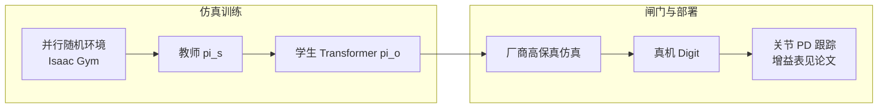

# Real-World Humanoid Locomotion with Reinforcement Learning（Digit）

**一句话定义**：在 Agility Digit 全尺寸人形上，用 **大规模并行仿真 + 域随机化** 训练 **因果 Transformer**，从本体感觉与动作历史自回归预测下一步关节指令，经 **低层 PD/跟踪** 上真机，实现零样本户外行走与扰动恢复。

## 英文缩写速查

| 缩写 | 英文全称 | 简要说明 |
|------|----------|----------|
| Sim2Real | Simulation to Real | 把仿真中学到的策略迁移落地真机的工程主线 |
| RL | Reinforcement Learning | 通过与环境交互最大化长期回报来学习策略的范式 |
| PD | Proportional–Derivative | 关节位置/阻抗底层控制，策略输出常为其 setpoint |
| Locomotion | Robot Locomotion | 足式/人形等无轮移动能力的总称 |
| MPC | Model Predictive Control | 滚动时域内优化控制序列的预测控制 |
| Kp | Proportional Gain | PD 控制的位置误差增益，影响刚度与响应 |
| Kd | Derivative Gain | PD 控制的速度误差增益，抑制振荡 |
| POMDP | Partially Observable Markov Decision Process | 部分可观测的 MDP，部署时观测受限的常见建模 |
| Isaac Gym | NVIDIA Isaac Gym | GPU 并行刚体仿真训练环境 |
| legged_gym | Legged Gym | 足式机器人 RL 训练的常用开源框架 |

## 为什么重要

- 把「**高维人形 + 盲走 + 户外材质变化**」收进一条可公开的 **sim→厂商仿真→硬件** 流水线，便于和经典 MPC / 厂商控制器对照。
- 对 **Kp/Kd 话题** 的价值在于：动作仍是 **离散策略输出 → 连续关节阻抗跟踪**；论文给出 **逐关节增益表**（随关节而异），适合作为 **人形 PD 量级** 的文献锚点，而不是孤立抄一组数。

## 核心机制（提炼）

- **两阶段学习**：先 **全观测教师策略** \(\pi_s(a|s)\)，再训 **仅本体学生** \(\pi_o(a|o_{:t},a_{:t-1})\)，学生损失混合 **模仿 + POMDP 强化**。
- **序列模型**：因果 Transformer 将 \((o,a)\) 历史 token 化，用自注意力做 **上下文内适应**（不更新权重）。
- **仿真**：Isaac Gym 千级并行环境 + 地形/动力学随机化；闭链与 Digit 机构在文中有专门仿真处理叙述。

## 与 Kp / Kd 设置的关系

- 精读时应以 **论文附录 / 补充材料中的 PD 表** 为准；公开讨论里常以 **髋部量级 \(K_p\approx 200\) N·m/rad、\(K_d\approx 10\) N·m·s/rad** 作为可读锚点，**左右肢与各关节仍有差异**。
- 调参时把 **策略时间步、仿真子步、PD 更新率** 与表放在同一页系统图里核对，避免只改 `stiffness` 不改分频。

## 实验与评测

- 量化指标、消融与 sim2real / 实机结果见 **原文 PDF** 与 [参考来源](#参考来源)；本页正文侧重方法结构与知识库交叉引用。

## 与其他工作对比

- 正文已给出与相邻路线 / baseline 的 **定性对照**；定量表格与 ablation 见原文（[参考来源](#参考来源)）。

## 参考来源

- [RL+PD 动作接口与增益设计论文索引](../../sources/papers/rl_pd_action_interface_locomotion.md)（本条在索引中的摘录与链接）
- Radosavovic et al., *Real-World Humanoid Locomotion with Reinforcement Learning*, [arXiv:2303.03381](https://arxiv.org/abs/2303.03381)

## 关联页面

- [Legged / Humanoid RL 中 Kp/Kd 设置](../queries/legged-humanoid-rl-pd-gain-setting.md)
- [Sim2Real](../concepts/sim2real.md)
- [Locomotion](../tasks/locomotion.md)
- [legged_gym](./legged-gym.md)

## 推荐继续阅读

- [机器人论文阅读笔记：Real-World Humanoid Locomotion with RL](https://imchong.github.io/Humanoid_Robot_Learning_Paper_Notebooks/papers/03_High_Impact_Selection/Real-World_Humanoid_Locomotion_with_RL/Real-World_Humanoid_Locomotion_with_RL.html)
- [项目页 Learning Humanoid Locomotion](https://learning-humanoid-locomotion.github.io/)
