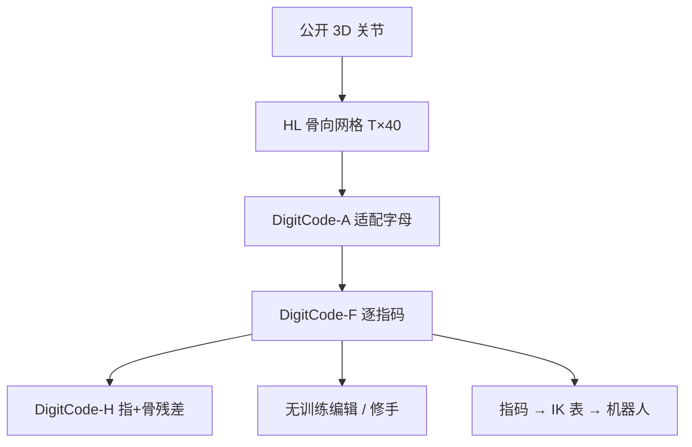

# DigitCode：按解剖单元做手部动作符号化

**DigitCode**（*Symbolic Tokenization of Hand Motion by Anatomical Units*；[arXiv:2608.03127](https://arxiv.org/abs/2608.03127)，[项目页](https://digitcode-demo.github.io/)）回答离散手表示里常被忽略的问题：**一个 token 应该跨过哪一层解剖结构**——骨、指，还是整只手。

## 一句话定义

**在 Hand Labanotation 的 \(T\times 40\) 方向网格上，把字母表按骨→指→残差分层，使每个 token 对应真实可枚举的解剖单元，从而既能降量化误差，又能当无训练的编辑/重定向手柄。**

## 英文缩写速查

| 缩写 | 英文全称 | 简要说明 |
|------|----------|----------|
| HL | Hand Labanotation | 每骨一个方向符的 \(T\times 40\) 记谱网格 |
| MANO | MANO hand model | 连续参数化手模型；准但不可局部索引 |
| VQ | Vector Quantization | 学习型向量量化；本文发现固定单元时与 k-means 可互换 |
| IK | Inverse Kinematics | 把逐指码一次编译成机器人关节查找表 |
| AUC | Area Under the Curve | 畸形指检测指标 |

## 为什么重要

- 生成手「拇指穿掌」时，连续表示只能整手重画；符号单元让你 **只改那一根指**。
- 视频到灵巧手的重定向缺合法性检查；有限指码可以 **一次 IK、终身查表**。
- 给 tokenizer 研究一个干净对照：手的单元来自解剖，不是超参。

## 核心信息

| 项 | 内容 |
|----|------|
| **数据** | InterHand2.6M / FreiHAND / HanCo / ASL-Skeleton3D，公开 3D 关节 |
| **开源** | **演示页已发；HandTok 宣称审稿后发布**（截至 2026-08-15） |

## 核心原理

### 方法栈

三步改 HL-26：DigitCode-A 用球面 k-means 适配各向异性方向（68% 落在 +Y 面）；DigitCode-F 把一指四骨联合量化；DigitCode-H 再叠每骨残差。时间轴可用相对编码 / 关键帧，但不改单元结论。

### 流程总览

## 工程实践

| 项 | 建议 |
|----|------|
| 源码运行时序图 | **不适用**（HandTok 尚未挂出） |
| 选单元 | 动力学/预测读骨；交互/编辑读指；身份/噪声读整手或 HL-26 |
| 重定向 | 5 指 × 128 码 ≈ 640 次 IK，约 1.6 s 编表；流式只做 O(1) 拼接 |
| 检测 | 用到最近码字的残差，不必再训分类器 |

## 实验与评测

- InterHand2.6M：HL-26 **14.71°** → A **8.45°** → F **5.50°/2.0 bit** → H **3.26°/4.75 bit**（可到 1.86°）。
- 固定单元时 k-means 与学习 VQ 差距 ≤0.1°；随机重分组同块长大约 +2.4°。
- 畸形指检测 AUC：码字残差 0.953 / 0.823；MANO 重拟合残差几乎无检测力。
- Allegro 查表重定向相对逐帧优化约快 3 个数量级，位置误差约 0.7 mm。

## 与其他工作对比

相对 MANO / 关节角：牺牲连续精度，换可索引与合法性。相对 HL-26：同一网格，只改单元。相对 UHAS：UHAS 统一的是 **策略动作空间**；DigitCode 统一的是 **观测/生成侧符号**。相对 MANGO-Grasp：后者编码手–物接触场，前者编码手自身姿态。

## 结论

**手部离散化的杠杆在「token 跨过哪块解剖」，不在「换一个更强的量化器」。**

1. **先改单元再调码本** — 指级联合量化同时降误差和码率。
2. **分层保留两级** — 指作接口、骨作精度，DigitCode-H 在 HL 码率附近把误差砍到约 1/4。
3. **可枚举才是接口** — 检测、局部修复、机器人查表都不需要再训一个网络。
4. **任务决定读哪一层** — 不要默认「越细越好」；噪声身份任务反而吃粗符号。
5. **复现等 HandTok** — 入库时只有演示页。

## 局限与风险

- 审稿匿名期无官方 PDF 外的代码；数字以 arXiv HTML / 演示页为准。
- 单步预测只打平「复制上一帧」基线，不是运动预报 SOTA。
- 查表重定向换速度，不追求峰值精度。

## 关联页面

- [UHAS](../methods/uhas-unified-hand-action-space.md) — 跨手型策略动作空间对照
- [WiLoR](../methods/wilor.md) — 从 RGB 出 3D 手，供本码消费
- [灵巧手运动学](../concepts/dexterous-kinematics.md)
- [MANGO-Grasp](./paper-mango-grasp.md) — 跨手型接触场
- [OnOff](./paper-onoff-handwriting.md) — 另一条「连续运动 → 可执行符号」线

## 参考来源

- [DigitCode 论文摘录](../../sources/papers/digitcode_arxiv_2608_03127.md)
- [DigitCode 演示页归档](../../sources/sites/digitcode-demo.md)
- [具身智能小站 9 篇盘点](../../sources/blogs/wechat_embodied_station_ego2robot_mango_grasp_2026-08-11.md)
- [arXiv:2608.03127](https://arxiv.org/abs/2608.03127)

## 推荐继续阅读

- [DigitCode 交互演示](https://digitcode-demo.github.io/)
- Li et al., Hand Labanotation（HL）— 本文网格起点
