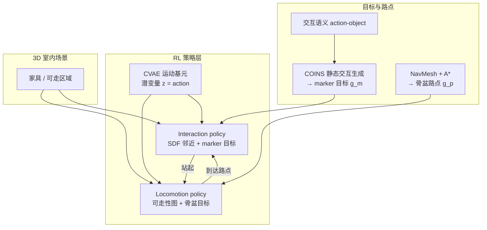

# DIMOS：室内 3D 场景中的多样人体运动合成

**DIMOS**（*Synthesizing Diverse Human Motions in 3D Indoor Scenes*，arXiv:2305.12411，ICCV 2023，[项目页](https://zkf1997.github.io/DIMOS/)，[代码](https://github.com/zkf1997/DIMOS)）提出 **强化学习驱动的 human-scene interaction 合成框架**：虚拟人体在复杂室内环境中 **自主导航、与家具交互（坐/躺/站起）并串联多段活动**，而**不依赖**昂贵且难覆盖的「人体运动–3D 场景」配对采集数据。

## 英文缩写速查

| 缩写 | 英文全称 | 简要说明 |
|------|----------|----------|
| RL | Reinforcement Learning | 通过与环境交互最大化长期回报来学习策略的范式 |
| CVAE | Conditional Variational Autoencoder | 条件变分自编码器，此处生成短时运动基元 |
| SDF | Signed Distance Field | 有符号距离场，编码点到物体表面的距离与法向梯度 |
| SMPL-X | Skinned Multi-Person Linear Model with eXpressions | 带手/脸的参数化人体网格模型 |
| MDP | Markov Decision Process | 状态–动作–奖励–转移的标准序贯决策建模框架 |
| PPO | Proximal Policy Optimization | 常用 on-policy 策略梯度 RL 算法 |
| MoCap | Motion Capture | 动作捕捉，AMASS/SAMP 等训练数据来源 |
| OOD | Out-of-Distribution | 分布外物体形状/场景，泛化评测关注点 |

## 为什么重要

- **突破配对数据瓶颈：** 传统 HSI 合成（如 SAMP 类）需要同步采集人体与场景；DIMOS 把 **目标写成奖励、感知写成状态、生成模型潜变量写成动作**，用 AMASS/SAMP 上学到的 **运动基元** + 合成场景 RL 泛化到未见家具与布局。
- **衔接 locomotion 与交互：** 继承 **GAMMA** 的高保真 waypoint 行走，又补上 **坐/躺/站起** 与 **碰撞避免**——解决 GAMMA「只会走、常穿模」与 SAMP「会坐但脚滑、多样性差」的分裂。
- **可组合的活动序列：** NavMesh 路点 + 模块化策略切换，可合成「走向 A 椅坐下 → 换 B 椅 → 躺沙发」等 **长程日常行为**，服务 AR/VR、游戏与 **具身学习训练数据** 规模化。
- **与机器人知识库的接口：** 同属「**生成式运动先验 + RL 任务策略**」家族，但与 [PhysHSI](./paper-amp-survey-15-physhsi.md) 等 **物理仿真人形** 不同，DIMOS 是 **运动学 SMPL-X 角色动画**；落地真机需经 [Motion Retargeting](../concepts/motion-retargeting.md) 与接触动力学重建模（参见 [角色动画 vs 机器人控制](../concepts/character-animation-vs-robotics.md)）。

## 流程总览

## 核心机制（归纳）

### 1）运动表示与基元

- 人体用 **SMPL-X**；运动序列用 **67 个体表 marker**（SSM2 布局，相对首帧骨盆坐标系）。
- **CVAE 运动基元**（延续 GAMMA）：给定 1–2 帧历史，解码 **0.25 s** marker 未来 → MLP 回归 SMPL-X 参数；在 **AMASS（BABEL sit/lie 子集）+ SAMP** 上训练，覆盖坐/躺技能。
- **RL 动作空间 = 基元潜变量 z**；策略输出高斯分布，PPO + KL 正则保持自然性。

### 2）场景感知 locomotion

- **状态：** marker 历史 + **局部 16×16 可走性二值图**（人体坐标系 1.6 m×1.6 m）+ 各 marker 指向目标骨盆的归一化方向。
- **奖励：** 骨盆距离/朝向 + 脚–地接触（抑脚滑）+ **bbox 与不可走格重叠惩罚**。
- **训练：** ShapeNet 随机 clutter 场景，NavMesh 采样起终点。

### 3）细粒度物体交互

- **目标：** [COINS](./paper-coins-compositional-human-scene-interaction.md) 由「action-object」语义生成 **静态交互 marker 目标**。
- **状态：** 当前 marker + 到目标的距离/方向 + **物体 SDF 值与梯度**（每人–物邻近）。
- **奖励：** marker 距离 + 顶点穿透惩罚（负 SDF）+ 脚接触项。
- **双向训练：** 随机交换初始/目标姿态，同时学 **坐下/躺下** 与 **站起**，便于回到 locomotion。

### 4）推理：树采样

测试时沿 GAMMA 做法，每步采样多个潜动作，用训练同款奖励保留 **top-K** 分支，提升目标到达与交互质量。

## 常见误区

1. **DIMOS = 物理仿真角色：** 方法是 **运动学** 的，项目页承认仍有人–场景穿透；不等于 Isaac/MuJoCo 里的动力学人形控制。
2. **不需要任何场景相关数据：** 虽不需配对轨迹，但 interaction 策略训练用 **PROX 静态交互 retarget 到 ShapeNet**；完全零场景先验不成立。
3. **可直接喂给人形 RL tracker：** 输出是 SMPL-X marker 轨迹，上机器人需 **重定向 + 接触/平衡约束**；与 [CRISP](../methods/crisp-real2sim.md)「先仿真就绪资产再 RL」是互补上下游。
4. **与 GAMMA 重复：** GAMMA 只做 **无碰撞意识的 waypoint 行走**；DIMOS 是其在 **室内 HSI** 上的扩展而非简单复现。

## 实验与评测（索引级）

- **Locomotion：** 相对 SAMP Unity demo 与 GAMMA，在合成 clutter 场景上 **多样性、穿透、感知自然度** 更优。
- **Interaction：** 坐/躺 OOD 测试（不同椅形、朝向、初始姿态）优于 SAMP；可展示 Replica/PROX 重建场景、户外点云长椅、Shap-E 生成椅子。
- **局限：** 躺姿数据不足；运动学穿透；量化指标与消融见 [论文 PDF](https://arxiv.org/abs/2305.12411)。

## 与其他页面的关系

- **图形学 RL 谱系：** [角色动画 vs 机器人控制](../concepts/character-animation-vs-robotics.md) — DeepMimic/AMP 从仿真角色到真机的迁移语境；DIMOS 停留在 **场景填充 / 数据合成** 一侧。
- **生成式运动：** [扩散运动生成](../methods/diffusion-motion-generation.md) — 文本/地形条件扩散 vs DIMOS 的 **RL+CVAE 潜空间控制**。
- **Real2Sim：** [CRISP](../methods/crisp-real2sim.md) — 从视频恢复可仿真人–场景；DIMOS 从 **语义/路点目标正向合成** 运动。
- **人形场景交互：** [PhysHSI](./paper-amp-survey-15-physhsi.md) — AMP 驱动的 **真实人形** 搬箱/坐/躺/站起，与 DIMOS 任务重叠但 **平台与物理层级不同**。
- **论文笔记索引：** [Human Motion 分类](../overview/paper-notebook-category-14-human-motion.md)

## 参考来源

- [DIMOS 论文归档（arXiv:2305.12411）](../../sources/papers/dimos_arxiv_2305_12411.md)
- [DIMOS 项目页](../../sources/sites/dimos-zkf1997-github-io.md)
- [zkf1997/DIMOS 代码索引](../../sources/repos/dimos.md)

## 推荐继续阅读

- [DIMOS 项目页](https://zkf1997.github.io/DIMOS/) — 演示视频、OOD 案例与训练演化
- [GAMMA 项目页](https://yz-cnsdq-z.github.io/) — 潜空间 locomotion 基座
- [COINS 实体页](./paper-coins-compositional-human-scene-interaction.md) — 语义可控静态人–场景交互（DIMOS 的 marker 目标来源）
- [arXiv:2305.12411](https://arxiv.org/abs/2305.12411) — 完整方法与实验
