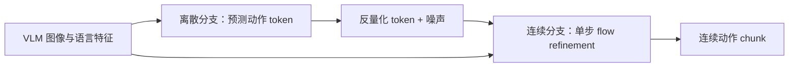
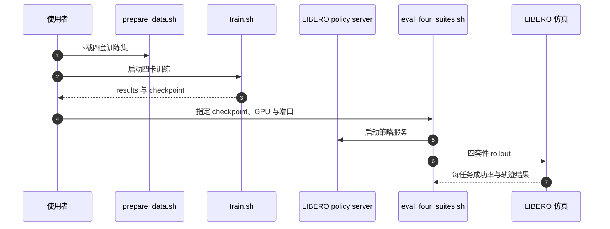

# Discrete Forcing（arXiv:2609.39526）

## 一句话定义

**Discrete Forcing** 先用离散动作 token 确定一个动作 chunk 的粗略结构，再以一次连续去噪恢复精确动作，让 VLA action expert 只需两次前向就完成粗到细生成。

## 英文缩写速查

| 缩写 | 英文全称 | 简要说明 |
|------|----------|----------|
| VLA | Vision-Language-Action | 以视觉和语言为条件预测机器人动作的策略模型 |
| DiT | Diffusion Transformer | 本文共享骨干与动作专家采用的 Transformer 去噪架构 |
| FM | Flow Matching | 训练连续分支预测从引导起点到目标动作的向量场 |
| NFE | Number of Function Evaluations | 动作专家推理时调用网络的前向次数 |
| LIBERO | Lifelong Benchmark for Robot Learning | 论文单臂操作仿真主基准之一 |

## 为什么重要

VLA 动作头需要同时表达动作的整体意图和精细连续控制值。纯离散输出量化紧凑、易形成结构，但会损失精度；纯连续 flow/diffusion 动作头保留精度，却常用多个去噪迭代换取效果。Discrete Forcing 把两种表示安排成有先后的两个阶段：离散预测承担粗结构，连续分支负责局部精修。其价值在于以较低推理预算保留动作质量，而不是单纯减少动作维度或把常规连续头蒸馏得更小。

## 核心信息

| 项 | 内容 |
|----|------|
| 论文与日期 | [arXiv:2609.39526](https://arxiv.org/abs/2609.39526)，v1 于 2026-09-30 提交 |
| 作者机构 | 香港科技大学（广州）、华南理工大学、中国科学技术大学、西湖大学、浙江大学、清华大学 |
| 策略输入 | VLM 特征与语言任务条件；LIBERO 配置使用主视角和腕部图像，训练配置不把机器人 state 注入模型 |
| 策略输出 | 长度 8 的连续动作 chunk；LIBERO 配置为 7 维动作，离散分支每维 256 个 bins |
| 主体结构 | 前部共享 DiT 层，后部离散与连续专用分支 |
| 推理预算 | 先离散预测、后连续精修，共 2 NFE |
| 真机平台 | ARX LIFT2 双臂机器人；三个 Intel RealSense D405 相机 |
| 开源状态 | [项目页](../../sources/sites/discrete-forcing-github-io.md) 链接公开代码；目前仓库含 LIBERO 管线，不含 checkpoint，RoboTwin 支持仍列为 TODO |

## 方法：离散先定结构，连续再补精度

离散分支把演示动作量化成 token，以 masked-token 目标学习动作序列的粗结构。连续分支在训练时使用真值离散动作的反量化结果与高斯噪声混合，构造 flow matching 的 source；连续向量场从这个起点指向演示动作。论文默认混合系数 \\(\alpha=0.3\\)，并加入 one-step reconstruction loss，使连续分支在推理时可以单次前向直接还原连续动作。

推理时：

1. 将离散动作序列全部设为 mask，由离散分支一次并行预测各位置 token。
2. 将预测 token 反量化，与噪声混合成连续分支的引导起点。
3. 连续分支以引导 token 和观测为条件，执行一次 refinement，输出动作 chunk。

整体不是「离散规划器 + 独立连续控制器」两个模型串联；它是在部分共享的 action DiT 内部组织两个专用分支。训练采用示范数据直接联合优化，不依赖把一个多步教师蒸馏成学生。

## 源码运行时序图

图中入口对应 [官方仓库归档](../../sources/repos/discrete-forcing.md) 的 README；仓库提供的当前可运行示例是 LIBERO。评估脚本一次执行 8 步动作后重规划，这是客户端执行时域，和模型两次 NFE 是不同概念。

## 实验与评测

| 场景 | Discrete Forcing | 对照 | 读法 |
|------|------------------:|------:|------|
| LIBERO，1.5B，2 NFE | 97.6% 平均成功率 | StarVLA 2 NFE：95.1%；StarVLA 10 NFE：96.7% | 在相同 2 NFE 下更高成功率；对照 10 NFE 时动作生成 P50 延迟从 145.46 ms 降至 24.91 ms |
| RoboTwin 2.0 | 59.32% 平均成功率 | StarVLA：49.80% | 论文称使用 50 demonstrations / task，且该评测未做 robot-specific pretraining |
| RoboCasa-GR1 | 56.8% 平均成功率 | StarVLA：43.9% | 在更复杂具身与较高维动作空间仍有增益 |
| 真机，ARX LIFT2 | 74.9% 平均 task progress | π0.5 基线 58.5% | 四项任务各 20 次试验；这是 task progress，不是二元成功率 |

LIBERO 端到端 P50 latency 为 78.95 ms，StarVLA 2 NFE 为 93.29 ms、10 NFE 为 200.43 ms；论文在其评测配置下报告相对 10 NFE 连续基线的 action generation 约 5× 加速，端到端超过 2×。这些是特定模型、硬件与 benchmark 的测量，不能直接换算成任意机器人的闭环控制频率。

## 与其他工作对比

- **连续动作 expert：** 常需迭代去噪以建立全局动作结构；Discrete Forcing 把粗结构显式放进离散阶段，再让连续分支做一次 refinement。
- **纯离散 VLA：** token 输出结构紧凑，但量化误差影响连续控制精度；这里的离散预测仅作为连续动作的引导起点，最终输出仍是连续动作。
- **Coarse-to-fine VLA：** 论文将其区别概括为离散表示和连续表示描述同一动作轨迹，离散输出直接定义连续 flow 的 source，而不只是一个语义意图向量。

## 结论

**主要贡献是让离散表示承担动作整体结构、连续表示承担精细数值，并以两次动作专家前向完成生成；性能与时延收益应结合任务和评测配置判断。**

1. **看两个阶段的职责：** 离散 token 提供全局方向和轨迹形状先验，连续阶段修整数值细节；消融显示离散→连续优于重复同一种表示。
2. **效率比较要同预算：** LIBERO 上 2 NFE 为 97.6%，StarVLA 2 NFE 为 95.1%；论文的显著加速 claim 则是与 10 NFE 基线比较。
3. **保留真机指标定义：** 74.9% 是四任务的 task progress，基线为 58.5%；不要改写成成功率提升。
4. **区分模型 NFE 与动作执行时域：** 两次前向描述生成计算；开源 LIBERO 客户端每次执行 8 步再重规划。
5. **部署前核查工件：** 当前公开代码主要覆盖 LIBERO；RoboTwin 代码仍是 TODO，checkpoint 不在仓库内，需另备数据、模型权重和 CUDA 环境。

## 局限与风险

- 论文报告来自特定 VLM、数据和硬件设置；延迟数值不能直接视为通用部署时延。
- 仿真中不同方法的 backbone、训练数据量和预训练条件需按论文表格逐项对齐；跨基准数字不宜横向当作同条件排名。
- 真机评估共四种操作任务，单个任务 20 次，且报告 task progress；尚不足以证明跨机器人或长时序任务上的普遍提升。
- 仓库许可证为 MIT，但 LICENSE 保留 StarVLA Team 上游版权与署名条件；使用时需一并遵守上游条款。

## 关联页面

- [VLA](../methods/vla.md) — 视觉、语言条件下的动作专家结构
- [Action Chunking](../methods/action-chunking.md) — 本文按动作块生成与执行
- [Diffusion Policy](../methods/diffusion-policy.md) — 连续动作去噪与生成策略背景
- [Diffusion Transformer](../concepts/diffusion-transformer.md) — DiT 骨干架构
- [OpenVLA](./paper-openvla.md) — 连续动作 expert 之外的离散 token VLA 代表

## 参考来源

- [论文来源归档](../../sources/papers/discrete_forcing_arxiv_2609_39526.md)
- [项目页开放状态核查](../../sources/sites/discrete-forcing-github-io.md)
- [官方代码归档](../../sources/repos/discrete-forcing.md)
- [arXiv HTML 正文](https://arxiv.org/html/2609.39526v1)

## 推荐继续阅读

- [项目页](https://discrete-forcing.github.io/)
- [官方 GitHub](https://github.com/Jbo-Wang/discrete_forcing)
- [论文](https://arxiv.org/abs/2609.39526)
