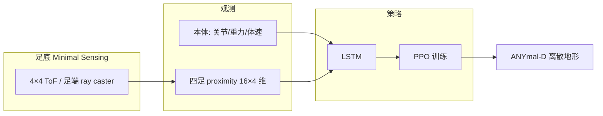

# Learning Locomotion on Discrete Terrain via Minimal Proximity Sensing

**一句话定义**：在四足 **足底** 嵌入 **低成本红外 ToF 接近传感器**，把 **接触前（pre-contact）** 的局部几何读数直接作为 RL 观测，使机器人在 **踏石、碎石、沟与平衡木** 等离散地形上 **自主搜索与安全落脚**，**无需相机、LiDAR 或高程图重建栈**。

## 英文缩写速查

| 缩写 | 英文全称 | 简要说明 |
|------|----------|----------|
| ToF | Time of Flight | 飞行时间测距，本文足底接近传感器原理 |
| RL | Reinforcement Learning | 用 PPO 在仿真中学离散地形行走策略 |
| PPO | Proximal Policy Optimization | 本文策略优化算法 |
| LSTM | Long Short-Term Memory | 处理时序 proximity 与本体观测的循环网络 |
| Sim2Real | Simulation to Real | 仿真噪声/时延建模后迁移 ANYmal-D 真机 |
| ANYmal | ANYbotics Quadruped | 本文硬件平台 ANYmal-D |
| FoV | Field of View | 传感器视场；本文 45°×45°、4×4 网格 |
| DR | Domain Randomization | 训练时对传感器缺失、噪声与时延随机化 |
| Locomotion | Robot Locomotion | 踏石/沟/平衡木等离散接触地形移动 |

## 为什么重要

- **任务对齐的「最小感知」**：离散地形的关键不确定性在 **下一脚落点几何**，全局视觉重建往往 **算力高、延迟大、易被腿自遮挡**；足底 **数十厘米内、高频** 的 proximity 直接回答「脚下即将发生什么」。
- **接触前而非触地后**：相对压力/接触开关，ToF 在 **摆动相** 即可探测沟缘、踏石顶面与侧壁，支撑 **动态落脚选择与间隙穿越**。
- **仿真友好、迁移可标定**：射线投射比高频接触力更易稳定建模；论文对 **噪声、缺失、20–60 ms 延迟** 做实测并注入训练，实机 **0.52 m/s** 级踏石/沟穿越验证 **sim2real 闭环**。
- **与重型感知栈正交**：可与机载 LiDAR/深度 **互补** 或作为 **低功耗备选**，适合算力/带宽受限或遮挡严重的场景。

## 核心信息

| 字段 | 内容 |
|------|------|
| 机构 | 苏黎世联邦理工（ETH Zürich）Robotic Systems Lab |
| 平台 | ANYmal-D（ANYbotics） |
| 传感器 | STMicro **VL53L5CX**，每足 4×4 ToF 网格，60 Hz |
| 训练 | **Isaac Gym** + **PPO** + **LSTM**；两阶段地形课程 |
| 项目页 | <https://sites.google.com/view/foot-tof/home> |

## 系统结构

**设计取舍（相对传统感知 locomotion）：**

1. **无独立高程图管线** — 不做机身深度 → SLAM/融合 → 注意力地图。
2. **单一统一策略** — Stage 1/2 课程覆盖踏石、沟、楼梯、平衡木、坡面，非按地形分专家。
3. **感知尽量靠近兴趣点** — 足端直连读数，避免经 **足位运动学 + 机载地图** 二次投影（仿真对照中此路径对关节偏置/里程计噪声更敏感）。

## 训练与域随机化

| 阶段 | 地形与目标 |
|------|------------|
| **Stage 1** | 密网格踏石、双行踏石、粗糙箱场、平台–沟、混合行；课程缩小踏面、增大间隙与高度差；感知退化 **保持较低** 以快速学 reflex |
| **Stage 2** | Stage 1 地形 **更难初值** + 平衡木、楼梯、上下坡；扩大初始姿态；**提高** 噪声/缺失/时延随机化至接近实机 |

仿真中对 proximity 注入：**静态偏置、比例+高斯噪声、随机缺失置零、多步时延**；每 episode 从 `[0, upper bound]` 均匀采样退化等级。

## 实验与评测

### 仿真鲁棒性（相对机载高程投影）

在 **80% 踏石 + 20% 沟** 组合、Stage 1 约 90% 课程难度、1000 次 rollout 成功率指标下：

| 扰动 | 足端 Proximity | Mock 理想高程扫描 | Mock 融合高程图 |
|------|----------------|-------------------|-----------------|
| 静态关节位置偏置 | 下降较慢 | 足位投影误差放大后骤降 | — |
| 小腿长度 ±20% | 更稳健 | 投影足位漂移导致更快失败 | — |
| 里程计噪声 0→400% | 相对稳健 | — | 成功率约 51.7%→24.3% |

**解读**：无扰动时机载理想扫描可与足端传感 **持平**；一旦 **运动学/状态估计** 失配，**越靠近接触点的传感** 失败点更少。

### 实机离散地形

- **60 cm** 水平沟；**20×20 cm** 错落踏石（含更低支撑砖层）；**20 cm** 宽平衡木。
- 平均速度约 **0.52 m/s**；策略呈现 **摆腿扫描**（各 zone 读数排序变化推断侧壁/顶面）与 **近似水平面检测后再触地** 等 emergent 行为。

## 与其他工作对比

| 路线 | 感知 | 典型代价 | 本文位置 |
|------|------|----------|----------|
| [Extreme Parkour](../entities/extreme-parkour.md) | 单目深度端到端 | 高带宽视觉、蒸馏管线 | 四足跑酷；**全局视觉** |
| [Learning Quadrupedal Locomotion over Challenging Terrain](./paper-notebook-learning-quadrupedal-locomotion-over-challenging.md) | 本体为主 | 对 **前瞻离散落脚** 弱 | 连续崎岖；**盲走强** |
| [Walk These Ways](./paper-walk-these-ways-quadruped-mob.md) | 平地训 + 行为参数试参 | 楼梯等 OOD 靠人工调 \(b\) | **弱感知试参** |
| [ANYmal Parkour（策展）](./paper-notebook-anymal-parkour-robust-perceptive-locomotion.md) | 机载深度/高程 | 完整感知栈 + teacher 蒸馏 | **重型感知** 对照轴 |
| **本文** | 足底 4×4 ToF | 低算力、低延迟、抗自遮挡 | **最小感知 · 离散地形** |

## 常见误区与局限

- **不是「完全无感知」**：依赖足端 **16 点/足** 的局部几何；远距离导航、语义障碍仍可能需要全局传感。
- **不等于替代 LiDAR 建图**：任务聚焦 **近场落脚**；长程路径规划不在此文范围。
- **材质与维护**：强吸收/镜面地面、足端泥污堵塞会导致 ToF 失效；论文讨论 **红外透明护罩/自清洁** 为后续方向。

## 参考来源

- [discrete_terrain_minimal_proximity_sensing_arxiv_2606_31912.md](../../sources/papers/discrete_terrain_minimal_proximity_sensing_arxiv_2606_31912.md)
- Fan et al., *Learning Locomotion on Discrete Terrain via Minimal Proximity Sensing*, [arXiv:2606.31912](https://arxiv.org/abs/2606.31912)
- 项目页：<https://sites.google.com/view/foot-tof/home>
- 演示视频：<https://www.youtube.com/watch?v=K7_acxnVrdI>

## 关联页面

- [ANYmal](./anymal.md)
- [四足机器人](./quadruped-robot.md)
- [Terrain Adaptation（地形适应）](../concepts/terrain-adaptation.md)
- [楼梯与障碍 Locomotion](../tasks/stair-obstacle-perceptive-locomotion.md)
- [Locomotion](../tasks/locomotion.md)
- [Sim2Real](../concepts/sim2real.md)
- [Extreme Parkour](./extreme-parkour.md)

## 推荐继续阅读

- [ETH RSL 项目页 Foot-ToF](https://sites.google.com/view/foot-tof/home)
- [ANYmal 分钟级并行 DRL](./paper-anymal-walk-minutes-parallel-drl.md) — 同平台 RL 工程栈入口
- [Learning Quadrupedal Locomotion over Challenging Terrain](./paper-notebook-learning-quadrupedal-locomotion-over-challenging.md) — 本体盲走穿越连续崎岖地形对照
