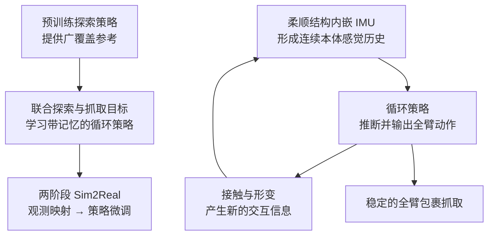

# 从分布式全臂交互中学习推断与操作

**Learning to infer and manipulate through distributed whole-arm interaction in a soft robot**（Chuhan Zhang、Ebrahim Shahabi、Kseniia Khomenko、Wei Pan、Cosimo Della Santina；代尔夫特理工大学、纽卡斯尔大学；arXiv:2608.30773，2026-08-31）研究软体机器人如何在缺少视觉目标状态的情况下，通过与物体的身体接触获取任务信息，并将推断与抓取动作统一到一个带记忆的策略中。

## 一句话定义

**让柔顺机械臂用“碰到物体时身体各处的本体感觉变化”推断物体和抓取条件，再用同一循环策略组织探索、定位与全臂包裹。**

## 英文缩写速查

| 缩写 | 英文全称 | 简要说明 |
|------|----------|----------|
| IMU | Inertial Measurement Unit | 嵌入柔顺机械臂结构、提供本体感觉观测的惯性测量单元 |
| RL | Reinforcement Learning | 用于学习探索与抓取的控制策略 |
| Sim2Real | Simulation-to-Real Transfer | 论文采用观测映射与策略微调将策略适配到真实机器人 |

## 为什么重要

常见抓取管线先通过视觉或外部传感器估计物体，再规划机械臂去接近。软臂在接触时会产生丰富的形变和分布式反馈；如果把接触仅视为需要克服的扰动，就丢掉了这些反馈携带的信息。本文提出的关键视角是：**对某些软体操作任务，机器人必须先通过动作与环境交互，才能获得足以决定下一步动作的信息。**

这让探索、感知和控制不再是严格串行的模块：机械臂探索工作空间时，接触过程本身既改变状态，也为后续抓取提供线索。

## 方法栈与流程总览

论文提出端到端、带记忆的强化学习架构，核心包括三个部分：

1. **探索参考策略：** 预训练一个在工作空间内广泛探索的策略，为后续操作提供参考。
2. **联合目标优化：** 在单个循环策略中联合考虑探索和抓取，使策略能根据此前的交互历史调整行为。
3. **两阶段 Sim2Real：** 先做观测映射，再微调策略，将仿真学习到的行为适配到真实机器人。

## 感知和动作如何耦合

实验平台是混合刚性—柔性机械臂，IMU 嵌入柔顺结构，提供策略所用的本体感觉。系统执行的不是单次“看见—抓取”，而是持续循环：先在工作空间中探索；通过物理接触发现并定位物体；从交互历史推断与抓取有关的属性；再调整身体形状，形成稳定的全臂包裹。

这里的 IMU 读数不是直接的触觉力图或物体视觉位姿，而是机械臂自身运动与形变相关的本体感觉；信息来自动作、接触和身体响应的组合。

## 实验与评测

论文在混合刚柔机械臂上展示盲式全臂抓取。摘要报告策略能够自主协调工作空间探索、物体遭遇与定位、抓取属性推断和稳定全臂包裹，并使用仿真到真实的两阶段适配流程。

本次可核实的 arXiv 摘要没有给出成功率、物体数量、对照基线或硬件参数，因此这里不补写未经原文核验的量化结果。精读论文全文后，可再增加具体指标、消融设计和失败案例。

## 源码运行时序图

**不适用（截至 2026-10-09，arXiv 页面与提交资料未提供官方可运行代码仓库或运行入口）。** 目前可以归纳论文方法流程，但无法据此给出忠实的仓库级训练、推理或部署调用顺序。

## 工程实践

| 设计点 | 工程读法 |
|--------|----------|
| 观测设计 | 不只看单帧传感器值；需要保留一段本体感觉历史，让策略利用接触前后的响应变化 |
| 软臂传感 | 传感器嵌入柔顺结构，可以给控制策略提供分布式身体状态线索；它不等于直接测量接触力 |
| 策略结构 | 让探索与抓取目标共同塑造循环策略，避免把信息获取完全外包给预先给定的物体位姿 |
| Sim2Real | 观测映射与策略微调是论文明确采用的适配环节；部署前应验证真实传感分布和仿真观测是否对齐 |
| 复现边界 | 现有资料不足以重建网络配置、训练参数和部署接口；不要把论文摘要描述误当作可直接运行的软件包 |

## 与其他工作对比

| 范式 | 任务信息来源 | 机器人如何抓取 | 与本文的区别 |
|------|--------------|----------------|--------------|
| 视觉先验抓取 | 相机估计物体位姿或形状 | 规划末端接近与夹持 | 本文突出接触后从本体感觉历史中继续推断 |
| 直接触觉抓取 | 触觉阵列测量接触分布或力 | 根据触觉图闭环调整手指 | 本文摘要强调嵌入式 IMU 本体感觉，不应误读为触觉阵列力控 |
| 柔顺全臂抓取 | 软臂形态适应物体 | 通过身体大面积包裹稳定抓取 | 本文把探索、信息推断和包裹动作整合到带记忆策略 |

## 结论

**本文最重要的贡献是把交互本身当作获取任务信息的主动过程，而不是单纯把柔顺接触当作控制扰动。**

1. **软臂可以边探索边感知：** 有些任务相关信息只有在机器人接触物体后才出现，策略需从历史响应中推断。
2. **本体感觉与视觉不是一回事：** 论文摘要描述的是嵌入式 IMU 观测，不代表系统具有直接接触力测量或视觉物体定位。
3. **探索和抓取要联合考虑：** 预训练探索参考与联合目标循环策略，构成从“找到物体”到“包裹抓取”的方法主线。
4. **Sim2Real 仍是必要工程环节：** 观测映射与策略微调表明跨越仿真与真实传感分布需要专门处理。
5. **复现判断要谨慎：** 当前提交资料没有官方代码入口，不能只凭摘要推断其训练超参、数值性能或可复用性。

## 局限与风险

- **硬件外推有限：** 论文展示的是特定混合刚柔机械臂；迁移到不同软臂材料、驱动形式或传感布局仍需验证。
- **信息依赖交互：** 接触带来信息，也可能增加搜索时间、碰撞风险和动作不确定性；合适与否取决于任务是否允许主动探索。
- **本体感觉不等于完整接触力觉：** IMU 响应不能直接替代接触位置、法向力和切向力测量。
- **代码与量化细节待核验：** 当前归档未能确认官方实现、完整硬件参数和具体实验统计。

## 关联页面

- [接触丰富型操作](../concepts/contact-rich-manipulation.md) — 接触既是约束，也是可用于闭环决策的信息来源
- [触觉感知](../concepts/tactile-sensing.md) — 对比直接接触测量与本文的 IMU 本体感觉
- [E-SOAM 仿章鱼可传感软臂](./paper-octopus-inspired-esoam-soft-arm.md) — 软臂形态、嵌入式传感与全臂交互的相关研究

## 参考来源

- [论文原始资料归档](../../sources/papers/distributed_whole_arm_interaction_soft_robot_arxiv_2608_30773.md)
- Zhang et al., [Learning to infer and manipulate through distributed whole-arm interaction in a soft robot](https://arxiv.org/abs/2608.30773) — arXiv:2608.30773，2026-08-31

## 推荐继续阅读

- [arXiv 摘要与 PDF](https://arxiv.org/abs/2608.30773)
- [Contact-Rich Manipulation：接触丰富型操作](../concepts/contact-rich-manipulation.md)
- [Tactile Sensing：触觉感知](../concepts/tactile-sensing.md)
