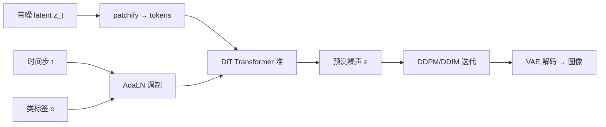
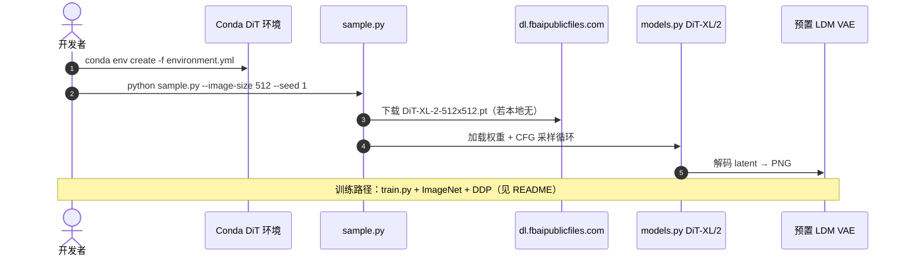

# DiT：可扩展的 Transformer 扩散模型

**DiT**（*Scalable Diffusion Models with Transformers*，[arXiv:2212.09748](https://arxiv.org/abs/2212.09748)，[项目页](https://www.wpeebles.com/DiT)，[代码](https://github.com/facebookresearch/DiT)）由 **William Peebles**（加州大学伯克利分校 UC Berkeley）、**Saining Xie**（纽约大学 NYU）提出（Peebles 实习于 **Meta AI FAIR**）：在 **隐空间扩散（LDM）** 中用 **patch 化 Vision Transformer** 作去噪骨干，系统验证 **前向 Gflops 与生成质量（FID）** 的可预测缩放，并在 class-conditional ImageNet 256×256 / 512×512 上取得发表时扩散模型中最好的 FID。

## 一句话定义

**扩散去噪不必绑 U-Net：把带噪 latent 当 patch token 序列，用 AdaLN 注入时间步与类别，算力（Gflops）比参数量更能决定 FID。**

## 英文缩写速查

| 缩写 | 英文全称 | 简要说明 |
|------|----------|----------|
| DiT | Diffusion Transformer | 本文：Transformer 扩散去噪骨干 |
| LDM | Latent Diffusion Model | 在 VAE latent 上扩散，降算力 |
| AdaLN | Adaptive Layer Normalization | 用 \(t\)/类别调制 LayerNorm，本文最佳条件注入 |
| CFG | Classifier-Free Guidance | 训练随机丢类标签，推理混合条件/无条件噪声 |
| FID | Fréchet Inception Distance | ImageNet 生成质量主指标（越低越好） |
| Gflops | Giga floating-point operations | 本文缩放分析的核心复杂度度量 |

## 为什么重要

- **架构统一：** 证明扩散图像生成可与 ViT/语言 Transformer **同族缩放**，U-Net 跳跃连接并非必要条件（对后续 **VLA / WAM 动作 DiT 头** 是概念先例）。
- **可预测的 scaling law（图像域）：** 在控制训练步数下，**更高 Gflops**（更深更宽或更小 patch → 更多 token）→ **更低 FID**；参数量 alone 不足以解释（如 XL/8 vs XL/2）。
- **机器人侧读法：** 本站 [Diffusion Transformer 概念页](../concepts/diffusion-transformer.md) 与 [VLA](../methods/vla.md) 中的「DiT 动作专家」多指 **本条骨干 + flow/DDPM 目标** 的迁移，而非 ImageNet 类条件训练配方本身。
- **可复现：** [facebookresearch/DiT](https://github.com/facebookresearch/DiT) 提供 `sample.py` 与 XL/2 权重；与机器人专用 [DiT4DiT](./paper-dit4dit-video-action-model.md)（双 DiT 联合 VAM）区分命名。

## 核心信息

| 项 | 内容 |
|----|------|
| **机构** | 加州大学伯克利分校（UC Berkeley）；纽约大学（NYU）；Meta AI FAIR（Peebles 实习） |
| **出处** | ICCV 2023 Oral；arXiv:2212.09748（2022-12） |
| **任务** | Class-conditional ImageNet 256×256 / 512×512 生成 |
| **骨干** | 冻结卷积 VAE latent + **DiT**（patch embed + DiT blocks + AdaLN） |
| **缩放网格** | 4 规模 × 3 patch（2/4/8）= 12 配置；主结果 **DiT-XL/2** |
| **开源** | **已开源** — [facebookresearch/DiT](https://github.com/facebookresearch/DiT)；权重 README 直链；[HF Space Demo](https://huggingface.co/spaces/wpeebles/DiT) |

## 核心原理

1. **Patchify：** 带噪 latent \(z_t\)（如 32×32×4）切成 patch，线性嵌入为长度为 \(T=(I/p)^2\) 的 token 序列；**patch 大小 \(p\)** 是调节 Gflops 的主旋钮（\(p\) 减半 → token 约 ×4 → Gflops 约 ×4）。
2. **DiT block：** 在标准 ViT block 上，用 **AdaLN-Zero** 注入扩散时间步与类标签 embedding，并在 **残差分支前** 做 scale/shift；初始化使 block 接近恒等，稳定训练。
3. **训练目标：** 与 DDPM 一致，预测噪声 \(\epsilon_\theta(z_t,t,c)\)（及学习方差分支）；**CFG** 训练时随机将类标签换为 null embedding。
4. **采样：** DDPM / DDIM 等标准迭代；项目页展示 DDIM 隐空间 walk 与 label embedding 插值。

### 流程总览

## 源码运行时序图

官方仓入口见 [sources/repos/facebookresearch-dit.md](../../sources/repos/facebookresearch-dit.md)：

## 评测与指标

| 模型 | 分辨率 | FID-50K | Inception Score | 去噪 Gflops |
|------|--------|---------|-----------------|-------------|
| DiT-XL/2 | 256×256 | **2.27** | 278.24 | 119 |
| DiT-XL/2 | 512×512 | **3.04** | 240.82 | 525 |
| 对照 LDM-4 / ADM-U | 256 | 3.60 / — | — | 103 / 742 Gflops 级 |

- **Scaling：** 400K iter 快照下，12 配置呈 **Gflops–FID** 单调改善；**XL/2** 在相同训练预算下 **算力效率** 优于多种 U-Net 扩散（论文 Fig.2）。
- **CFG：** 256 常用 scale 4.0、512 常用 6.0（项目页采样设置）。
- **机器人 relevance：** 本文 **不** 含操控/导航 benchmark；对具身栈的价值在 **架构与缩放证据**，见 [diffusion-transformer](../concepts/diffusion-transformer.md)。

## 与其他工作对比

| 对照 | DiT（本文） | U-Net LDM / ADM | 机器人 [DiT4DiT](./paper-dit4dit-video-action-model.md) |
|------|-------------|-----------------|-----------------------------------------------------------|
| 骨干 | patch ViT + AdaLN | 卷积 U-Net + 空间注意力 | **双 DiT**（Video + Action）联合 flow matching |
| 条件 | 类标签 + 时间步 | 同类 + 多模态变体 | 视频隐状态 + 动作块 |
| 缩放度量 | **Gflops** 为主 | 参数量/Gflops 均有讨论 | 样本效率相对 Grounding/FLARE（机器人指标） |
| 开源 | facebookresearch/DiT | 各基线分散 | Mondo-Robotics/DiT4DiT |

## 结论

**DiT 把「Transformer 能否替代 U-Net 做扩散」答成肯定，并用 Gflops–FID 给出可复现的缩放曲线，成为后续文生图与具身 DiT 动作头的共同模板。**

- 选型时优先看 **目标 Gflops / token 数**，不要只看参数量（XL/8 反例）。
- 条件注入上 **AdaLN-Zero 残差调制** 是稳定训练的关键细节，迁移到动作 DiT 时值得保留。
- 复现论文图像结果走 `sample.py` + 官方权重；训练全量 ImageNet 需 DDP 与数据管线，与机器人小数据微调不是同一路径。
- 读 VLA 论文中的 DiT 头：数学仍是扩散/flow，**骨干结构** 可回溯本文。
- ImageNet 类条件 ≠ 语言/动作条件；跨模态需另设计 cross-attn 或观测 encoder（见 WAM/VLA 页）。

## 工程实践

| 项 | 建议 |
|----|------|
| 最短验证 | `sample.py --image-size 256` 拉权重生成 grid |
| 算力规划 | patch 2 显著增 Gflops；高分辨率优先 LDM + 适中 patch |
| 与 diffusers | HF diffusers DiT pipeline 适合快速对比采样器 |
| 机器人 | 动作序列更短，常缩小 depth/width；延迟看 **每步注意力成本** |

## 局限与风险

- **二次注意力成本：** token 数随分辨率/patch 爆炸；机器人实时环需截断步数或蒸馏。
- **类条件 ImageNet 配方** 不能直接套用到语言条件 VLA，需重训条件接口。
- VAE 质量与 latent 尺度绑定；换 VAE 须重训 DiT。

## 关联页面

- [Diffusion Transformer（概念）](../concepts/diffusion-transformer.md)
- [扩散模型](../concepts/diffusion-model.md)
- [Diffusion Policy](../methods/diffusion-policy.md)
- [VLA](../methods/vla.md)
- [DiT4DiT（机器人双 DiT VAM）](./paper-dit4dit-video-action-model.md)
- [RCL Awesome WAM 技术地图](../overview/rcl-awesome-wam-technology-map.md)（Components 分组 #086）

## 参考来源

- [DiT 论文归档（arXiv:2212.09748）](../../sources/papers/peebles_dit_arxiv_2212_09748.md)
- [DiT 项目页（wpeebles.com）](../../sources/sites/dit-wpeebles-com.md)
- [facebookresearch/DiT 仓库归档](../../sources/repos/facebookresearch-dit.md)

## 推荐继续阅读

- [ICCV 2023 OpenAccess 论文页](https://openaccess.thecvf.com/content/ICCV2023/html/Peebles_Scalable_Diffusion_Models_with_Transformers_ICCV_2023_paper.html)
- [Hugging Face DiT Space](https://huggingface.co/spaces/wpeebles/DiT)
- [Latent Diffusion Models（Rombach et al.）](https://arxiv.org/abs/2112.10752) — DiT 训练的 latent 框架
