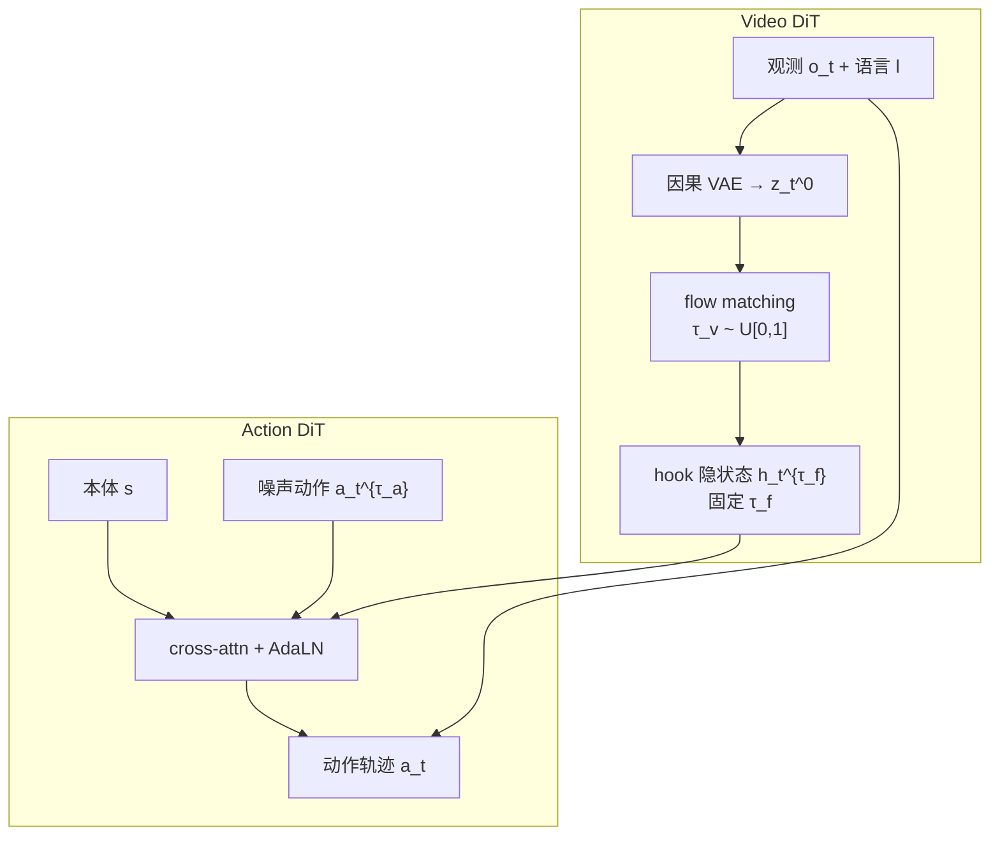

# DiT4DiT（双 DiT 联合视频–动作建模）

**DiT4DiT**（*Jointly Modeling Video Dynamics and Actions for Generalizable Robot Control*，arXiv:2603.10448，[项目页](https://dit4dit.github.io/)，[代码](https://github.com/Mondo-Robotics/DiT4DiT)，Mondo Robotics · 港科大（广州）· 港科大）提出端到端 **Video-Action Model（VAM）**：**Video DiT** 与 **Action DiT** 在 **dual flow-matching** 下联合优化，用视频生成过程的 **中间去噪隐特征**（非重建像素未来帧）条件动作预测，把 **视频生成** 确立为相对 Grounding / FLARE 更强的 **机器人策略 scaling proxy**。

## 一句话定义

**联合训练 Video DiT 与 Action DiT，从视频去噪隐状态直接解码机器人动作**——用生成式物理动力学先验替代 VLA 的静态图文骨干。

## 英文缩写速查

| 缩写 | 英文全称 | 简要说明 |
|------|----------|----------|
| VAM | Video-Action Model | 视频动力学与动作联合建模的具身策略 |
| VLA | Vision-Language-Action | 本文主要对照的静态 VLM 先验路线 |
| DiT | Diffusion Transformer | Video / Action 双骨干架构 |
| FM | Flow Matching | 双模块共享的连续流匹配训练目标 |
| WAM | World Action Model | 更广义的联合世界–动作建模范式 |

## 为什么重要

- **把「视频生成 = 预训练目标」做成可证伪假设：** §3 在 RoboCasa-GR1 上系统对比 Grounding、FLARE 式 VLM 对齐与 **视频生成**，后者 **~7× 更快收敛、~10× 更高样本效率**——为后续 WAM/VAM 路线提供实证锚点。
- **相对 mimic-video 的关键推进：** 二者均用 Cosmos 系 Video DiT + 中间隐状态条件动作，但 DiT4DiT **端到端联合微调** 两路 DiT，并引入 **三时间步**（$\tau_v$ / 固定 $\tau_f$ / Beta 采样 $\tau_a$），而非冻结视频骨干只训动作头。
- **人形真机与开源：** G1 上 **八项桌面 + 三项全身 loco-manip**（可选 **+SONIC** 或 decoupled WBC）；官方 **MIT 代码** 降低复现门槛。
- **谱系枢纽：** 同团队 [MotionWAM](./paper-motionwam-humanoid-loco-manipulation-wam.md)（arXiv:2606.09215）明确 **继承 DiT4DiT 双 DiT + flow matching 接口**，面向 **实时人形全身 loco-manipulation** 与 **SONIC 统一 motion token**。

## 核心结构

| 模块 | 作用 |
|------|------|
| **Video DiT** | Cosmos-Predict2.5-2B 初始化；因果 VAE 压缩 $\mathbf{o}_t,\mathbf{o}_{t+1}$；flow matching 预测未来 latent 速度场 |
| **隐状态 hook** | 在固定 $\tau_f$ 从 Video DiT 抽取 $\mathbf{h}_t^{\tau_f}$，作为 Action DiT 的 cross-attn 条件 |
| **Action DiT** | GR00T-N1 系改编；本体 + 噪声动作序列 + future tokens；预测动作 flow 速度场 |
| **三时间步** | $\tau_v$ 均匀采样学全视频去噪；$\tau_f$ 固定稳特征；$\tau_a$ Beta 偏重关键控制相位 |

### 流程总览

## 实验要点（索引级）

| 轴 | 报告口径 |
|----|----------|
| **LIBERO** | 四套件平均 **98.6%**（Long **97.6%**） |
| **RoboCasa-GR1** | 24 任务平均 **50.8%**（论文摘要）/ 项目页 **56.7%** vs GR00T-N1.6 **47.8%** |
| **G1 真机** | 八项桌面 + 三项全身 loco-manip；单目 egocentric；优于 GR00T-N1.5、Qwen3DiT |
| **泛化** | 未见物体/类别/数量；如 Arrange Flower 类别变化 **70%** vs Qwen3DiT **0%** |
| **效率** | **2.2B** 可训参数；A100 **6 Hz**（相对 Cosmos Policy **0.7 Hz**、mimic-video **1.9 Hz**） |

## 常见误区或局限

- **误区：** 把 DiT4DiT 等同于「任意视频生成 + 动作头」；关键是 **联合 flow matching** 与 **固定 $\tau_f$ 的稳定隐特征提取**，而非两阶段拼接。
- **误区：** 认为 6 Hz 慢于 GR00T（13 Hz）即不可用；论文主张 **动作质量** 在闭环中更关键，且同接口可演进至 [MotionWAM](./paper-motionwam-humanoid-loco-manipulation-wam.md) 的 **单次前向实时** 设定。
- **局限：** 全身 loco-manip 在 DiT4DiT 原文中任务规模小于后续 MotionWAM 九项套件；跨硬件平台迁移需重新验证三时间步与 projector 配置。

## 方法栈

见上文 **核心结构** 与 **流程总览**；训练冻结 VAE / 文本编码器，仅更新 Video + Action DiT；推理可 **仅采样动作** 或同步生成未来视频计划（Algorithm 2）。

## 与其他工作对比

| 工作 | 关系 |
|------|------|
| **[mimic-video](../methods/mimic-video.md)** | 同 Cosmos 骨干 + 中间隐状态条件动作；DiT4DiT **联合训练** 两路 DiT，mimic-video **冻结** 视频骨干 |
| **Cosmos Policy** | 同类世界模型策略；迭代去噪更慢（**0.7 Hz**） |
| **GR00T-N1.5 / Qwen3DiT** | 参数匹配 VLA 基线；DiT4DiT 在 G1 与 RoboCasa 上显著领先 |
| **[MotionWAM](./paper-motionwam-humanoid-loco-manipulation-wam.md)** | **后续工作**：同双 DiT 接口 + **SONIC 统一全身 token** + 三阶段 egocentric 预训练；**实时人形 loco-manip WAM** |

## 关联页面

- [MotionWAM（人形实时 WAM）](./paper-motionwam-humanoid-loco-manipulation-wam.md) — 同团队谱系延伸
- [World Action Models（WAM）](../concepts/world-action-models.md) — Joint 族文献坐标
- [mimic-video（VAM）](../methods/mimic-video.md) — 冻结骨干对照
- [VLA](../methods/vla.md) — 静态先验基线语境
- [SONIC](../methods/sonic-motion-tracking.md) — G1 全身低层接口（+SONIC 演示）
- [Loco-Manipulation](../tasks/loco-manipulation.md) — 全身任务族

## 参考来源

- [DiT4DiT 论文摘录（arXiv:2603.10448）](../../sources/papers/dit4dit_arxiv_2603_10448.md)
- [Mondo-Robotics/DiT4DiT 仓库归档](../../sources/repos/mondo_robotics_dit4dit.md)
- [DiT4DiT 项目页归档](../../sources/sites/dit4dit-project.md)

## 推荐继续阅读

- [DiT4DiT 论文（arXiv:2603.10448）](https://arxiv.org/abs/2603.10448)
- [MotionWAM（arXiv:2606.09215）](https://arxiv.org/abs/2606.09215) — 同团队人形实时 WAM 推进
- [mimic-video（arXiv:2512.15692）](https://arxiv.org/abs/2512.15692) — 冻结视频骨干 VAM 对照
