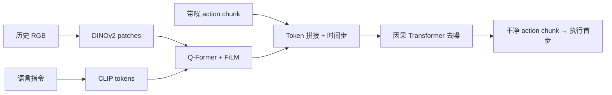
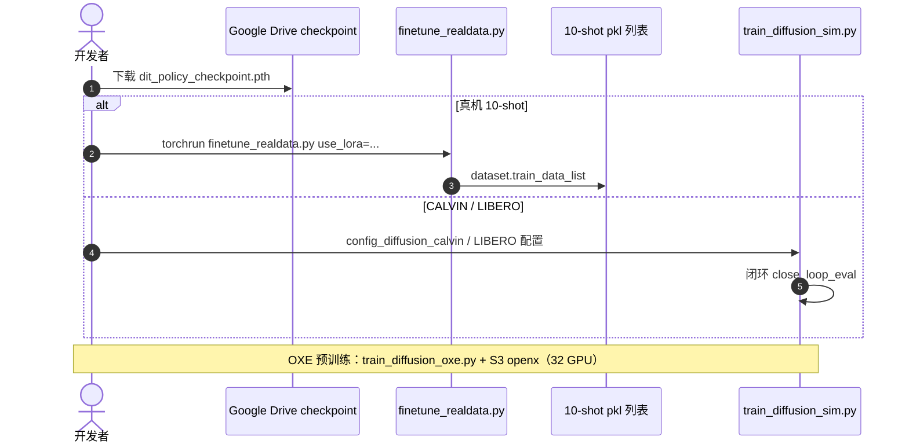

# Dita：可扩展的扩散 Transformer 通才 VLA

**Dita**（*Dita: Scaling Diffusion Transformer for Generalist Vision-Language-Action Policy*，[arXiv:2503.19757](https://arxiv.org/abs/2503.19757)，[项目页](https://robodita.github.io/)，[代码](https://github.com/RoboDita/Dita)）由 **侯智、张天怡、熊雨文、蒲恒俊、赵成阳** 等提出（上海 AI Lab、浙大、清华、港中文 MMLab、北大、商汤等；Yuntao Chen 通讯）。工作源自预印本 [**Diffusion Transformer Policy**](https://arxiv.org/abs/2410.15959)（2410.15959）：用 **大 Transformer 在 action chunk 上做多模态扩散去噪**，以 **in-context conditioning** 对齐历史视觉 token，替代 OpenVLA 离散动作 token 与 Octo 小 MLP 扩散头。

## 一句话定义

**把 VLA 的「动作头」换成与观测 token 同序列的扩散 Transformer，让 chunk 级连续动作随模型一起缩放。**

## 英文缩写速查

| 缩写 | 英文全称 | 简要说明 |
|------|----------|----------|
| Dita | Diffusion Transformer（VLA 通才版） | 本文命名；非图像 DiT 论文 |
| VLA | Vision-Language-Action | 视觉–语言–动作策略 |
| OXE | Open X-Embodiment | 跨本体预训练数据 |
| DP | Diffusion Policy | 动作 chunk DDPM 去噪范式 |
| Q-Former | Query Transformer | 用指令查询 DINOv2 patch，降算力 |
| LoRA | Low-Rank Adaptation | 真机 10-shot 默认配方（全参微调更鲁棒） |

## 为什么重要

- **架构分界：** 与 [OpenVLA](./paper-openvla.md)（Llama 自回归 **离散** 动作 bin）和 [Octo](./paper-octo.md)（Transformer embedding + **小** 扩散 MLP）并列，代表 **「大扩散骨干 = 动作生成器」** 的通才路线。
- **Scaling：** 利用 Transformer + 扩散的可扩展性，在 **OXE** 上预训练后迁移 CALVIN / LIBERO / [SimplerEnv](https://github.com/simpler-env/SimplerEnv) 与 **Franka 真机**。
- **Few-shot 真机：** 项目页强调 **第三人称单相机** + **10-shot** 微调完成长时域操作（开抽屉、倒水、叠碗等）。
- **已开源：** [RoboDita/Dita](https://github.com/RoboDita/Dita)（MIT）+ Google Drive 权重；README 明确 2410.15959 为 **Earlier preprint**。

## 核心信息

| 项 | 内容 |
|----|------|
| **机构** | 上海人工智能实验室；浙江大学；清华大学；香港中文大学 MMLab；北京大学；商汤科技；中科院 HKISI 等 |
| **出处** | arXiv:2503.19757（2025）；前序 arXiv:2410.15959（2024，*Diffusion Transformer Policy*） |
| **视觉–语言** | 冻结 **CLIP** 文本；**DINOv2** 图像 patch（端到端可训）+ **Q-Former**（FiLM 指令条件） |
| **动作** | 7D 末端执行器（平移+旋转向量+夹爪）；**action chunk** 扩散去噪 |
| **预训练** | Open X-Embodiment（S3 `openx`；README 示例 32 GPU） |
| **开源** | **已开源** — GitHub + Drive checkpoint；OXE 全量预训练需自有 S3/算力 |

## 核心原理

1. **Token 序列：** 拼接 **语言 token、图像观测 token、扩散步 embedding、带噪 action chunk token**，送入 **因果 Transformer**，预测 DDPM 噪声（in-context，非先 fuse 再小头去噪）。
2. **动机：** 动作去噪需对齐 **细粒度视觉 patch**（如 action delta）；单一 fused embedding + MLP（Octo 式）在跨本体、多视角 OXE 上容量不足。
3. **与 [ScaleDP](./paper-scaledp-scaling-diffusion-transformer-policy.md) 区别：** ScaleDP 聚焦 **单任务 IL 的 DP-T 加深**；Dita 是 **语言条件通才 VLA + OXE**，并强调 **chunk 级 in-context 扩散**。
4. **与 [DiT 图像](./paper-dit-scalable-diffusion-transformers.md) 区别：** 同族 **AdaLN/Transformer 扩散** 思想，任务为 **机器人连续控制** 而非 ImageNet 生成。

### 流程总览

## 源码运行时序图

官方仓见 [sources/repos/robodita_dita.md](../../sources/repos/robodita_dita.md)：

## 评测与指标

### SimplerEnv（README 表，OXE 预训练）

| 子任务 | Dita | RT-1-X | Octo-Base | OpenVLA |
|--------|------|--------|-----------|---------|
| coke_can/matching | **0.837** | 0.567 | 0.17 | 0.163 |
| coke_can/variant | **0.855** | 0.490 | 0.006 | 0.545 |
| move_near/matching | **0.760** | 0.317 | 0.042 | 0.462 |
| drawer/matching | 0.463 | **0.597** | 0.227 | 0.356 |

- 2410 摘要：CALVIN ABC→D **连续 5 任务** 平均完成数约 **3.6**（相对基线 +1.2 量级）；LIBERO / ManiSkill2 见原文与项目页视频。

### 真机（项目页）

- **10-shot** 微调；长时域多步与 **背景/桌布/光照** 方差视频。

## 与其他工作对比

| 轴 | Dita | OpenVLA | Octo | ScaleDP |
|----|------|---------|------|---------|
| 动作表示 | 连续 chunk **扩散 Transformer** | 离散 256-bin token | 小 MLP 扩散头 | 无语言；DP-T 缩放 |
| 预训练 | OXE | OXE | OXE | 无通才 VLA 叙事 |
| 开源 | RoboDita/Dita | openvla/openvla | octo-models/octo | 未开源 |

## 结论

**Dita 把「通才 VLA」的动作生成从浅层头升级为可扩展的 in-context 扩散 Transformer，并在 Real-to-Sim 与 10-shot 真机给出开源基线。**

- 选型：要 **连续 chunk + 扩散** 且需对标 OpenVLA/Octo 时，优先评估 Dita checkpoint 与微调脚本。
- 微调：README 建议 **全参微调** 往往比 LoRA **更抗环境方差**；10-shot 只是下限演示。
- 成本：OXE **从头预训练** 需 S3 与多机；多数团队从 **Released checkpoint** 做 CALVIN/LIBERO/真机。
- 文献：引用以 **2503.19757** 为准；2410.15959 为 **Earlier preprint**（同一研究线）。
- 勿与 **ManiSkill 策略名 Dita** 以外部 Apache Spark「ScaleDP」库混淆。

## 工程实践

| 项 | 建议 |
|----|------|
| 环境 | Python 3.9 + PyTorch 2 + CUDA 12.1；CALVIN 单独 requirements |
| 真机 | `finetune_realdata.py` + pkl 列表；`scheduler_type=0` → 100 DDPM 训练步 |
| LIBERO | 先按 OpenVLA 文档准备 **修改版 LIBERO 数据集** |
| 对照 | README 提供 **Diffusion MLP Head** checkpoint 作 ablation |

## 局限与风险

- OXE 预训练 **门槛高**（密钥、带宽、32 GPU 示例）。
- 第三人称单相机设定 **不** 直接等于腕部相机部署。
- 2410 与 2503 指标 **不可** 无核对混引（版本与实验表有更新）。

## 关联页面

- [VLA（方法）](../methods/vla.md)
- [Diffusion Policy](../methods/diffusion-policy.md)
- [OpenVLA](./paper-openvla.md)
- [Octo](./paper-octo.md)
- [ScaleDP](./paper-scaledp-scaling-diffusion-transformer-policy.md)

## 参考来源

- [Dita 论文归档（2410.15959 / 2503.19757）](../../sources/papers/dita_arxiv_2410_15959.md)
- [robodita.github.io 项目页](../../sources/sites/robodita-github-io.md)
- [RoboDita/Dita 仓库归档](../../sources/repos/robodita_dita.md)

## 推荐继续阅读

- [Earlier preprint（2410.15959）](https://arxiv.org/abs/2410.15959)
- [OpenVLA LIBERO 评测说明](https://github.com/openvla/openvla)
- [SimplerEnv](https://github.com/simpler-env/SimplerEnv)
