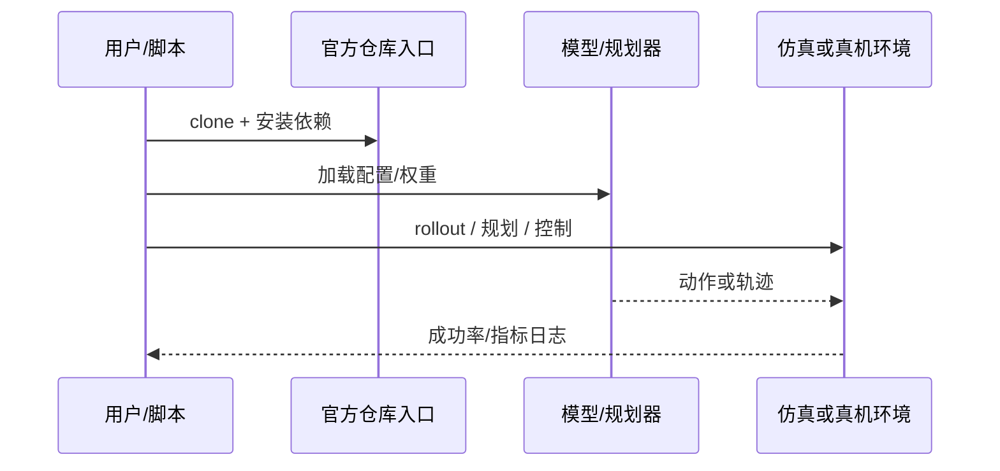

# DLSRL（arXiv:2609.11270）

**DLSRL**（[Beyond Noise Steering: Dual-Latent Space Reinforcement Learning for Generative Robot Policy](https://arxiv.org/abs/2609.11270)）来自 [具身智能小站 14 篇盘点](../../sources/blogs/wechat_embodied_station_14_papers_dexterous_wm_humanoid_2026-09-11.md)。冻结生成器下同时学习噪声与动作表示双 latent；RoboMimic 与 LIBERO 在线适配。

## 一句话定义

**别只调初始噪声——在生成策略中间表示上注入残差适配特征做 RL。**

## 英文缩写速查

| 缩写 | 英文全称 | 简要说明 |
|------|----------|----------|
| VLA | Vision-Language-Action | 视觉-语言-动作策略 |
| VLM | Vision-Language Model | 视觉-语言多模态模型 |
| WM | World Model | 预测未来观测或表征的动力学模型 |
| IL | Imitation Learning | 模仿学习 |
| RL | Reinforcement Learning | 强化学习 |
| DoF | Degrees of Freedom | 自由度 |

## 为什么重要

- 纳入本期 **灵巧手 / 世界模型 / 人形控制 / VLA** 主线之一。
- 开源状态：**已开源**（步骤 2.5 核查，2026-09-11）。
- 与 [14 篇技术地图](../overview/dexterous-wm-humanoid-14-papers-technology-map.md) 中同类工作可横向对照。

## 核心机制

| 项 | 内容 |
|----|------|
| **arXiv** | [2609.11270](https://arxiv.org/abs/2609.11270) |
| **项目页** | https://github.com/xianchaoxiu/DLSRL |
| **代码/资源** | https://github.com/xianchaoxiu/DLSRL |
| **开源** | **已开源** |
| **文内指标** | RoboMimic 与 LIBERO 实验重点考察在线适配速度。 |

## 源码运行时序图

## 实验与评测

| 项 | 文内口径 |
|----|----------|
| 要点 | RoboMimic 与 LIBERO 实验重点考察在线适配速度。 |

- **读法：** 本页为索引级摘要，上表取自 [公众号盘点](../../sources/blogs/wechat_embodied_station_14_papers_dexterous_wm_humanoid_2026-09-11.md) 与项目页；具体对照方法、任务集与逐项指标以 **原文 PDF** 为准（[参考来源](#参考来源)）。

## 与其他工作对比

- **只调初始噪声的 latent RL** — 搜索空间限于采样起点，表达力受限；DLSRL 在 **噪声 latent + 动作表示 latent** 双通道上注入残差适配特征。
- **直接微调 [Diffusion Policy](../methods/diffusion-policy.md) 权重** — 需反传整个去噪链、易破坏预训练先验；DLSRL **冻结生成器**，只学适配表示，降低在线适配成本。
- **[在线 RL vs 离线 RL](../comparisons/online-vs-offline-rl.md)** — 本文落在「离线预训练生成策略 + 在线适配」的组合位，文内以 RoboMimic 与 LIBERO 的 **在线适配速度** 为主要观察量。
- **[IMLE-VLA](./paper-imle-vla.md)** — 同样面向生成式策略的中间表示，但目标是 **单步采样加速**；DLSRL 目标是 **适配/提升成功率**。
- **[模仿学习 vs 强化学习](../comparisons/rl-vs-il.md)** — 该页给出两类监督信号的取舍；DLSRL 是「IL 打底、RL 精修」的典型折中。

- **读法：** 以上为知识库内 **路线级** 对照；与原文 baseline 的逐项定量比较与消融以 **原文 PDF** 为准（[参考来源](#参考来源)）。

## 结论

**DLSRL 适合作为本期「已开源」边界下的快速索引页，部署前请核对仓库/README 可运行性。**

1. 核心贡献：别只调初始噪声——在生成策略中间表示上注入残差适配特征做 RL。
2. 开源结论：**已开源** — 以项目页实际链接为准（入库日 2026-09-11）。
3. 横向对照见 [14 篇技术地图](../overview/dexterous-wm-humanoid-14-papers-technology-map.md)，避免与同 arXiv 重复造页。

## 关联页面

- [14 篇技术地图](../overview/dexterous-wm-humanoid-14-papers-technology-map.md)
- [VLA（Vision-Language-Action）](../methods/vla.md)
- [Generative World Models](../methods/generative-world-models.md)
- [Manipulation](../tasks/manipulation.md)

## 参考来源

- [dlsrl_arxiv_2609_11270.md](../../sources/papers/dlsrl_arxiv_2609_11270.md)
- [wechat 14篇盘点](../../sources/blogs/wechat_embodied_station_14_papers_dexterous_wm_humanoid_2026-09-11.md)
- [arXiv:2609.11270](https://arxiv.org/abs/2609.11270)

## 推荐继续阅读

- [arXiv PDF](https://arxiv.org/pdf/2609.11270)
- [项目页/资源](https://github.com/xianchaoxiu/DLSRL)
- [代码/资源](https://github.com/xianchaoxiu/DLSRL)
