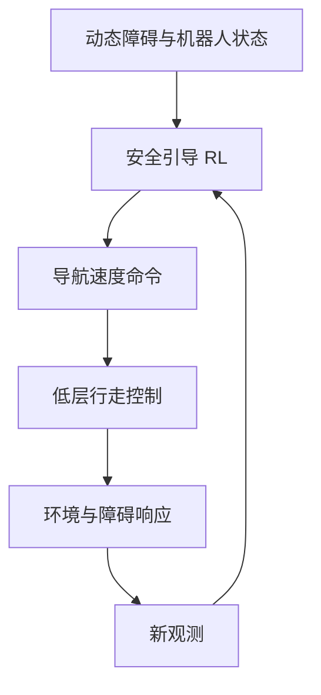

# DODGER：动态障碍中的安全引导导航

**DODGER**（*Safety-Guided Reinforcement Learning for Robot Navigation Among Dynamic Obstacles*，[arXiv:2609.38873](https://arxiv.org/abs/2609.38873)，[项目页](https://psh0823.github.io/dodger-homepage/)）研究机器人如何在人群等动态障碍中选择安全导航动作。

## 一句话理解

高层根据目标和移动障碍决定速度指令，低层行走控制器负责把指令变成稳定身体运动。

## 英文缩写速查

| 缩写 | 英文全称 | 简要说明 |
|---|---|---|
| CBF | Control Barrier Function | 控制屏障函数 |
| RL | Reinforcement Learning | 强化学习 |

## 流程总览

以下按本页已归纳的机制与资料绘制，表示模块或阅读路径关系。

## 方法要点

- 以关系图组织机器人、目标和动态行人信息。
- 训练阶段使用控制屏障函数和安全引导信号，部署时由学习策略输出导航命令。
- 该接口把高层路线选择与低层平衡控制连接起来。

## 参考来源

- [arXiv:2609.38873](https://arxiv.org/abs/2609.38873)
- [项目页](https://psh0823.github.io/dodger-homepage/)
- [Day 2 文章来源索引](../../sources/blogs/humanoid_motion_intelligence_day2_locomotion_motion_priors_2026_10_03.md)

## 评测

文章报告 Unitree G1 在人群中绕过五名行人；成功定义与完整设置以论文为准。

## 与其他工作对比

DODGER输出导航速度命令；低层行走控制仍负责动态平衡和跟踪。

## 结论

DODGER展示了高层安全导航命令与低层行走能力之间的控制接口。

## 关联页面

- [locomotion](../tasks/locomotion.md)
- [humanoid-locomotion](../tasks/humanoid-locomotion.md)
