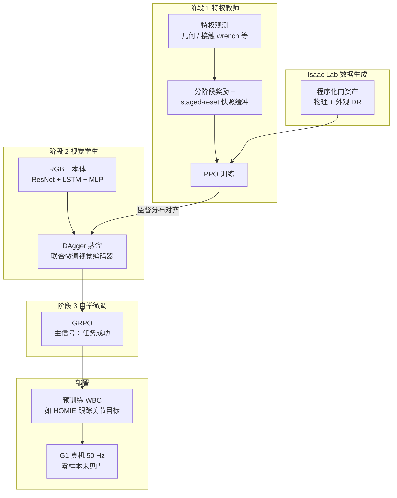

# DoorMan（Opening the Sim-to-Real Door for Humanoid Pixel-to-Action Policy Transfer）

**DoorMan** 是 NVIDIA GEAR 等团队的人形 **视觉 loco-manipulation** 论文（arXiv:2512.01061，CVPR 2026）：策略 **完全在仿真中训练**，部署时仅 **机载 RGB + 本体感知**，在 **Unitree G1** 上对 **未见过的真实门** 做 **零样本** 开关门与穿行。与姊妹工作 [VIRAL](./paper-viral-humanoid-visual-sim2real.md) 同属 [GR00T-VisualSim2Real](./gr00t-visual-sim2real.md) 开源栈，但 DoorMan 强调 **铰接接触 + 长时域** 下的 **像素到关节目标** 迁移与 **GRPO 自举**。

## 为什么重要

- **任务对准日常难点**：门把手弹簧负载、铰链约束力与 **全身平衡** 强耦合，是「看似简单、实则难」的 **接触丰富 loco-manipulation** 代表。
- **算法配方可复用**：**分阶段重置** 解决教师 RL 在长桥接转移上的探索不足；**DAgger → GRPO** 把「模仿特权教师」与「在自身观测分布上自举」拆成可插拔两阶段。
- **视觉 Sim2Real 证据链完整**：系统消融 **PBR 纹理 / 穹顶光 / 相机参数** 对 RGB 策略泛化的影响，量化 **无强视觉随机化时性能崩塌** 的现象。

## 流程总览

## 核心机制（归纳）

### 特权教师与接口

- **算法**：PPO；观测含 **根–门、双手–把手** 等 **特权几何**、手部 **接触 wrench**、根线速度等（部署时不假设可得）。
- **动作**：对 **预训练 WBC** 输出 **关节目标**（论文强调 **50 Hz** 推理与 **高维动作** 下仍须细粒度力矩级平衡，故依托 WBC 而非从裸力矩学起）。
- **分阶段奖励**：将接近、抓拧把手、开门板、穿行等拆成 **阶段条件奖励**，降低长时域信用分配难度。

### Staged-reset 探索

- 进入新阶段时，将仿真 **广义坐标快照** 写入 **滚动缓冲**（论文主实验取 **最近 100 步** 量级）。
- 环境 reset 时按 **混合律** 从「初始阶段」与「已达成的中后期阶段」采样初始化，从而 **提高后期状态占用率**，缓解早期错误接触导致策略 **回避关键阶段** 的问题。

### 视觉学生与 GRPO

- **学生**：**ResNet** 图像编码（与策略 **联合微调**）+ 本体 → **LSTM** → **MLP** 输出关节目标；用 **DAgger** 在 **学生自身会遇到的观测分布** 上持续向教师取标签。
- **GRPO 微调**：在 **任务成功二值信号** 为主、辅以速度/加速度/动作平滑惩罚的条件下，用 **组相对优势** 做近似 PPO 的 **actor-only** 更新，缩小 **特权 vs RGB** 带来的 **部分可观测缺口**；论文观察到 **保持把手在视野内** 等补偿行为。

### 仿真随机化与真机结论（量级）

- **物理**：门型、尺寸、铰链阻尼、闩锁、把手位、阻力矩等 **程序化** 随机化。
- **视觉**：**PBR 材质**、大量 **dome light**、相机内外参微扰、后处理等；消融显示 **无纹理/无穹顶光** 时成功率可降至 **约 5–20%**，全量设置下子任务约 **81–86%**（论文表 1，未见门评估）。
- **真机**：报告相对 **同 WBC 人类遥操作** 的 **成功率与耗时** 优势（具体百分比以论文图 5 与正文为准）。

## 常见误区或局限

- **算力与工程前提**：站点给出 **多卡 × 数十小时** 量级的蒸馏与 GRPO 叙述；与 [VIRAL](./paper-viral-humanoid-visual-sim2real.md) 类似，应把 **并行仿真吞吐** 视作方法的一部分。
- **WBC 依赖**：策略输出 **关节目标** 而非裸力矩；更换人形栈需对齐 **动作维度与安全区域**。
- **失败模式**：项目页与论文均提到 **未建模铰接状态、距离感知、门框碰撞** 等残留风险。

## 关联页面

- [GR00T-VisualSim2Real](./gr00t-visual-sim2real.md)
- [VIRAL（论文实体）](./paper-viral-humanoid-visual-sim2real.md)
- [Sim2Real](../concepts/sim2real.md)
- [Privileged Training](../concepts/privileged-training.md)
- [Domain Randomization](../concepts/domain-randomization.md)
- [Contact-Rich Manipulation](../concepts/contact-rich-manipulation.md)
- [Loco-Manipulation](../tasks/loco-manipulation.md)
- [Unitree G1](./unitree-g1.md)
- [Isaac Gym / Isaac Lab](./isaac-gym-isaac-lab.md)
- [Tairan He](./tairan-he.md)

## 参考来源

- [sources/papers/doorman_opening_sim2real_arxiv_2512_01061.md](../../sources/papers/doorman_opening_sim2real_arxiv_2512_01061.md)
- [sources/sites/doorman-humanoid-github-io.md](../../sources/sites/doorman-humanoid-github-io.md)
- Xue, He, Wang, Ben, Xiao, Luo, Da, Castañeda, Shi, Sastry, Fan, Zhu, *Opening the Sim-to-Real Door for Humanoid Pixel-to-Action Policy Transfer*, arXiv:2512.01061, 2025. <https://arxiv.org/abs/2512.01061>

## 推荐继续阅读

- [DoorMan 项目主页](https://doorman-humanoid.github.io/)
- [NVlabs/GR00T-VisualSim2Real](https://github.com/NVlabs/GR00T-VisualSim2Real) — 官方实现与任务配置
- [Isaac Lab 动画录制指南](https://isaac-sim.github.io/IsaacLab/main/source/how-to/record_animation.html) — 项目页披露的渲染/录像工作流
