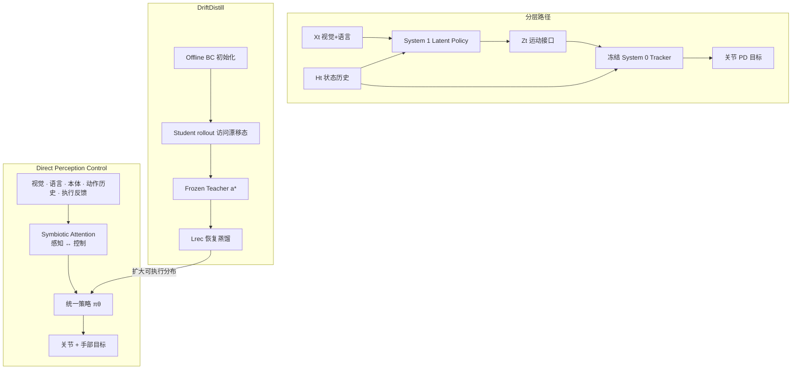

# DPC：Direct Perception Control（直接感知控制）

**DPC**（*Direct Perception Control Model*，[项目页](https://symbiosis-robotics.com/research/dpc/en/)，[规范引用](https://symbiosis-robotics.com/research/dpc)）是 **Symbiosis Robotics** 在 2026-08 发布的公司研究报告：主张把智能模型的边界从「生成待跟踪的运动学目标」推到「依赖当前身体状态、可直接执行的物理动作」。它把 [Helix](https://www.figure.ai/news/helix)、[Gemini Robotics 2](./gemini-robotics.md)、[ω-0](./paper-omega-0.md)、[MotionWAM](./paper-motionwam-humanoid-loco-manipulation-wam.md) 等分层全身系统写成 **System 1 Latent Policy → \(Z_t\) → 冻结 System 0 Whole-Body Tracker**，并以冻结 [SONIC](../methods/sonic-motion-tracking.md) 解码器为具体靶，给出三条可证伪的信息瓶颈。

## 一句话定义

**去掉中间运动 token，让视觉–语言–本体在关节 PD 目标空间联合学习，再用闭环蒸馏把可执行分布从 locomotion-centric 先验里撑开。**

## 英文缩写速查

| 缩写 | 英文全称 | 简要说明 |
|------|----------|----------|
| DPC | Direct Perception Control | 本文去掉运动接口的直接感知–控制模型 |
| SONIC | Scalable Online Neural whole-body Integrated Control | 页内冻结 System 0 的 64 维 motion token / 29 维 PD 解码器靶 |
| SA | Symbiotic Attention | 感知表示与控制表示在共享动作目标下互相关注 |
| BC | Behavior Cloning | DriftDistill 的离线初始化阶段 |
| PD | Proportional–Derivative | 最终仍保留的 29 维关节目标接口 |
| G1 | Unitree G1 | 统一监督与演示所落地的人形平台 |
| WAM | World Action Model | MotionWAM / ω-0 等仍经 SONIC 接口的对照范式 |
| VLA | Vision-Language-Action | 页内 Helix / Gemini / π 系等高层感知–任务模型 |

## 为什么重要

- **把「VLA/WAM + 冻结 GMT」写成能力上限，而不是默认底座。** 2026 年大量人形 loco-manipulation 把 [SONIC](../methods/sonic-motion-tracking.md) token 当统一动作空间（[MotionWAM](./paper-motionwam-humanoid-loco-manipulation-wam.md)、[ω-0](./paper-omega-0.md)、[LEGS](./paper-legs-embodied-gaussian-splatting-vla.md)）。DPC 的论点是：缩放的是目标生成器，接触/平衡/上下身协调仍发生在冻结解码器之后。
- **瓶颈不在维度而在监督几何。** 页内明确：问题不是「64 维太小」，而是 token 损失走 \(I_{64}\)、动作损失走 \(\mathrm{rank}\le 29\) 的 \(J_h^\top J_h\)，二者全局不等价。
- **数据主张可对照产业叙事。** 15,010 h 统一到 G1 关节空间，介于 [Curr-0](./current-robotics-curr0.md) 的 human-task-hour 与 π 系异构多本体之间：先对齐执行空间，再谈混合。
- **工程读法必须保守：** 无代码、无消融表、无对照成功率；适合当选型坐标，不适合当复现基线。

## 核心信息

| 项 | 内容 |
|----|------|
| **机构** | 共生机器人（Symbiosis Robotics）；联系 info@symbioact.com |
| **类型** | 公司研究博客（非 arXiv / 无 PDF） |
| **平台** | Unitree G1；输出 29 维关节 PD 目标 + 手部目标 |
| **栈** | 单模型 direct-joint；Symbiotic Attention；DriftDistill（Offline BC → 在线恢复蒸馏） |
| **数据** | 15,010 h 统一关节轨迹：Ego 6,781 / 武装机器人 4,024 / 轮式人形 3,660 / 双足人形 545 |
| **开源** | **确认未开源**（截至 **2026-08-17** 项目页未列 GitHub / 权重 / 数据集） |

## 核心原理

### 方法栈：三条瓶颈 → 直接关节监督

页内把旧路径写成顺序三层，而不是单一「端到端 vs 分层」口号：

| 层 | 旧路径（冻结 SONIC） | Direct-joint |
|----|----------------------|--------------|
| 表示 | \(X_t,H_t\to Z_t\)（运动学参考） | 无中间 \(Z_t\)；监督落在 \(A_t\) |
| 联合训练 | 未来视觉 attend \(E_{Z,t}\)；\(\partial L_{\mathrm{future}}/\partial\theta_D=0\) | 未来视觉 attend \(E_{A,t}\)；动作损失 + 未来损失共享梯度 |
| 动作像 | \(A_t=D_{\mathrm{frozen}}(Z_t,H_t)\in M_h\) | \(A_{\mathrm{joint}}=q_{\mathrm{default}}+C_{\mathrm{scale}}A_{\mathrm{raw}}\)（可逆仿射，仍 29 维 PD） |

风险间隙（页内 sufficiency gap）：若两个任务上下文在相同 \(H\) 下塌成同一 \(Z\) 却需要不同 \(A^*\)，只读 \((Z,H)\) 的策略无法分开它们。

**自由的代价：** 放大假设类的同时放弃解码器自带的平衡/平滑先验，必须用数据与闭环训练补回来。限位、力矩饱和、安全裁剪**没有**被主张取消。

### 流程总览

### DriftDistill

1. **Ground：** 对齐的离线轨迹元组 \((t, o_{\mathrm{RGB}}, q, a)\)。
2. **Initialize：** Offline BC 得到统一策略。
3. **Visit：** 闭环 rollout 产生策略访问态（含漂移）。
4. **Correct：** \(q_t\to\pi_T\to a_t^*\)（冻结教师）。
5. **Distill：** 最小化 \(L_{\mathrm{rec}}(a_t,a_t^*)\)；Stage 2 混合 visited + demo。

循环语义是 **Visit → Correct → Absorb**：每次 rollout 扩大训练分布，针对的是冻结 System 0 覆盖不了的 loco-manipulation 混合激活区。

### 异构数据如何进同一执行空间

页内引用 [π0.5](./paper-pi05-open-world-vla.md) / [π0.7](../methods/pi07-policy.md) 说明「人体与机器人语料不能直接混」。DPC 的解法不是提示条件，而是**先把所有源转成 G1 可执行关节轨迹**：

- 遥操作人形：统一坐标系、关节定义、控制率。
- 头戴记录：从可恢复全身运动重建并重定向。
- Egocentric 视频：手/腕/末端轨迹抬到全身。

## 源码运行时序图

**不适用。** 截至 2026-08-17，项目页与页脚未列可运行官方仓库、权重或训练入口；无 README 步骤可对齐。代码若日后发布，应补 `sequenceDiagram`（节点对齐数据加载 → DriftDistill Stage 1/2 → G1 PD 部署）。

## 工程实践

| 检查项 | 建议 |
|--------|------|
| 复现入口 | **无。** 只把本页当架构对照，不要按博客数字排期训练。 |
| 源码运行时序图 | **不适用**（确认未开源） |
| 接口读法 | 仍是 G1 29 维 PD + 手部目标；「去掉接口」指去掉 **learned latent \(Z_t\)**，不是去掉底层伺服。 |
| 与 SONIC 栈并存时 | 若现有系统已经依赖冻结 GMT 的平衡先验，直接切 direct-joint 等于把平衡/平滑重新交给数据——页内自己承认这是代价。 |
| 数据对齐 | 异构源必须先落到同一关节时间序列；否则 15,010 h 不可加。 |
| 闭环蒸馏 | DriftDistill 需要可用的 Frozen Teacher；教师本身若仍是 locomotion-centric，恢复目标会把边界再画回去。 |
| 调试信号 | 页内 Pair Explorer：latent 近邻 vs 关节空间距离。若「高层很近、关节很远」，说明任务决策在接口之后。 |

## 实验与评测

公开材料是**定性真机演示**，没有成功率、对照基线或消融表。

| 任务 | 页内描述 | 能读出的耦合 |
|------|----------|--------------|
| Mobile pick-and-place | 走近锥桶、蹲抓、转身走两步放下 | 抓取 + 负重平衡 + 转向运输 |
| Constrained whole-body loco-manipulation | 紧空间躯干/手臂重配置 | 支撑与物体接触同时成立 |
| Hand–eye–foot coordination | 右脚油门、双手转向出弯 | 视觉时序 + 足端精细 + 驾驶语义 |

**读法：** 这三项都故意选「冻结 locomotion prior 的像 \(M_h\) 可能盖不住」的混合激活区；它们**不能**代替与 MotionWAM / ω-0 / GR00T 的同协议对照。

## 结论

**DPC 真正重要的是把冻结运动接口写成三条可证伪瓶颈（表示、联合训练、动作像）；15,010 h 与真机视频只是配套叙事，次要代价是放弃 GMT 先验且目前完全不可复现。**

1. **真影响：监督落点。** 把损失从 SONIC token 挪到关节目标，并让未来视觉 attend 动作表示——这是对 WAM+SONIC 栈最清楚的反对命题。
2. **真影响：动作像 \(M_h\)。** 若任务所需 \(a^*\) 落在冻结解码器像外，更好的感知/规划过不去；这比「64 维不够」更准确。
3. **真影响：数据先对齐执行空间。** 相对 π 系用提示混合异构数据，DPC 先把所有源变成 G1 关节轨迹再缩放。
4. **次要代价：先验被丢掉。** Direct-joint 放大假设类，平衡与平滑必须重学；不是免费午餐。
5. **次要代价：无定量。** 没有公开 SR / 对照 / 消融，不能据此宣称已超过 MotionWAM 或 Gemini Robotics 2。
6. **部署读法：仍是 PD 目标。** 选型时把它放进 [VLA+低层控制器](../queries/vla-with-low-level-controller.md) 的「无冻结 System 0」一档，而不是「VLA 直接驱动力矩」。
7. **工程读法：未开源。** 2026-08-17 只能当坐标，不能当训练配方。

## 与其他工作对比

| 维度 | DPC | [MotionWAM](./paper-motionwam-humanoid-loco-manipulation-wam.md) / [ω-0](./paper-omega-0.md) | [Gemini Robotics 2](./gemini-robotics.md) | 经典 [VLA+WBC](../queries/vla-with-low-level-controller.md) |
|------|-----|----------------------------------------------------------------------------------------|-------------------------------------------|---------------------------------------------------------------|
| 高层 | 与控制同一模型 | Video/latent WAM | 闭源全身 VLA | VLA / 规划器 |
| 接口 | **无 \(Z_t\)** | SONIC token / 全身 latent | 未公开；产品叙事仍是策略→电机 | EE / 任务命令 |
| 低层 | 仅 PD | 冻结或配套 SONIC 跟踪 | 未公开 | WBC / MPC |
| 闭环适应 | DriftDistill | 主要离线 + 真机微调 | On-Device 数小时适配 | 通常冻结低层 |
| 开源 | 未开源 | MotionWAM 未开源；ω-0 WIP | VLA 权重 gated | 视具体系统 |
| 定量 | 仅演示 | 有同协议 SR | 自报条形图 | 视具体系统 |

页内脚注把 Helix / Gemini 当作「可复用控制器但引入三条瓶颈」的产业例，把 ω-0 / MotionWAM 当作「latent 近邻 ≠ 关节近邻」的证据，把 π0.5 / π0.7 当作「异构语料不能直接加」的数据问题。

## 局限与风险

- **确认未开源：** 无法核对 DriftDistill 教师是谁、闭环在仿真还是真机、15,010 h 如何去重与对齐。
- **无对照实验：** 对 SONIC 的流形论证没有配公开 GEAR-SONIC 权重的失败案例表。
- **平台绑定：** 统一语料以 G1 关节为汇；跨本体要重做转换，不是 π 系那种提示条件迁移。
- **安全叙事弱：** 强调保留限位/饱和，但没有公开 CBF / 接触力约束 / 人机安全评测。
- **教师循环风险：** Frozen Teacher 若仍来自 locomotion-centric System 0，蒸馏可能把低层边界再引进来。
- **中文页：** 语言切换存在，但入库抓取时 `/research/dpc/` 正文仍可能先出英文；以英文技术稿为准。

## 关联页面

- [Loco-Manipulation](../tasks/loco-manipulation.md) — 任务坐标与「去掉运动接口」路线
- [SONIC](../methods/sonic-motion-tracking.md) — 被本页当作冻结 System 0 的具体接口
- [Query：VLA 与低级控制器融合](../queries/vla-with-low-level-controller.md) — 把 DPC 读成无冻结 tracker 的 direct-joint 档
- [MotionWAM](./paper-motionwam-humanoid-loco-manipulation-wam.md) — 页内引用的实时 WAM + SONIC token 对照
- [ω-0](./paper-omega-0.md) — 页内引用的潜空间 foresight + SONIC latent 对照
- [Gemini Robotics](./gemini-robotics.md) — 页内引用的分层全身 VLA 产品对照
- [VLA](../methods/vla.md) — 通才策略族谱
- [π0.7](../methods/pi07-policy.md) — 异构数据用提示对齐的对照解法
- [π0.5](./paper-pi05-open-world-vla.md) — 页内数据节引用
- [Curr-0](./current-robotics-curr0.md) — 另一条产业侧「反对走–手两阶段」叙事
- [Whole-Body Control](../concepts/whole-body-control.md) — 经典可复用低层对照
- [Unitree G1](./unitree-g1.md) — 执行与数据汇聚平台

## 参考来源

- [symbiosis-robotics-dpc.md](../../sources/sites/symbiosis-robotics-dpc.md) — 项目页与开源核查
- [symbiosis_dpc_direct_perception_control.md](../../sources/blogs/symbiosis_dpc_direct_perception_control.md) — 技术摘录
- [官方英文页](https://symbiosis-robotics.com/research/dpc/en/)

## 推荐继续阅读

- [Direct Perception Control 项目页](https://symbiosis-robotics.com/research/dpc/en/)
- [SONIC / GEAR](https://nvlabs.github.io/GEAR-SONIC/) — 被批评的冻结全身接口原文
- [MotionWAM（arXiv:2606.09215）](https://arxiv.org/abs/2606.09215) — 统一 SONIC token 的实时对照
- [ω-0（arXiv:2608.06375）](https://arxiv.org/abs/2608.06375) — 潜空间 WAM + SONIC 对照
- [Gemini Robotics 2 博客](https://deepmind.google/blog/gemini-robotics-2-brings-whole-body-intelligence-to-robots/) — 页内分层全身产品例
