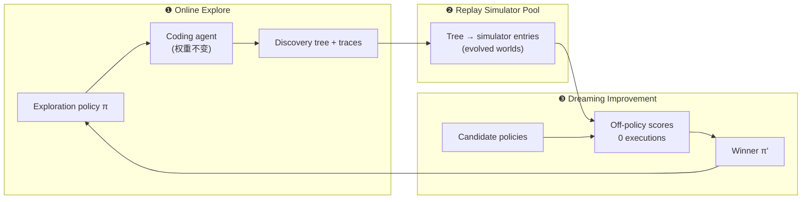
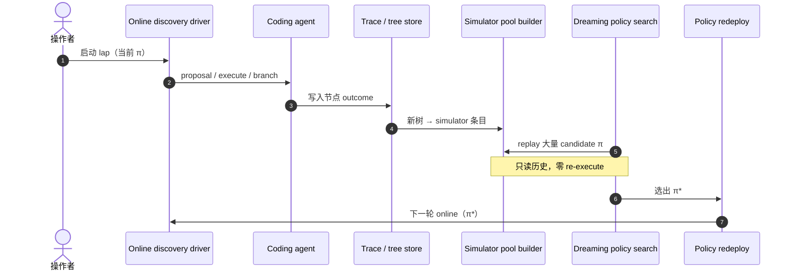

# Dream-RSI：在演化世界中递归自改进

**Dream-RSI**（[arXiv:2609.14858](https://arxiv.org/abs/2609.14858)，[dream-rsi.com](https://dream-rsi.com/)）由 **Google、Google DeepMind、马里兰大学学院公园分校（University of Maryland）、弗吉尼亚大学（University of Virginia）** 等提出：当 RSI 目标拉长到 **数千次 proposal–evaluation**，瓶颈从「写代码的 agent」转向 **exploration policy**（何时分支、并行、截断）。本文主张 **已完成 discovery 的树形历史** 本身就是 **精确 replay 模拟器** — 候选 exploration 策略只需 **换序遍历已记录节点** 即可得 **零 execution** 的 off-policy 反馈；赢家策略回到线上录 **新树**，simulator **pool 演化**，形成 **Recursive Self-Improvement through Evolving Worlds**。

## 一句话定义

**用 discovery 历史当 exact「世界」在离线 dream 中改进 exploration orchestration，再在线扩展 world pool — 不改底层 coding agent 权重。**

## 英文缩写速查

| 缩写 | 英文全称 | 简要说明 |
|------|----------|----------|
| RSI | Recursive Self-Improvement | 本文落在 **exploration 层** 的多轮自改进 |
| WM | World Model | 类比对象；本文 **不用** 学习型 WM，而用 history replay |
| MBRL | Model-Based RL | 思想类比：dream in model；此处 model = **recorded tree** |
| TES | Tree Exploration Strategy | 类 exploration 策略族；文内与 SimpleTES 等基线对照 |

## 为什么重要

- **Meta 反馈贵且慢：** 评一条 exploration policy 往往要等 **整段 discovery run** 结束；Dream-RSI 把 **已付成本的 history** 变成可批量 replay 的 **simulator pool**。
- **Exact vs learned：** 对已探索子空间 **不预测、只 replay** — 避免 WM 近似误差；代价是 **只能 dream 到 history 曾到达的分支**，故必须 **多 lap 在线扩 pool**（evolving worlds）。
- **与 harness/model RSI 正交：** [MetaRSI-v1](./paper-metarsi-v1.md) 组合 Data/Harness/Model 算子；Dream-RSI **不动 coding agent 梯度**（README：**zero gradient steps**），改 **可编程 exploration 层**。
- **对本库读者：** 算法工程 / GPU kernel / 数学优化等 **长 horizon coding discovery** 与 [AI Auto-Research](../concepts/ai-auto-research.md) 同构；机器人侧若用 agent 写 sim/reward/评测脚本，exploration RSI 可降 discovery compute — 真机 metric 仍须 [verify 环境](../queries/real-robot-policy-autoresearch-harness.md)。

## 核心信息

| 项 | 内容 |
|----|------|
| **机构** | Google · Google DeepMind · 马里兰大学学院公园分校（UMD）· 弗吉尼亚大学（UVA） |
| **项目页** | <https://dream-rsi.com/> |
| **arXiv** | [2609.14858](https://arxiv.org/abs/2609.14858) |
| **GitHub** | [zhengkid/Dream-RSI](https://github.com/zhengkid/Dream-RSI) |
| **任务** | 8 tasks，algorithm engineering · mathematical optimization · GPU kernel engineering |
| **开源** | **部分 / 待发布** — PDF + 站 + demo ✅；**完整代码与复现脚本 ⏳**（2026-09-26 项目页与 README Release plan） |

## 核心原理

### 瓶颈与对象

- **Frozen exploration 的困境：** 固定分支/并行/停止规则无法从累积失败中学习；在线 meta-搜索则 **策略空间大 × 反馈延迟贵**。
- **History-as-simulator：** 一次 run 记录 **exploration 决策树 + 各节点真实 execution 结果**；alternative policy = **不同遍历/并行/停止** over **同一棵树**，评分 **只读磁盘**。

### 流程总览

## 源码运行时序图

官方仓库截至 **2026-09-26** **未发布** 可运行训练/复现入口（README：**Code is being prepared for release**）。预期闭环（待代码落地后对齐 README 模块名细化）：

- **当前复现路径：** 读 [PDF](https://arxiv.org/pdf/2609.14858) + [dream-rsi.com 交互 demo](https://dream-rsi.com/#demos)；**不适用** 本地 `clone` 一键跑（见 [sources/repos/dream-rsi.md](../../sources/repos/dream-rsi.md)）。

## 实验与评测

| 域 | 归档要点（以 PDF / 项目页为准） |
|----|--------------------------------|
| **Algorithm engineering** | 相对 Recursive Fixed Exploration：约 **1.22×** held-out runtime、**1.74×** 更少 discovery compute；相对 SimpleTES：约 **162×** 更少 discovery-agent calls（如 Lasso 设定） |
| **Mathematical optimization** | 3 tasks 中 **2** ≥ 所选 baseline |
| **GPU kernel engineering** | **4/4** kernels 改进；等预算 ~**2.09×** perf；等 perf ~**2.43×** 更少 generations |
| **Agent 设定** | 底层 coding agent **零梯度步**；backbone 含 Gemini-3.1-Pro / 3.7-Flash 等（见结果表） |

- **读数 caution：** 部分基线（SimpleTES 等）使用不同 backbone 或 generation 预算；横比须回到原文表格与 footnote（如 †）。
- **与 AlphaEvolve / EvoX 等：** 项目页列出 Auto Correlation 等 task 上与 published systems 的对照行 — 本页不搬运全表。

## 工程实践

| 项 | 建议 |
|----|------|
| **今日能做什么** | 跟 demo 理解 replay 语义；读 PDF 的 exploration formalism；Star/watch [GitHub](https://github.com/zhengkid/Dream-RSI) 等 Release plan 变 ✅ |
| **不能假设** | 已有开源复现包 — **待发布** |
| **与 autoresearch** | [karpathy/autoresearch](./karpathy-autoresearch.md) 锁单文件 + val metric；Dream-RSI 改 **树搜索 orchestration**，可想象叠在类似 discovery loop 外层 |
| **与 MetaRSI** | MetaRSI 改 harness/data/model **artifact**；Dream-RSI 改 **exploration policy** — 可概念组合，无官方一体栈 |
| **机器人** | 优先把 discovery compute 省在 **sim/脚本/评测** 迭代；部署策略仍独立评测 |

## 局限与风险

- **Coverage：** Replay **仅 exact 于已探索子空间** — 必须持续 **online lap** 扩边界；纯 offline dream 不能替代新 execution。
- **任务域：** 验证集中在 **code-execution 可判定** 的 algorithm / optimization / kernel — 向开放科学或真机 **不可完全验证** 任务的推广需读者自判。
- **开源：** **代码未发布** — 指标与 demo 暂无法独立 audit 实现细节。
- **非 WM 训练：** 与 [生成式世界模型](../methods/generative-world-models.md) 路线不同 — 不解决 **未见过状态** 的外推，只 **复用沉没 discovery 成本**。

## 与其他工作对比

| 对照 | 差异读法 |
|------|----------|
| [MetaRSI-v1](./paper-metarsi-v1.md) | 三算子改 data/harness/weights；Dream-RSI **专改 exploration**，且 **history exact replay** |
| [RSI Survey](./paper-rsi-survey-2607-07663.md) | 全谱 taxonomy；Dream-RSI 属 **meta-exploration + off-policy replay** 切片 |
| [autoresearch](./karpathy-autoresearch.md) | 单环、固定 search；Dream-RSI **显式 meta-policy + simulator pool** |
| Learned WM / Dreamer 系 | 神经网络预测未来；Dream-RSI **无预测、树即 simulator** |

## 结论

**Dream-RSI 的可迁移贡献是：把 discovery history 重读为 exact replay「世界」，用 dreaming 在 exploration 层做 RSI，并以 evolving worlds pool 解决单次 run 的过拟合 — 工程复现仍待官方代码发布。**

1. **真影响：对象选择** — RSI 不必先训 WM；**已记录树** 即可承载 meta-feedback。
2. **真影响：成本结构** — 筛 exploration policy 的 marginal cost → **读日志**，适合 **数千步** discovery。
3. **真影响：递归形状** — 每 lap **+1 world**；跨 pool dream 优于单 run 调参。
4. **次要代价：覆盖** — 不能 dream 出 history 未触达的分支；必须继续在线探索。
5. **开源读法：** 2026-09-26 为 **PDF+demo 可用、代码待发布** — 勿当已可复现系统。
6. **部署读法：** 与机器人 **策略权重 RSI** 解耦；价值在 **Auto-Research / coding discovery 搜索效率**。

## 关联页面

- [递归自改进（RSI）](../concepts/recursive-self-improvement.md)
- [AI Auto-Research](../concepts/ai-auto-research.md)
- [MetaRSI-v1](./paper-metarsi-v1.md)
- [RSI Survey（2607.07663）](./paper-rsi-survey-2607-07663.md)
- [karpathy/autoresearch](./karpathy-autoresearch.md)
- [生成式世界模型](../methods/generative-world-models.md)
- [真机策略 autoresearch 闭环](../queries/real-robot-policy-autoresearch-harness.md)

## 参考来源

- [Dream-RSI 论文归档](../../sources/papers/dream_rsi_arxiv_2609_14858.md)
- [dream-rsi.com 项目页归档](../../sources/sites/dream-rsi-com.md)
- [Dream-RSI GitHub 归档](../../sources/repos/dream-rsi.md)

## 推荐继续阅读

- [Dream-RSI 项目页与 demo](https://dream-rsi.com/)
- [arXiv:2609.14858 PDF](https://arxiv.org/pdf/2609.14858)
- [Hugging Face Papers 2609.14858](https://huggingface.co/papers/2609.14858)
- [zhengkid/Dream-RSI（GitHub）](https://github.com/zhengkid/Dream-RSI)
