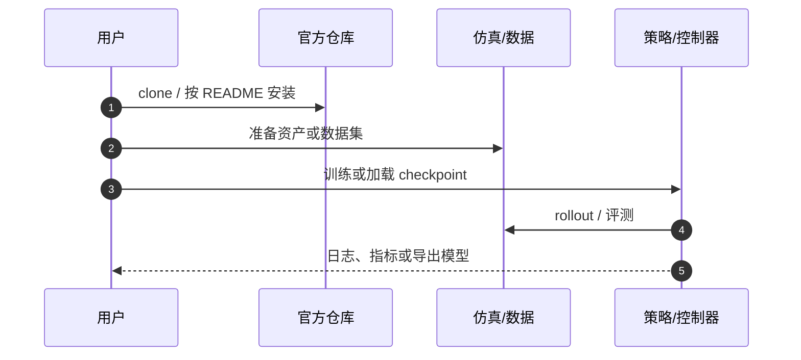

# Dreamer（HMI P064）

**Dreamer**（*Dream to Control: Learning Behaviors by Latent Imagination*，2019，[arXiv:1912.01603](https://arxiv.org/abs/1912.01603)）收录于具身智能研究室 [论文与项目总索引](https://github.com/RealXiaoze/humanoid-motion-intelligence/blob/main/%E8%AE%BA%E6%96%87%E4%B8%8E%E9%A1%B9%E7%9B%AE/README.md) **P064**，主分类为 **世界模型、VLA与Agent**。本页为本库独立详情节点（编译自策展解读与公开元数据，非原文镜像）。

## 一句话定义

从历史学习潜在转移，再在短时想象轨迹中训练 Actor-Critic，从而用更少真实交互学习像素控制行为。

## 英文缩写速查

| 缩写 | 英文全称 | 简要说明 |
|------|----------|----------|
| RSSM | Recurrent State-Space Model | 潜在动力学骨干 |
| MBRL | Model-Based RL | 在想象轨迹中更新策略 |
| VAE | Variational Autoencoder | 观测编码相关结构 |
| WM | World Model | 世界模型总称 |

## 为什么重要

- 世界模型包含图像编码/重建、RSSM潜转移和奖励预测。它用replay buffer中的真实序列训练，不依赖actor对世界的猜测当监督信号。学行为时固定世界模型，从编码后的真实潜状态出发，actor采样动作，RSSM预测后续状态和奖励，critic估计每个状态的长期价值。因此世界模型学“动作会把世界带到哪里”，actor学“为了高回报应该选哪个动作”，两者不是一个损失。
- 在 HMI 六条技术路线中属于 **世界模型、VLA与Agent**，补齐「总索引有条目、本库无下钻页」的缺口。
- 与相邻方法对照时，优先看问题设定与接口，而不是只记算法名。

## 核心信息

| 字段 | 内容 |
|------|------|
| HMI ID | P064 |
| 年份 | 2019 |
| 分组 | 世界模型、VLA与Agent |
| 开源状态 | 已开源（danijar/dreamer） |
| 原文 | https://arxiv.org/abs/1912.01603 |

## 核心原理

PlaNet有了潜动力学，但在环境的每一步仍要用CEM评估上千组动作。Dreamer的改变是把这项在线搜索成本提前到训练阶段：它从真实经验学RSSM，再从经验对应的潜状态出发，在模型里想象大量未来，训一个actor和critic。真正与环境交互时，只需前向跑actor，不做规划搜索。

### 流程直觉

模块边界与符号定义以原文为准；上图只固定阅读骨架。

## 工程实践

真实环境每产生新图像、动作和奖励，就写入replay并继续更新世界模型；执行时历史经后验编码成当前belief，actor直接输出下一动作。与PlaNet不同，部署没有CEM内循环，重新适应环境主要依靠belief被新观测修正，以及后续训练用新数据更新模型和actor。单个episode内actor不会临时搜索一条全新计划。

| 检查项 | 建议 |
|--------|------|
| 一手来源 | 回 arXiv / DOI / 项目页核对数值与声明 |
| 开源边界 | 已开源（danijar/dreamer） |
| 本库定位 | 详情编译页；深入公式与实验表读原文 |

## 源码运行时序图

关键复现路径以官方 README 为准；上图仅标出通用入口顺序。

## 实验与评测读法

- 把「仿真指标 / 真机证据 / 仅项目演示」分开记账。
- 对照同组相邻工作（见关联页面）时，对齐任务定义与观测接口，再比成功率。
- 综述类条目关注分类框架与缺口，不把引用列表当作选型排名。

## 结论

**Dreamer 应作为 HMI「世界模型、VLA与Agent」线上的独立知识节点阅读：先抓住其真正改变的问题接口，再决定是否进入复现或对比实验。**

- 核心贡献是问题表达或管线接口，而不只是单一网络结构名。
- 开源状态：已开源（danijar/dreamer）。
- 与本库已有相邻页交叉阅读，避免重复造页。
- 数值、消融与许可以一手来源为准；本页是编译索引。
- 若官方后续补齐代码/数据，应回写 `sources/` 与本节开源字段。

## 局限与风险

- 若只把H步内预测奖励相加，策略会短视；H过长又会让模型误差积累。Dreamer使用lambda return，把不同n-step预测和末端critic价值加权组合，用价值函数补上想象地平线之后的回报。critic回归这个目标，actor则将价值梯度穿过奖励模型和可微的RSSM转移反传回动作。这与PPO用环境采样轨迹做优势估计不同：Dreamer的actor更新大部分发生在学得模型中。
- 勿把 HMI 解读中的工程判断直接写成论文作者承诺。
- 经典控制论文与现代 RL/VLA 论文的「可复现」标准不同，选型时分开评估。

## 与其他工作对比

| 维度 | 本工作（Dreamer） | [PlaNet](paper-planet-latent-dynamics.md) | [DreamerV3](paper-shenlan-wm-13-dreamerv3.md) | [生成式世界模型](../methods/generative-world-models.md) |
|------|------------------|------------------------------------------|-----------------------------------------------|--------------------------------------------------------|
| 方法族 | RSSM 潜动力学 + 想象轨迹中训 actor-critic | RSSM 潜动力学 + 在线 CEM 规划 | 与 Dreamer 同族，工程化到单套超参跨任务 | 世界模型方法总述（含 RSSM/生成路线） |
| 决策方式 | 部署时前向 actor，无在线搜索 | 每步用 CEM 搜索上千组动作 | 同 Dreamer，纯 actor 前向 | 视具体方法而定 |
| 长时回报 | λ-return + critic 补想象地平线外价值 | 仅在规划窗口内累加预测奖励 | 沿用 λ-return，加符号变换稳定跨域 | 依赖世界模型预测误差控制 |
| 关系/取舍 | 把 PlaNet 的在线搜索成本前移到训练 | 无需学策略，但每步在线搜索昂贵 | Dreamer 的后继，扩到 150+ 任务 | 本页是该族的一个具体实例 |

## 关联页面

- [HMI 论文覆盖导读](../queries/hmi-papers-coverage.md)
- [Humanoid Motion Intelligence](./humanoid-motion-intelligence.md)
- [latent-imagination](../concepts/latent-imagination.md)
- [paper-shenlan-wm-13-dreamerv3](./paper-shenlan-wm-13-dreamerv3.md)
- [paper-planet-latent-dynamics](./paper-planet-latent-dynamics.md)
- [generative-world-models](../methods/generative-world-models.md)

## 参考来源

- [sources/papers/hmi_p064_dreamer-latent-imagination.md](../../sources/papers/hmi_p064_dreamer-latent-imagination.md)
- [sources/repos/humanoid-motion-intelligence.md](../../sources/repos/humanoid-motion-intelligence.md)
- [HMI 论文总索引](https://github.com/RealXiaoze/humanoid-motion-intelligence/blob/main/%E8%AE%BA%E6%96%87%E4%B8%8E%E9%A1%B9%E7%9B%AE/README.md)

## 推荐继续阅读

- [arXiv:1912.01603](https://arxiv.org/abs/1912.01603)
- [代码](https://github.com/danijar/dreamer)
- [HMI 逐篇解读 P064](https://github.com/RealXiaoze/humanoid-motion-intelligence/blob/main/%E8%AE%BA%E6%96%87%E4%B8%8E%E9%A1%B9%E7%9B%AE/%E8%AE%BA%E6%96%87%E9%80%90%E7%AF%87%E8%A7%A3%E8%AF%BB/P064.md)
