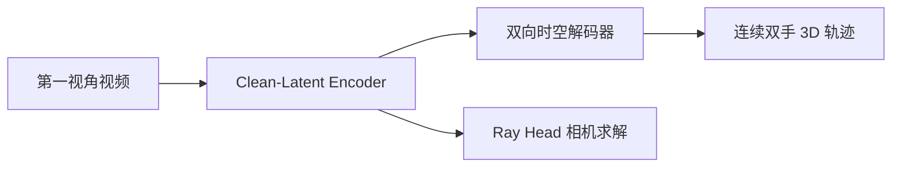

# DreamHand

**DreamHand: Repurposing Video Diffusion Models for Occlusion-Robust Egocentric 3D Hand Motion Recovery**（[arXiv:2608.20308](https://arxiv.org/abs/2608.20308)，[项目页](../../sources/sites/dreamhand-ggxxii.md)）——上海交通大学（SJTU）；南洋理工大学（NTU）；香港中文大学（CUHK）；ACE Robotics。

## 一句话定义

**别把视频扩散当像素生成器——单次 clean latent 前向当几何记忆，补全遮挡与出画双手轨迹。**

## 英文缩写速查

| 缩写 | 英文全称 | 简要说明 |
|------|----------|----------|
| VDM | Video Diffusion Model | 视频扩散骨干，本文作确定性几何编码器 |
| MPJPE-p | Mean Per Joint Position Error (percentage) | 关节位置误差百分比 |
| MANO | Mesh-based hand Model | 手部网格参数化模型 |

## 为什么重要

- 纳入 [具身智能小站 2026-08-22 十篇盘点](../../sources/blogs/wechat_embodied_station_video_contact_control_10_papers_2026-08-22.md) 的「视频→接触→控制→VLA 持续学习」主线。
- 开源状态（入库日）：**待发布**。

## 核心信息

| 项 | 内容 |
|----|------|
| **机构** | 上海交通大学（SJTU）；南洋理工大学（NTU）；香港中文大学（CUHK）；ACE Robotics |
| **出处** | arXiv:2608.20308（2026-08） |
| **开源** | **待发布** |

### 流程总览

## 评测

| 项 | 内容 |
|----|------|
| **基准覆盖** | 五个第一视角（egocentric）手部重建 benchmark，均报 SOTA |
| **ARCTIC** | MPJPE-p 相对下降 **约 30%** |
| **HOT3D** | MPJPE-p 相对下降 **约 40%** |
| **出画手子集** | 增益 **46%–61%**（遮挡/出画为主要收益来源） |

- 数据出处：[ingest 摘录「基准」](../../sources/papers/dreamhand_arxiv_2608_20308.md)。
- 相机设定：Ray-Based Camera Solver 支持无测试时内参（K-free），故跨数据集评测不依赖各集标定参数。

## 结论

**扩散先验的价值可能不在生成，而在几何记忆与遮挡补全。**

- VDM 单次确定性前向暴露当前观测外场景内容
- Ray-Based Solver 支持无测试时相机内参（K-free）
- 五 benchmark SOTA；含出画手评估收益 46%–61%
- 仓已建但推理/权重/训练 **待发布**

## 源码运行时序图

**不适用**（截至 **2026-08-22**）：官方训练/推理入口尚未公开发布。

## 与其他页面的关系

- [egocentric-vision](../methods/macrodata-egocentric-hand-action.md)
- [manipulation](../tasks/manipulation.md)
- [paper-hand-visibility-detector](./paper-hand-visibility-detector.md)
- [generative-world-models](../methods/generative-world-models.md)
- [视频–接触–控制 10 篇技术地图](../overview/video-contact-control-10-papers-technology-map.md)
- [开源具身 8 篇技术地图](../overview/open-source-8-papers-technology-map.md)

## 参考来源

- [dreamhand_arxiv_2608_20308](../../sources/papers/dreamhand_arxiv_2608_20308.md)
- [dreamhand-ggxxii](../../sources/sites/dreamhand-ggxxii.md)
- [dreamhand](../../sources/repos/dreamhand.md)
- [wechat_embodied_station_video_contact_control_10_papers_2026-08-22](../../sources/blogs/wechat_embodied_station_video_contact_control_10_papers_2026-08-22.md)
- [wechat_embodied_station_8_papers_open_source_2026-08-25](../../sources/blogs/wechat_embodied_station_8_papers_open_source_2026-08-25.md)

## 推荐继续阅读

- [arXiv:2608.20308](https://arxiv.org/abs/2608.20308)
