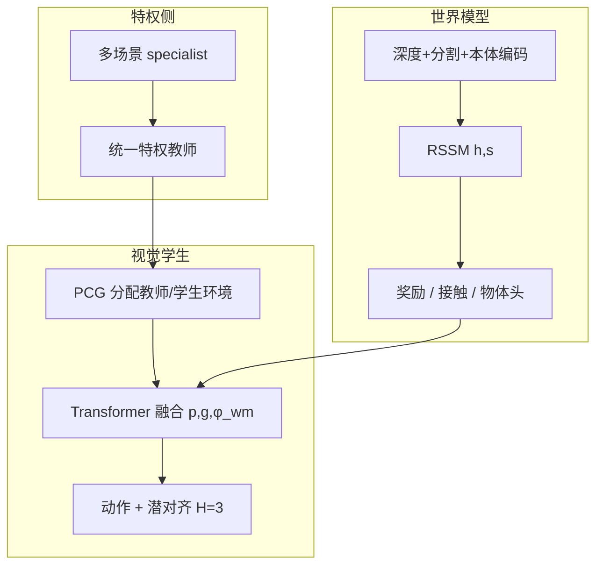

# DreamMimic：世界模型辅助的视觉全身 Mimic

**DreamMimic**（*Learning Visuomotor Whole-Body Loco-Manipulation via World Model*，[arXiv:2608.22278](https://arxiv.org/abs/2608.22278)，[项目页](https://dreammimic.github.io/)）由 **Jie Yin（Independent）** 与 **Xingyu Lai（清华大学）** 提出：把特权 HOI 教师蒸馏成只看 **深度、分割与本体** 的人形全身 loco-manipulation 学生。Dreamer 风格 **RSSM 不作规划**，只当预测表征与多步监督；**Performance-Conditioned Guidance（PCG）** 按师生奖励比调节教师 rollout 比例。

## 一句话定义

**用动作条件潜动力学把「特权教师会做什么」对齐到视觉学生的未来隐状态上，而不是让学生在线读物体位姿或交互图。**

## 英文缩写速查

| 缩写 | 英文全称 | 简要说明 |
|------|----------|----------|
| RSSM | Recurrent State-Space Model | Dreamer 系确定性 \(h\) + 随机 \(s\) 的潜动力学 |
| PCG | Performance-Conditioned Guidance | 按师生奖励比衰减教师驱动环境比例 |
| HOI | Human–Object Interaction | 人–物交互参考；教师跟踪对象 |
| DAgger | Dataset Aggregation | 以教师动作为主监督的蒸馏 |
| GT | Ground Truth | 本页仿真深度/分割为渲染真值，非学习感知 |

## 为什么重要

- **视觉全身的漂移问题：** 接触时序一旦错，单步行为克隆会把学生推到教师没见过的状态。多步潜对齐直接罚「师生动作导致的未来隐状态分叉」。
- **世界模型的另一种用法：** 不是 Joint WAM 的未来视频+动作，也不是 Dreamer 想象规划；RSSM 是 **蒸馏稳定器**。
- **相对 VisualMimic：** [VisualMimic](./paper-notebook-visualmimic.md) 走关键点分层且有 **真机零样本**；DreamMimic 走端到端视觉学生 + RSSM，数字停在仿真。
- **PCG 可读：** BEHAVE 上 naive annealing 能凑到同一成功率，但跟踪误差更差——说明「何时撤教师」比「撤不撤」更敏感。

## 核心信息

| 项 | 内容 |
|----|------|
| **机构** | Independent；清华大学 |
| **教师** | InterMimic 式 specialist→generalist 特权 RL（物体位姿 / 交互图 / 接触） |
| **学生观测** | 深度 + 分割 + 非特权本体 + 紧凑目标 \(g_t\)（物体位姿 + 短视界机体轨迹） |
| **世界模型** | RSSM；重建视觉/本体；辅助头：奖励、特权向量、接触、13-D 物体状态 |
| **蒸馏** | 动作 MSE + \(\mathcal{L}_{\text{latent}}\)（H=3）+ PPO 正则；PCG 调 \(\rho\) |
| **开源** | **宣称将开源** — GitHub 仅 README「Codes coming soon!」（2026-08-26） |

## 流程总览

策略条件：\(\boldsymbol{c}_t=[\boldsymbol{p}_t,\boldsymbol{g}_t,\boldsymbol{\phi}^{\text{wm}}_t]\)，其中 \(\boldsymbol{\phi}^{\text{wm}}_t=[h_t,\hat r_t,\hat x^{\text{priv}}_t,\hat c^{\text{contact}}_t,\hat x^{\text{obj}}_t]\)。重建头只训表征，**不进策略**。

## 源码运行时序图

**不适用。** 截至 2026-08-26，项目页写 Code (Coming soon)，[`DreamMimic/DreamMimic`](https://github.com/DreamMimic/DreamMimic) 无训练或推理脚本。

## 核心原理

- **教师：** 特权状态 RL，奖励含全身跟踪、末端、物体一致与接触项；大数据集走 InterMimic 多专家再合并。
- **学生：** 不直接编码原图。\(h_t\) 与辅助预测作 token，轻量 Transformer 后再接 actor–critic MLP。
- **多步潜蒸馏：** 从当前后验分叉，师生均值动作各走冻结 RSSM 先验 H 步，对齐 \(h\) 与 \(s\)。不需要教师侧图像。
- **PCG：** 维护教师/学生环境的奖励 EMA，相对分 \(\pi=\hat r_S/(\hat r_T+\epsilon)\) 接近目标后衰减 \(\rho\)；模仿系数 \(c\) 固定。避免按 iteration 过早撤教师。
- **参考缓冲：** 只把 **学生驱动** 失败窗口写回，使课程反映学生自己的状态分布。

## 实验与评测

数据：OMOMO（桌/椅/大箱/塑料箱/小箱/行李箱）与 BEHAVE 长程（>300 步；背包/容器/凳）。指标循 InterMimic：Succ. / Time / \(E_r\) / \(E_o\)。学生输入对齐；基线只换视觉模块与蒸馏日程。

### SMPL-X · OMOMO（Table I）

| 方法 | Succ.↑ | Time↑ | \(E_r\)↓ | \(E_o\)↓ |
|------|--------|-------|----------|----------|
| InterMimic 教师 | 100.0 | 190.51 | 9.4 | 6.8 |
| Dreamer 单阶段 | 0.0 | 28.73 | 25.6 | — |
| ResNet-18 DAgger+RL | 72.6 | 169.49 | 7.8 | 9.7 |
| Simple-CNN DAgger+RL | 76.5 | 173.82 | 7.4 | 9.7 |
| 无多步潜蒸馏 | 70.6 | 178.69 | 7.9 | 12.8 |
| RecH-only WM | 86.3 | 177.88 | 7.5 | 12.7 |
| **DreamMimic** | **92.2** | **184.18** | **5.4** | **8.8** |

质量 ×5 时 Succ. 41.2%（教师 68.6%）；去多步潜蒸馏 39.2%，物体误差仍更差。

### BEHAVE 与日程（Table II）

PCG 与 naive annealing 成功率同为 **72.7%**（质量 ×2 为 63.6%），PCG 的 Time / \(E_r\) / \(E_o\) 更好（289.53 / 10.2 / 13.3 vs 275.21 / 15.2 / 14.9）。

### 感知与迁移

深度+分割 92.2%；仅深度 88.2%；仅分割 86.3%；RGB 88.2%。G1 推箱与 Isaac Lab 同序列仅为定性；**不是真机验证**。失败多在遮挡、模糊接触；G1 上 GMR 重定向保下肢、手接触不够，重物倾向推而不是抬。

## 结论

**DreamMimic 表明：在接触丰富的视觉全身蒸馏里，RSSM 的价值是「师生未来隐状态对齐」，不是想象规划；PCG 主要修跟踪质量而不是成功率标题数字。**

1. **真影响指标：** 去掉多步潜蒸馏，OMOMO Succ. 92.2→70.6——这是方法主杠杆。
2. **辅助头要进策略：** 只当损失不加到 \(\phi^{\text{wm}}\)，Succ. 掉到 84.3%。
3. **历史摘要靠 \(h_t\)：** 只用当前随机特征 Succ. 74.5%；去动作条件只掉到 90.2%。
4. **部署读法：** 现在是 **仿真 GT 深度+分割**；换成学习感知会另开 visual gap，不能对标 [VisualMimic](./paper-notebook-visualmimic.md) 真机。
5. **跨本体/跨仿真器：** 项目页视频是存在性证据，不是成功率表。
6. **开源：** 占位仓，复现需等代码；教师配方仍以 [InterMimic](./paper-bfm-15-intermimic.md) 为准。

## 与其他工作对比

| 对比轴 | DreamMimic | VisualMimic | InterMimic 教师 | 单阶段 Dreamer |
|--------|------------|-------------|-----------------|----------------|
| 部署观测 | 深度+分割+本体 | egocentric 深度 | 特权状态 | 像素 |
| 接口 | RSSM 特征 + \(g_t\) | root+5 关键点 | 全状态 | 端到端 RL |
| 世界模型角色 | 蒸馏监督 | 无 | 无 | 想象规划 |
| 真机 | 无 | 零样本 push/lift/kick | 仿真为主 | 弱 |
| 开源 | Coming soon | 部分（Sim2Sim+ckpt） | 已开源 | 通用实现 |

## 工程实践

| 项 | 说明 |
|----|------|
| 源码运行时序图 | **不适用**（占位 README，无 CLI） |
| 仿真栈 | 主结果 Isaac Gym；定性 Isaac Lab |
| 参考数据 | InterAct 管线重定向的 OMOMO / BEHAVE |
| 关键超参 | \(H=3\)；PCG 的 \(\rho_{\max}\to\rho_{\min}\)；PPO 热身后低权重 |
| 感知 | 主实验 GT 深度+分割；RGB 可跑但略差 |

## 局限与风险

- **无真机、无学习感知：** 深度/分割来自仿真器。
- **手接触精度：** G1 重定向后上肢交互不足。
- **遮挡：** 弱视觉证据时多步监督仍救不了。
- **代码未发布：** 数字不可独立复核。

## 关联页面

- [Loco-Manipulation](../tasks/loco-manipulation.md) — 视觉全身接触任务族
- [VisualMimic](./paper-notebook-visualmimic.md) — 关键点分层 + 真机对照
- [InterMimic](./paper-bfm-15-intermimic.md) — 特权教师与 HOI 跟踪配方
- [World Action Models](../concepts/world-action-models.md) — 对照：WM 作蒸馏器 ≠ Joint WAM
- [DAgger](../methods/dagger.md) — 主监督
- [Generative World Models](../methods/generative-world-models.md) — Dreamer / RSSM 工具箱
- [ResMimic](./paper-resmimic.md) — 另一条全身接触残差路线
- [TONAV](./paper-tonav.md) — 四足铰接物体真机对照
- [GOLEM](./paper-golem-humanoid.md) — 人形工业模块对照
- [48ms WAM / 编排 10 篇地图](../overview/glancewam-vla-crew-10-papers-technology-map.md)

## 参考来源

- [DreamMimic 论文摘录](../../sources/papers/dreammimic_arxiv_2608_22278.md)
- [项目页归档](../../sources/sites/dreammimic-github-io.md)
- [GitHub 占位仓归档](../../sources/repos/dreammimic.md)
- [具身智能小站 10 篇盘点](../../sources/blogs/wechat_embodied_station_10_papers_glancewam_vla_crew_2026-08-30.md)

## 推荐继续阅读

- [arXiv:2608.22278](https://arxiv.org/abs/2608.22278) — 方法公式与完整消融
- [项目页](https://dreammimic.github.io/) — OMOMO / G1 / BEHAVE 视频
- [InterMimic](https://arxiv.org/abs/2502.20390) — 特权教师来源
