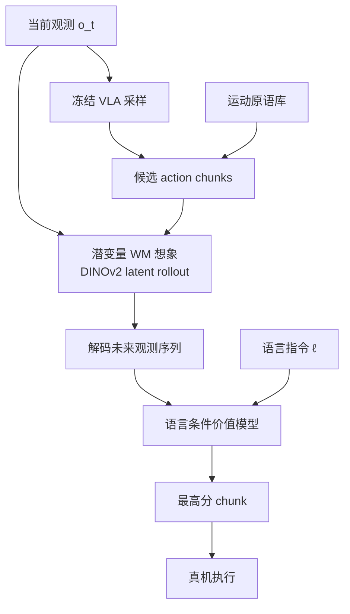

# DreamSteer（Latent World Model Steering for VLA · arXiv:2607.02865）

**DreamSteer**（*DreamSteer: Latent World Models can steer VLA Policies during deployment without any finetuning*，[arXiv:2607.02865](https://arxiv.org/abs/2607.02865)，Meta FAIR + University of Minnesota，[项目页](https://dream-steer.github.io/)）提出 **零微调部署时 steering**：冻结 VLA 采样多个 action chunk，辅以 **预定义 Cartesian 运动原语**；**动作条件潜变量世界模型** 想象各候选未来观测，**语言条件价值模型** 按任务指令排序，仅执行最高分 chunk。

## 一句话定义

**动手前先「想几条未来」：潜空间 WM 预演候选动作后果，价值模型在部署端筛选——不改 VLA 参数、不用目标域微调数据。**

## 英文缩写速查

| 缩写 | 英文全称 | 简要说明 |
|------|----------|----------|
| VLA | Vision-Language-Action | 被 steering 的 **冻结** 生成式策略（如 $\pi_0$） |
| WM | World Model | 动作条件 **潜变量** 动力学 $\mathcal{W}_\phi$ |
| LVM | Language-conditioned Value Model | 对想象轨迹按语言指令打分 |
| OOD | Out-of-Distribution | 四组真机 benchmark 含 **未见物体** |
| DINOv2 | — | 冻结视觉编码器；WM 在 **其潜空间** 预测未来 |
| H | Horizon | rollout 步长（例：$H{=}10$，3 帧 latent 解码） |
| TR | Training-free composition | 各组件 **即插即用、无目标域联合训练** |

## 为什么重要

- **第三类 WAM 职责——部署前筛选：** 与 [DSWAM](./paper-dswam-dual-system-wam.md)（直接执行）、[DynaWM](./paper-dynawm-vla-online-correction.md)（在线修正）并列；机器人 **真正执行前** 比较多条可能未来（策展文核心论点）。
- **测试时 scaling 的 VLA 类比：** 类似 LLM 的 **采样 + rerank**；扩散/自回归 VLA 本身 **随机采样 action chunk**，DreamSteer 用 WM 提供 **执行前 look-ahead**。
- **潜空间 rollout 的工程可行性：** 同 RTX 4090，$H{=}10$、3 帧 $320{\times}192$：**视频扩散 23.12s vs 潜变量 WM 0.59s**——使 **多候选评估** 在部署环内可行。
- **与 [TACO](./paper-taco-tactile-wm-vla-posttrain.md) 形成后训练 vs 推理对照：** TACO 把失败转为 **纠错训练数据**；DreamSteer **零参数改动、纯推理 steering**。

## 核心结构与方法

| 模块 | 方法要点 |
|------|----------|
| **候选生成** | 冻结 VLA $\pi_\theta$ 采样多个 $a_{t:t+H-1}$； augment **预定义 Cartesian 运动原语** |
| **多本体 WM 训练** | DROID 等异构数据；共享 **时空 Transformer** + embodiment-specific action/state tokenizer；缺失模态 mask |
| **潜变量动力学** | 在 **冻结 DINOv2** 潜空间自回归预测未来；解码为图像供价值模型评估 |
| **时空分解注意力** | 空间 cross-attn（帧内）+ 因果 temporal cross-attn（patch 级）→ 复杂度对 $H$ **近线性** |
| **语言价值模型** | 对想象 rollout 排序；选最高分 chunk **真机执行** |
| **部署约束** | **全部组件冻结**；无目标环境 demonstration 用于 adaptation |

### 部署时 steering 流程

### 与 policy steering 方法对比（论文 Table 1 摘要）

| 方法 | Action chunks | 广义 WM | 零样本 steering | 训练无关组合 |
|------|---------------|---------|-----------------|--------------|
| V-GPS | ✗ | — | ✓ | ✗ |
| FOREWARN / GPC | ✓ | 任务微调 latent/pixel | ✗ | ✗ |
| **DreamSteer** | ✓ | **广义 latent WM** | **✓** | **✓** |

## 实验要点（索引级）

| 轴 | 报告口径（以论文为准） |
|----|------------------------|
| **四组真机 OOD 操纵** | 任务成功率 **23.75% → 66.25%**（基于 $\pi_0$ VLA） |
| **指令遵循** | **38.75% → 56.25%** |
| **Rollout 效率** | 潜变量 WM vs 视频扩散：**~39× 加速**（同 GPU 设定） |
| **设定** | 未见物体；**无目标域 finetune** |
| **机构** | Meta FAIR、明尼苏达大学 |
| **演示** | [dream-steer.github.io](https://dream-steer.github.io/) |

## 结论

**真正重要的是「冻结 VLA + 潜空间 WM 预演 + 语言价值排序」的零微调部署 steering；次要代价是有限候选集上的 rerank，不是全局最优规划。**

1. **真机 OOD 增益可读** — 基于 \(\pi_0\) 的四组操纵：任务成功率 **23.75%→66.25%**，指令遵循 **38.75%→56.25%**；设定为未见物体、**无目标域 finetune**。
2. **潜变量 WM 让多候选评估进得了环** — 同 RTX 4090、\(H{=}10\)：视频扩散 **23.12 s** vs 潜变量 WM **0.59 s**（约 **39×**）；时空分解注意力使复杂度对 horizon 近线性。
3. **候选来自 VLA 采样 + Cartesian 运动原语** — 质量上限取决于采样覆盖与原语设计；价值模型仍可能被「视觉合理但接触错误」的想象轨迹误导。
4. **与后训练纠错正交** — 相对 [TACO](./paper-taco-tactile-wm-vla-posttrain.md)（失败→纠错数据→改参数），DreamSteer **全部组件冻结**、纯推理筛选；相对 GigaWorld 更像动作选择器而非离线评估器。
5. **部署仍付推理延迟** — 多候选 + WM rollout 增算力；长时序误差累积与未建模不确定性是开放风险。

## 与其他工作对比

| 工作 | 关系 |
|------|------|
| **[TACO](./paper-taco-tactile-wm-vla-posttrain.md)** | **失败→想象纠错→后训练**；DreamSteer **纯部署筛选** |
| **[GigaWorld-1](./paper-gigaworld-1-policy-evaluation.md)** | WM 作 **策略评估器**；DreamSteer 作 **动作选择器** |
| **Cosmos / DreamGen（pixel WM）** | 视觉丰富但 **在线 steering 太贵** |
| **DINO-WM / VT-WM** | 同类 **latent WM**；DreamSteer 强调 **多候选 VLA steering** |
| **DSWAM / DynaWM** | **训练期集成 WAM**；DreamSteer **不改 VLA、外挂 WM** |

## 常见误区或局限

- **误区：** 认为 WM 排序等于 **全局最优规划**；实为 **有限候选集上的 rerank**，质量取决于 VLA 采样覆盖与原语设计。
- **误区：** 把潜空间 rollout 等同于 **物理精确仿真**；价值模型仍可能被 **视觉上合理但接触错误** 的轨迹误导。
- **局限：** 多候选 + WM rollout 仍增 **推理延迟与算力**；WM 对 **长时序误差累积** 敏感；未建模 **不确定性** 时可能过度自信（策展文开放问题）。

## 与其他页面的关系

- [wm-action-consequence-category-01-wam-action-prediction](../overview/wm-action-consequence-category-01-wam-action-prediction.md) — 部署筛选类 WAM
- [wm-action-consequence-category-04-eval-posttrain](../overview/wm-action-consequence-category-04-eval-posttrain.md) — 与 GigaWorld 评估链路相邻
- [动作后果技术地图](../overview/robot-world-models-action-consequence-technology-map.md) — 专题总览
- [World Action Models](../concepts/world-action-models.md) — WM 预演动作后果概念
- [VLA](../methods/vla.md) — $\pi_0$ / GR00T 等被 steering 的策略
- [Harness VLA](./paper-harness-vla.md) — 原语级 agentic harness + 记忆；同属冻结 VLA 部署路线

## 推荐继续阅读

- [DreamSteer 论文（arXiv:2607.02865）](https://arxiv.org/abs/2607.02865)
- [DreamSteer 项目页与视频](https://dream-steer.github.io/)
- [TACO 论文实体](./paper-taco-tactile-wm-vla-posttrain.md) — 后训练纠错对照
- [GigaWorld-1 论文实体](./paper-gigaworld-1-policy-evaluation.md) — WM 策略评估

## 参考来源

- [具身智能研究室 · 世界模型动作后果专题导读（2026-07）](../../sources/blogs/wechat_embodied_ai_lab_robot_world_models_action_consequence_2026.md)
- [DreamSteer 论文（arXiv:2607.02865）](https://arxiv.org/abs/2607.02865)
