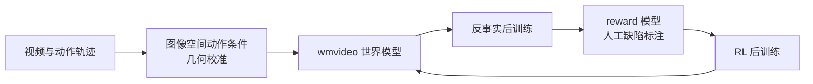
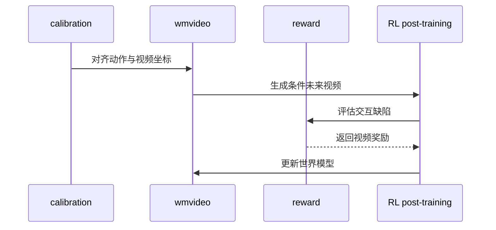

# DreamTrue：动作保真的机器人世界模型

**DreamTrue** 是面向机器人交互视频预测的世界模型框架：校准动作条件与视频运动的一致性，以反事实后训练扩展少见交互，再用具身视频奖励模型引导生成结果趋向物理合理。

## 英文缩写速查

| 缩写 | 英文全称 | 简要说明 |
|---|---|---|
| WM | World Model | 根据观测和条件动作预测环境未来的模型 |
| RL | Reinforcement Learning | 用奖励信号优化模型的后训练过程 |
| SOTA | State of the Art | 论文针对特定 benchmark 的比较结论 |

## 方法栈

1. **动作几何校准：** 将机器人动作轨迹渲染成图像空间条件，以离线几何校准将动作表示与视频观测对齐。改善的是 action-to-video calibration，不自动保证所有接触动力学正确。
2. **反事实后训练：** 修改记录动作并生成扩展动作/接触配置的未来视频，补充真实数据少见的失败交互。合成结果不能当作真实机器人观测。
3. **具身视频奖励：** 用人工标注的机器人、物体和交互缺陷训练视频奖励模型，分数引导 RL 后训练。标注偏差和 reward hacking 是主要风险。

## 流程总览

## 评测

| 指标 | 论文报告 | 说明 |
|---|---:|---|
| AgiBot action following | 对比 SOTA | 限论文 benchmark 设置 |
| 人评交互缺陷率 | 48.12% → 6.25% | 人工评估指标，需结合标注与采样协议 |
| AgiBot World Challenge 2026 | 第 1 名 | 作者报告名次，不替代独立复现 |

## 与其他工作对比

| 维度 | 普通条件视频模型 | DreamTrue |
|---|---|---|
| 动作条件 | 直接输入动作标签/token | 轨迹投影到图像空间并几何校准 |
| 失败覆盖 | 依赖已采集失败样本 | 反事实修改并生成候选未来 |
| 质量信号 | 视频/像素目标 | 人工缺陷视频奖励参与 RL 后训练 |

DreamTrue 是世界模型训练系统，不应等同于可直接部署的闭环 manipulation policy。

## 源码运行时序图

此图按仓库 README 的 calibration、wmvideo、reward 组件概括训练关系；具体执行命令以模块 README 为准。

## 工程实践

- 先验证相机参数、动作坐标系和时间戳，避免动作条件错位。
- 按任务和接触类型检查反事实样本与真实数据差异。
- 人工缺陷奖励需做分组评估，防止均值掩盖安全失败。
- 官方仓库已部分开放，README 称完整数据后续发布；ModelScope 有资产不代表完整复现条件齐备。

## 结论

**结论：** DreamTrue 将动作—视频几何一致性作为世界模型训练的核心约束，但可信度仍取决于校准、合成反事实和奖励模型。

1. 先核对动作轨迹与图像坐标，再评估视频逼真度。
2. 反事实视频扩展覆盖，不构成真实物理验证。
3. 48.12%→6.25% 应与人评协议和样本规模一起报告。
4. 世界模型不等于闭环控制器或安全验证器。
5. 当前为部分开源，完整数据待补齐。

## 局限与风险

- 几何校准不能消除遮挡、柔性物体和复杂接触的动力学误差。
- 反事实生成可能产生逼真但物理错误的未来。
- 人工标签存在覆盖不足，奖励模型也可能被优化过程利用。
- 论文结果集中于特定 AgiBot 评测，需跨平台、真实闭环验证。

## 关联页面

- [World Action Models](../concepts/world-action-models.md)
- [生成式世界模型](../methods/generative-world-models.md)
- [基于模型的强化学习](../methods/model-based-rl.md)
- [机器人操作](../tasks/manipulation.md)
- [DreamWAM](paper-dreamwam.md)

## 参考来源

- [论文摘录](../../sources/papers/dreamtrue_arxiv_2610_12468.md)
- [项目页归档](../../sources/sites/dreamtrue-project-page.md)
- [官方仓库归档](../../sources/repos/brave-eai-dreamtrue.md)
- [arXiv](https://arxiv.org/abs/2610.12468)
