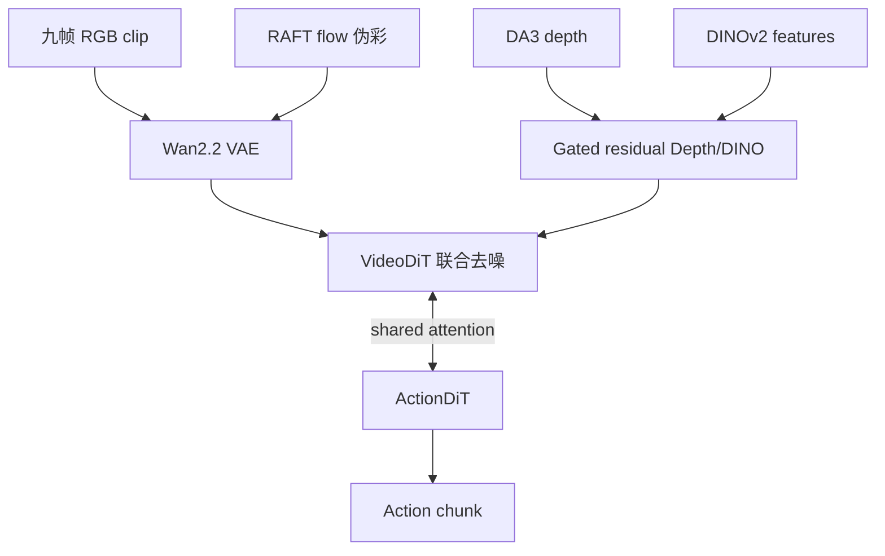
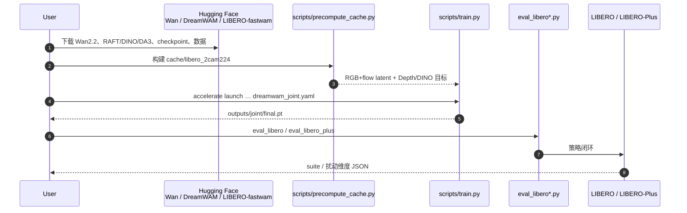

# DreamWAM（Beyond RGB Future Prediction · arXiv:2608.04996）

**DreamWAM**（*DreamWAM: Beyond RGB Future Prediction for World Action Models*，[arXiv:2608.04996](https://arxiv.org/abs/2608.04996)）由 **华中科技大学 hustvl、地瓜机器人（D-Robotics）、武汉大学、地平线** 提出（袁尚林\* / 赵伟恒\* / 史鑫 / 姜浩逸 / 郭现达 / 刘浏 / 刘文予 / 隋伟† / 王兴刚‡）：把 WAM 的「未来」从 RGB 像素扩成 **外观 + 运动 + 几何 + 语义** 结构化状态，训练时用这些视图塑形共享表征，**部署仍只吃 RGB**。[项目页](https://hustvl.github.io/DreamWAM/) · [代码](https://github.com/hustvl/DreamWAM) · [权重](https://huggingface.co/hustvl/DreamWAM)。

## 一句话定义

**别只梦像素：用 flow / depth / DINO 在训练期教 VideoDiT「什么变化对动作有用」，推理关掉这些分支，仍走 RGB→动作的 Joint WAM。**

## 英文缩写速查

| 缩写 | 英文全称 | 简要说明 |
|------|----------|----------|
| WAM | World Action Model | 联合未来预测与动作生成的策略族 |
| VideoDiT / ActionDiT | Video / Action Diffusion Transformer | 本工作的视频与动作双骨干（承自 FastWAM） |
| RAFT | Recurrent All-Pairs Field Transforms | 离线光流估计，编码为 motion latent |
| DA3 | Depth Anything 3 | 几何支路深度目标（DA3-Base） |
| DINOv2 | — | 语义支路 patch 特征（ViT-B/14 + registers） |
| LIBERO-Plus | — | 未见视觉扰动套件；本文无其训练数据 |

## 为什么重要

- **把 WAM 问题从「怎么滚未来」拧到「未来该长什么样」：** 相对只堆更强视频骨干，DreamWAM 主张 RGB 目标会把任务状态与 nuisance 绑死，应显式监督 **motion / geometry / semantics**。
- **训练多视图、部署零额外传感器：** beyond-RGB 全是离线教师信号；推理与 Fast-WAM 同为 RGB-only，工程可落地。
- **增益集中在扰动与真机 OOD：** 域内 LIBERO 已近饱和（98→98.9），**LIBERO-Plus +6.3 pt**、真机扰动 **+18.8 pt** 才是选型读点。
- **开源完整：** 代码 + joint/uncond 权重 + 预处理脚本，可直接挂 FastWAM 数据协议复现。

## 核心信息

| 项 | 内容 |
|----|------|
| **机构** | 华中科技大学（HUST）；地瓜机器人（D-Robotics）；武汉大学（WHU）；地平线（Horizon Robotics） |
| **族谱** | **Joint WAM**（VideoDiT ↔ ActionDiT shared attention） |
| **基线** | Fast-WAM-Joint（同骨干 / 同数据 / 同协议） |
| **开源** | **已开源** — [hustvl/DreamWAM](https://github.com/hustvl/DreamWAM)；HF MIT 权重 |

## 核心原理

### 结构化未来四视图

| 视图 | 目标构造（离线） | 注入方式 |
|------|------------------|----------|
| Appearance | Wan2.2 VAE 编码 RGB clip | VideoDiT 主去噪 |
| Motion | RAFT 光流 → 伪彩视频 → 同 VAE → \(z_{\mathrm{flow}}\) | 与 RGB **联合 latent 去噪** |
| Geometry | DA3 深度 → log + 区域 PCA-8 → \(z_{\mathrm{depth}}\) | 选定 VideoDiT block 的 **gated residual** |
| Semantics | DINOv2 patch → PCA-8 → \(z_{\mathrm{dino}}\) | 同上门控残差 |

九帧 clip 对齐到 Wan latent 的三步时间轴；几何/语义用「首帧 + 中间平均 + 末段平均」压缩。

### 训练–部署不对称

- **训练：** RGB+Flow 联合去噪 + Depth/DINO 残差；ActionDiT 经 **shared attention** 吸收未来状态监督。
- **推理 / 真机：** **关闭全部 beyond-RGB 分支**，仅 RGB 观测条件化动作（可 no-rollout 或 joint video-action）。

### 流程总览

## 源码运行时序图

官方入口对齐 [`sources/repos/dreamwam.md`](../../sources/repos/dreamwam.md)：预处理 → 训练 → LIBERO / LIBERO-Plus 评测。

关键复现路径：先 `prepare_action_dit.py` 从 Wan VideoDiT 派 ActionDiT，再 `precompute_cache.py`，最后 `train.py` / `eval_*.py`。

## 工程实践

| 项 | 建议读法 |
|----|----------|
| 环境 | Python 3.10 + CUDA 12.x；`pip install -e .` 及 DA3 / LIBERO |
| 数据 | [yuanty/LIBERO-fastwam](https://huggingface.co/datasets/yuanty/LIBERO-fastwam)，MuJoCo 3.3.2 |
| 权重 | `dreamwam_joint.pt`（主评测）/ `dreamwam_uncond.pt` |
| 对照协议 | 与 Fast-WAM-Joint matched；LIBERO-Plus **不训练** |
| 调试信号 | 扰动轴（camera / background / noise）提升是否大于域内边际 |

## 实验与评测

| 设定 | Fast-WAM-Joint | DreamWAM |
|------|----------------|----------|
| LIBERO avg（joint，两 seed） | 98.00% | **98.90%** |
| LIBERO-Plus avg | 69.16% | **75.47%** |
| 真机标准任务 avg | 90.8% | **96.7%** |
| 真机视觉扰动 avg | 55.6% | **74.40%** |

摘要另报 no-rollout：**97.30% → 98.40%**（LIBERO）、**51.36% → 63.44%**（LIBERO-Plus）。

## 结论

**真正拉开差距的不是域内再涨 1 个点，而是用 beyond-RGB 监督换来的扰动与真机鲁棒；部署仍 RGB-only，所以这是「训练税」而非「传感器税」。**

1. **读 LIBERO-Plus / 真机扰动表，不要只看 LIBERO 98.x** — 域内已饱和，主贡献在 camera/background/layout 等轴。
2. **Flow 进主去噪、Depth/DINO 进门控残差** — 运动与外观共享 VAE 网格；几何语义是轻量校正而非第二套生成器。
3. **复现成本在教师管线** — RAFT + DA3 + DINO + Wan VAE 预处理是训练前置，推理不带它们。
4. **选型坐标：** 要 Joint WAM 且关心视觉 nuisance → DreamWAM；要冻结 VLA 在线改写 → [DynaWM](./paper-dynawm-vla-online-correction.md)；要部署多候选筛选 → [DreamSteer](./paper-dreamsteer-vla-deployment-steering.md)。

## 局限与风险

- 桌面操纵 + 单臂真机为主，未覆盖全身 loco-manip。
- 几何/语义目标经 PCA 压缩，信息上界受教师与 PCA 拟合域限制。
- 依赖 FastWAM / Wan2.2 栈；许可证以仓库与 HF 卡为准（HF MIT，GitHub 根目录未声明 SPDX）。

## 与其他工作对比

| 工作 | 关系 |
|------|------|
| Fast-WAM | 直接基线；DreamWAM 改「未来定义」而非换骨干 |
| [Kairos](./paper-kairos-native-world-model-stack.md) | 同属 Video+Action DiT Joint 族；Kairos 强调 CEDC / regret |
| [DSWAM](./paper-dswam-dual-system-wam.md) / [DynaWM](./paper-dynawm-vla-online-correction.md) / [DreamSteer](./paper-dreamsteer-vla-deployment-steering.md) | 执行 / 修正 / 筛选三角；DreamWAM 落在 **联合训练直接出动作** |

## 关联页面

- [World Action Models](../concepts/world-action-models.md)
- [VLA](../methods/vla.md)
- [生成式世界模型](../methods/generative-world-models.md)
- [动作后果技术地图](../overview/robot-world-models-action-consequence-technology-map.md)
- [DynaWM](./paper-dynawm-vla-online-correction.md)
- [DreamSteer](./paper-dreamsteer-vla-deployment-steering.md)

## 参考来源

- [DreamWAM 论文归档](../../sources/papers/dreamwam_arxiv_2608_04996.md)
- [hustvl/DreamWAM 仓库归档](../../sources/repos/dreamwam.md)
- [项目页归档](../../sources/sites/hustvl-dreamwam-github-io.md)

## 推荐继续阅读

- 项目页方法与表格：<https://hustvl.github.io/DreamWAM/>
- FastWAM 基线仓：<https://github.com/yuantianyuan01/FastWAM>
