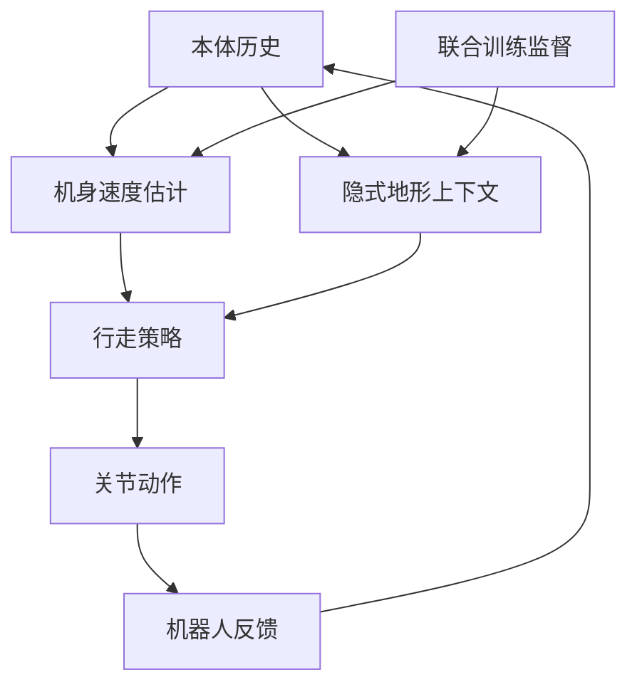

# DreamWaQ：从本体历史学习鲁棒四足行走

**DreamWaQ**（*Learning Robust Quadrupedal Locomotion With Implicit Terrain Imagination via Deep Reinforcement Learning*，[arXiv:2301.10602](https://arxiv.org/abs/2301.10602)，ICRA 2023）研究四足机器人如何只靠身体反馈适应地形和动力学变化。它从短时本体观测历史估计机身速度与隐式环境表示，并将估计结果用于行走策略。

## 一句话理解

机器人不能直接读到地面摩擦等属性时，利用近期身体响应形成控制所需的环境线索，再据此调整步态。

## 英文缩写速查

| 缩写 | 英文全称 | 简要说明 |
|---|---|---|
| CENet | Context Estimation Network | 由本体历史估计速度和环境表示 |
| RL | Reinforcement Learning | 强化学习 |

## 流程总览

以下按本页已归纳的机制与资料绘制，表示模块或阅读路径关系。

## 方法要点

- **历史编码：** Context Estimation Network（CENet）处理本体历史，预测机身线速度并学习隐式环境表示。
- **联合优化：** 状态估计目标与策略训练共同更新；价值网络可用训练期特权信息，部署策略依靠本体输入。
- **作用边界：** 身体历史有助于接触后的适应，但不能替代对沟隙、台阶等前方障碍的预先观察。

## 与相邻工作

- [DreamWaQ 方法页](../methods/dreamwaq.md)归纳算法机制；本页是论文的独立详情节点。
- [DreamWaQ++](./dreamwaq-plus.md)在后续工作中加入点云等外部感知。
- [Robust Perceptive Locomotion](./paper-robust-perceptive-locomotion-wild.md)提供带噪高程图与本体历史融合的另一条路线。

## 参考来源

- [arXiv:2301.10602](https://arxiv.org/abs/2301.10602)
- [项目页](https://sites.google.com/view/dreamwaq)
- [Day 2 文章来源索引](../../sources/blogs/humanoid_motion_intelligence_day2_locomotion_motion_priors_2026_10_03.md)

## 评测

文章以 A1 真机行走为例讨论该运动先验；完整实验范围与指标以论文原文为准。

## 与其他工作对比

与 [DreamWaQ++](./dreamwaq-plus.md) 对照时，前者依赖本体历史适应已接触到的变化，后者加入点云提供前向地形信息。

## 结论

DreamWaQ把身体历史用于接触后的速度与环境适应估计；跨沟和选落脚点仍需前向感知。

## 关联页面

- [dreamwaq](../methods/dreamwaq.md)
- [dreamwaq-plus](./dreamwaq-plus.md)
- [paper-notebook-learning-quadrupedal-locomotion-over-challenging](./paper-notebook-learning-quadrupedal-locomotion-over-challenging.md)
