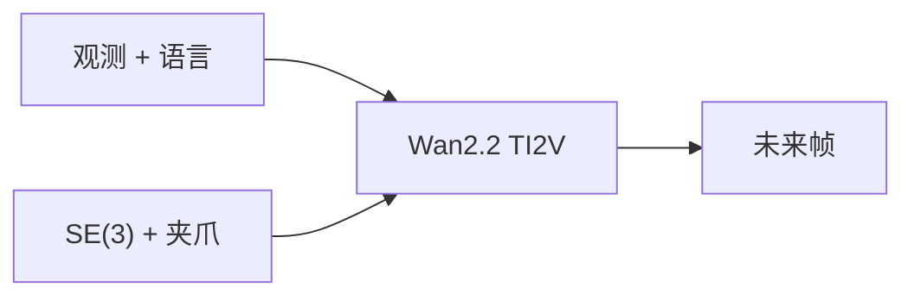

# DreamX-Phi：好看的未来不等于听动作的未来

**DreamX-Phi 1.0**（*Action-Conditioned Video World Model for Robotic Manipulation*；[arXiv:2608.13489](https://arxiv.org/abs/2608.13489)，[代码](https://github.com/AMAP-ML/DreamX-Phi)）由 **阿里巴巴 AMAP-ML** 提出：给定观测、语言指令和末端位姿+夹爪序列，预测未来帧。骨干 **Wan2.2-TI2V-5B**。

## 一句话定义

**视频世界模型的第一指标是动作忠实——每只臂的 SE(3) 必须进注意力，而不是只把画面做真。**

## 英文缩写速查

| 缩写 | 英文全称 | 简要说明 |
|------|----------|----------|
| DreamX-Phi | DreamX-Phi 1.0 | 本文动作条件视频 WM |
| SE(3) | Special Euclidean group in 3D | 每臂刚体变换 |
| PRoPE | 几何位置编码风格 | 把 SE(3) 注入 attention |
| SAM3 | Segment Anything Model 3 | 抓取过程物体一致性 |
| V-JEPA | Video Joint Embedding Predictive Architecture | 冻结教师 |
| DMD | Distribution-Matching Distillation | 少步部署蒸馏 |
| WM | World Model | 本页是视频前向，不是联合 WAM |

## 为什么重要

- 操作 WM 若只卷 FVD/PSNR，会在错臂、丢小物体上「看起来很好」。
- 双臂身份必须在几何编码里保留，否则条件动作会对错身体。
- WorldArena 2.0 把可控性放到赛道上，是读这类模型的外部尺子。

## 核心信息

| 项 | 内容 |
|----|------|
| **机构** | 阿里巴巴（Alibaba / AMAP） |
| **骨干** | Wan2.2-TI2V-5B |
| **开源** | **部分开源**（占位 README；权重待赛后） |

## 核心原理

### 方法栈

动作序列 = 末端位姿 + 夹爪。每臂 SE(3) 做 PRoPE-style 注入。轻量 depth 分支管场景几何；SAM3 mask + 冻结 V-JEPA 管被抓小物体。最后 DMD 把多步生成蒸成少步学生。

### 流程总览

## 工程实践

| 项 | 建议 |
|----|------|
| 源码运行时序图 | **不适用**（截至入库日无可运行推理） |
| 读榜 | 先看动作忠实/赛道名次，再看视频观感 |
| 对照 | 与 Ctrl-World 一样，问「策略闭环能不能用」而不是「像不像」 |

## 实验与评测

作者自报撰写时 WorldArena 2.0 **Track 1 第一、Track 2 并列第二**。无公开权重则无法复核。细节以技术报告图表为准。

## 与其他工作对比

相对 [Wan](./paper-wan-video.md)：本页是操作动作条件的下游，不是新视频基座。相对 [Ctrl-World](./paper-ctrl-world.md)：Ctrl-World 强调多视角 VLA 闭环评估；DreamX-Phi 强调几何编码与赛道名次。相对联合 [WAM](../concepts/world-action-models.md)：本页预测未来观测，不直接出机器人动作。

## 结论

**操作视频世界模型要先保证「臂走哪、物体还在不在」，再谈画质和少步蒸馏。**

1. **SE(3) 进 attention** — 身份与刚体结构不能只靠图像。
2. **小物体要额外约束** — SAM3 + V-JEPA 不是装饰。
3. **赛道名次是自报** — 等权重再复核。
4. **现在不能部署复现** — 仓是占位。

## 局限与风险

- 推理代码与权重未发布。
- WorldArena 协议若更新，名次会过时。
- 视频 WM 仍可能物理违例（穿透、接触力不可用）。

## 关联页面

- [生成式世界模型](../methods/generative-world-models.md)
- [Wan](./paper-wan-video.md)
- [Ctrl-World](./paper-ctrl-world.md)
- [Video as Simulation](../concepts/video-as-simulation.md)
- [机器人世界模型训练闭环](../overview/robot-world-models-training-loop-taxonomy.md)
- [VLA·预测·抓取 9 篇技术地图](../overview/vla-predict-grasp-9-papers-technology-map.md)

## 参考来源

- [论文摘录](../../sources/papers/dreamx_phi_arxiv_2608_13489.md)
- [官方仓归档](../../sources/repos/dreamx-phi.md)
- [具身智能小站 10 篇盘点（2026-08-18）](../../sources/blogs/wechat_embodied_station_contact_predict_adapt_10_papers_2026-08-18.md)
- [具身智能小站 9 篇盘点（2026-08-24）](../../sources/blogs/wechat_embodied_station_9_papers_vla_predict_grasp_2026-08-24.md)

## 推荐继续阅读

- [AMAP-ML/DreamX-Phi](https://github.com/AMAP-ML/DreamX-Phi)
- [arXiv:2608.13489](https://arxiv.org/abs/2608.13489)
