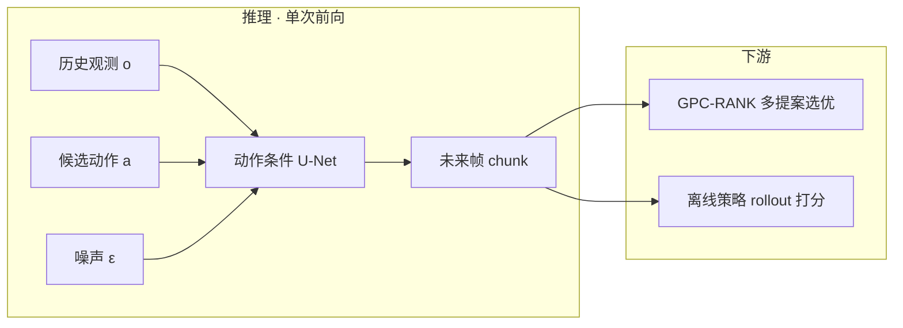
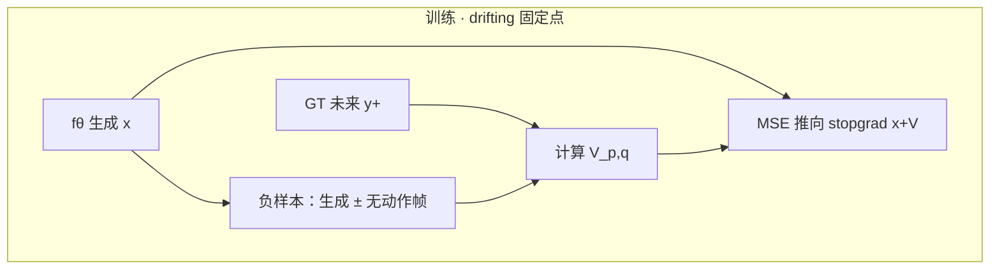
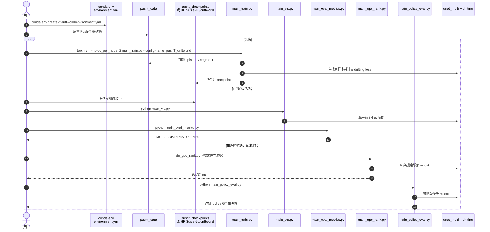

# DriftWorld（Fast World Modeling through Drifting）

**DriftWorld**（*DriftWorld: Fast World Modeling through Drifting*，[arXiv:2607.15065](https://arxiv.org/abs/2607.15065)，2026，Susie Lu / Weirui Ye · **麻省理工学院（MIT）**；Haonan Chen / Yilun Du · **哈佛大学（Harvard University）**；[项目页](https://susie-lu.github.io/driftworld/)，[代码](https://github.com/Susie-Lu/driftworld)）把 **drifting generative models** 接到 **动作条件视频世界模型**：用训练期学习的 drift 替代扩散多步去噪，使想象 rollout 快到能撑 **在线动作搜索** 与 **离线策略排名**。

## 一句话定义

**一个 1-step 动作条件世界模型：当前帧（+ 历史）与候选动作序列经单次前向生成未来帧（30+ fps），用快而准的想象支撑推理时策略改进与离线策略评估。**

## 英文缩写速查

| 缩写 | 英文全称 | 简要说明 |
|------|----------|----------|
| WM | World Model | 预测动作后果以支撑规划 / 评估 |
| FPS | Frames Per Second | 每秒生成帧数；本文 H100 上报告 30+ |
| GPC-RANK | Generative Predictive Control ranking | 多提案想象 rollout 后按奖励选优 |
| IoU | Intersection over Union | Push-T 方块–目标重叠指标 |
| DINO | DINOv2 / DINOv3 | 自监督视觉特征，作复杂场景 drifting 空间 |
| FiLM | Feature-wise Linear Modulation | 帧级动作条件调制 |
| VAE | Variational Autoencoder | 实机高分辨率路径用 SD3 VAE latent |
| MSE | Mean Squared Error | 同骨干对照基线（非 drifting 损失） |

## 为什么重要

- **打破扩散 WM 的决策时延：** 多步采样使「一次决策评估几百条提案」不现实；DriftWorld 平均约 **17×** 更快，把 [虚拟沙盒](../overview/world-models-route-03-virtual-sandbox.md) 从「能评」推到「控环里也能搜」。
- **质量不靠堆采样步：** 同骨干 MSE baseline 也是 1-step，但 drifting 在 Push-T 视觉与 GPC-RANK IoU 上明显更好——说明 **训练目标** 而非仅「少步」决定可用性。
- **双用途闭环：** 同一模型既做 **推理时策略改进**（Push-T IoU **0.635→0.781**），又做 **离线评估器**（Lift Pearson **0.9916**），对齐 [GigaWorld-1](./paper-gigaworld-1-policy-evaluation.md) / [WorldGym](./paper-shenlan-wm-15-worldgym.md) 的评估叙事，但强调 **速度预算**。

## 核心原理（方法）

### 问题与生成形式

给定历史观测 $o_{t-F:t}$ 与未来动作块 $a_{t:t+T}$，学习

$$
o_{t+1:t+T+1}\sim\mathcal{W}(\cdot\mid o_{t-F:t},a_{t:t+T}).
$$

生成器 $f_\theta(\epsilon,c)$ 把噪声先验一次映射到未来视频 chunk；训练期用 drifting field $V_{p,q}=V_p^+-V_q^-$ 把生成分布推向条件数据分布（**单一 GT 正样本** + 多条生成负样本）。

### 机器人适配

| 模块 | 作用 |
|------|------|
| **Action-accentuated drift** | 负样本混合「无动作」真实帧，强化动作跟随 |
| **特征空间 drifting** | 实机数据在 DINOv2/v3 特征图上算 mean-shift；推理不用特征器 |
| **运动加权** | 高运动区域更高 loss 权重，抑制背景 identity mapping |
| **动作条件 U-Net** | 时空分解卷积 + **帧级 FiLM**；历史帧与噪声通道拼接 |
| **可选 self-forcing** | 第二阶段用自预测帧作条件，改善长自回归 |

预测视界 $T$：Push-T **4**、Robomimic **2**、Bridge-V2 / RT-1 / Language Table **1**。仿真数据可在像素空间 drifting；实机高分辨率走 **SD3 VAE latent + DINO 特征损失**。

### 流程总览

## 实验要点（索引级）

| 轴 | 报告口径（以论文 / 项目页为准） |
|----|--------------------------------|
| 视觉 · Push-T 64-frame | SSIM **0.9925**、PSNR **33.78**、LPIPS **0.005**；**0.0037 s/frame**（H100） |
| 视觉 · Bridge / RT-1 / LT | 多数指标优于 IRASim / LVDM / VDM；约 **33–39 fps** |
| GPC-RANK（$K=50$） | Policy 1 IoU **0.781** vs 基策略 **0.635**；全提案耗时 **0.912 s**（vs GPC WM **2.241 s**） |
| 离线评估相关性 | Lift **0.9916**、Can **0.9250**、Push-T **0.9515** |
| 消融 | 无 DINO → 夹爪模糊、FID/FVD 崩；运动加权 + self-forcing 改善自回归 |

## 开源状态

**部分开源**（截至 **2026-07-22** 项目页与 README 核查）：

| 产物 | 状态 |
|------|------|
| 论文 / 项目页 / 交互 demo | 已发布 |
| 代码 | [Susie-Lu/driftworld](https://github.com/Susie-Lu/driftworld) |
| 权重 | [HF Susie-Lu/driftworld](https://huggingface.co/Susie-Lu/driftworld) |
| Push-T 训练 / 评测 / GPC-RANK | **可运行** |
| Bridge-V2 · RT-1 · Language Table · Robomimic | README：**Will be added soon** |
| License | 仓库元数据 **未声明** |

## 源码运行时序图

官方仓当前以 **Push-T** 为完整入口；节点对齐 [`sources/repos/driftworld.md`](../../sources/repos/driftworld.md)。

- **最短复现路径：** 装环境 → 下载 HF checkpoint → `main_vis.py` / `main_eval_metrics.py`。
- **完整 Push-T 训练：** `torchrun … main_train.py --config-name=pushT_driftworld`（论文设定 2×H100）。
- **其它数据集：** 待官方补齐入口后再扩展本图。

## 工程实践

| 项 | 实践要点 |
|----|----------|
| 训练显存 | 每步需生成多条负样本（文中例 **64**），VRAM 限制上下文 / 生成帧数 |
| 环境复杂度 | 仿真可像素 drifting；实机建议 VAE latent + DINO 特征损失 |
| 在线控制 | 用 chunk 自回归：预测末帧回灌策略再出下一动作块 |
| 调试 | 先看动作跟随（夹爪是否动）再看背景；identity mapping 多为运动加权不足 |
| 选型 | 需要 **大量提案 + 低延迟** 时优先于多步扩散 WM；需要跨具身骨架条件见 [OSCAR](./paper-oscar.md) |

## 局限与风险

- **依赖预训练特征：** 复杂场景锐度依赖 DINOv2/v3；特征仅训练期使用。
- **训练内存高于标准扩散一步：** 负样本批量限制长窗口；长程一致性仍是未来工作（稀疏历史 / 时序压缩 VAE）。
- **部分开源：** 不可假设 clone 即可复现全部五环境 Table；当前公开栈以 **Push-T** 为主。
- **License 未声明：** 商用 / 再分发前需自行核实。
- **评估相关 ≠ 可完全替代真机：** 高 Pearson 适合预筛选与版本对比，闭环部署仍需真机校准（见 [评测选型闭环](../queries/embodied-eval-benchmark-selection-loop.md)）。

## 与相邻工作的分界（对比）

| 对比轴 | DriftWorld | [OSCAR](./paper-oscar.md) | [Masked Visual Actions](./paper-masked-visual-actions.md) | [WorldGym](./paper-shenlan-wm-15-worldgym.md) / [GigaWorld-1](./paper-gigaworld-1-policy-evaluation.md) |
|--------|------------|---------------------------|----------------------------------------------------------|--------------------------------------------------------------------------------------------------------|
| **生成范式** | **Drifting · 1-step** | Cosmos-Predict2.5 扩散 / flow | Wan-Fun-Control + LoRA | 各异（常为扩散视频 WM） |
| **条件** | 低维动作 + 可选语言；帧级 FiLM | **2D 骨架** 跨具身 | **像素掩码轨迹**（机器人/物体） | 动作 / 语言不等 |
| **主卖点** | **推理速度 + 搜索/评估** | 跨具身 + RoboArena 排名 | **前向/逆向统一** + 评估 | 评估协议 / WMES / VLM 奖励 |
| **开源重心** | Push-T 全链路 | 数据管线 + 2B 微调 | DiffSynth LoRA；渲染 *soon* | 视各项目 |

## 关联页面

- [Generative World Models](../methods/generative-world-models.md) — 像素域 WM 谱系；本页为 **非扩散单次前向** 代表
- [世界模型路线 03：虚拟沙盒](../overview/world-models-route-03-virtual-sandbox.md) — 想象环境用于规划 / 评估
- [robot-world-models-training-loop-taxonomy](../overview/robot-world-models-training-loop-taxonomy.md) — 训练闭环坐标
- [Video-as-Simulation](../concepts/video-as-simulation.md) — 像素仿真动机与延迟约束
- [OSCAR](./paper-oscar.md) — 动作条件视频 WM + 虚拟策略评估
- [Masked Visual Actions](./paper-masked-visual-actions.md) — 掩码动作条件：前向/逆向统一 + 策略评估
- [GigaWorld-1](./paper-gigaworld-1-policy-evaluation.md) — WM 作策略评估器 roadmap
- [WorldGym](./paper-shenlan-wm-15-worldgym.md) — VLM 奖励策略评估靶场
- [具身大模型评测基准选型闭环](../queries/embodied-eval-benchmark-selection-loop.md) — ② 世界模型评估层
- [Manipulation](../tasks/manipulation.md) — 操纵基准语境

## 参考来源

- [DriftWorld 论文归档（arXiv:2607.15065）](../../sources/papers/driftworld_arxiv_2607_15065.md)
- [Susie-Lu/driftworld 代码索引](../../sources/repos/driftworld.md)
- [DriftWorld 项目页归档](../../sources/sites/susie-lu-driftworld-github-io.md)

## 推荐继续阅读

- [arXiv:2607.15065](https://arxiv.org/abs/2607.15065) — 论文全文
- [项目页与交互 demo](https://susie-lu.github.io/driftworld/)
- [GitHub — Susie-Lu/driftworld](https://github.com/Susie-Lu/driftworld)
- [Deng et al., Generative Modeling via Drifting](https://arxiv.org/abs/2602.04770) — drifting 生成基础
