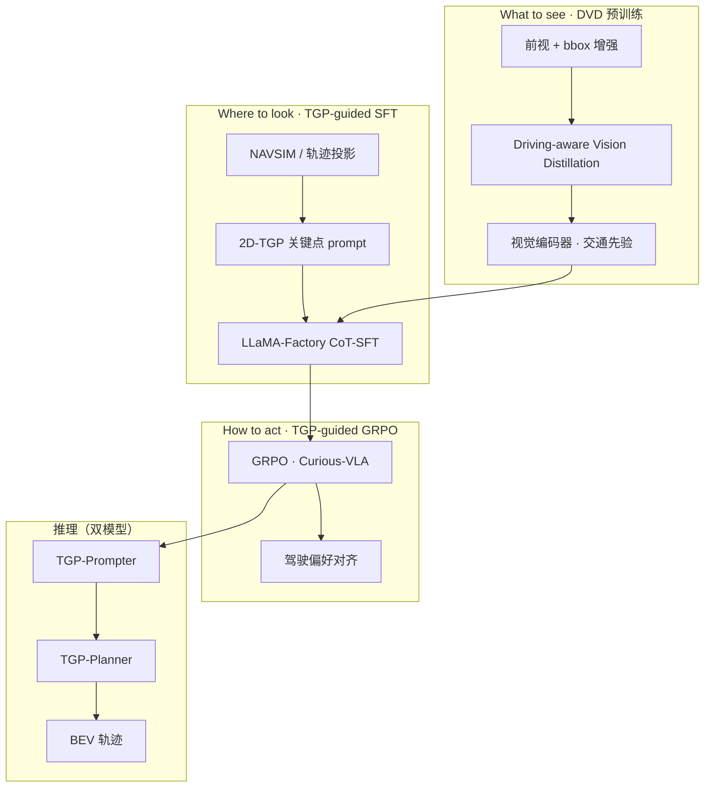
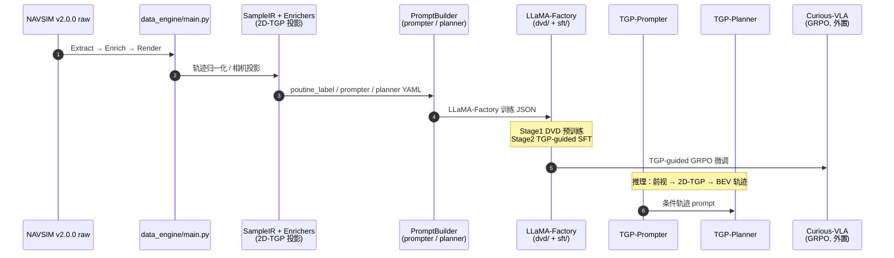

# DriveTeach-VLA：教 VLA 看什么、看哪里

**DriveTeach-VLA**（*Teaching Vision-Language-Action Models What to See and Where to Look*，[arXiv:2607.01658](https://arxiv.org/abs/2607.01658)，**ECCV 2026**，[代码](https://github.com/ShivaTeam/DriveTeach-VLA)）由 **北京航空航天大学**、**清华大学智能产业研究院（AIR）**、**滴滴** 与 **中国传媒大学** 等（Yuguang Yang、Canyu Chen、Zhewen Tan、Yizhi Wang、Zichao Feng、Chunyang Liu、Kehua Sheng、Juan Zhang、Linlin Yang、Baochang Zhang、Yan Wang、Bo Zhang、Xianbin Cao）提出：针对驾驶 VLA 过度依赖 **文本中心 VQA/CoT**、缺乏 **action-grounded 空间依赖** 的问题，用 **Driving-aware Vision Distillation（DVD）** 注入交通视觉先验，用 **2D Trajectory-Guided Prompts（2D-TGP）** 提供与可行轨迹对齐的空间 conditioning，再经 **TGP-guided SFT + GRPO** 生成 **BEV 轨迹**。

## 英文缩写速查

| 缩写 | 英文全称 | 简要说明 |
|------|----------|----------|
| VLA | Vision-Language-Action | 视觉–语言–动作统一策略 |
| DVD | Driving-aware Vision Distillation | 本文：bbox 增强自蒸馏，向视觉编码器注入驾驶感知先验 |
| 2D-TGP | 2D Trajectory-Guided Prompts | 投影到前视的轨迹关键点 prompt，提供 spatial grounding |
| GRPO | Group Relative Policy Optimization | 组相对优势 RL；本文 TGP-guided GRPO 对齐驾驶偏好 |
| BEV | Bird's-Eye View | 鸟瞰轨迹输出空间 |
| NAVSIM | Non-reactive Autonomous Vehicle Simulation | 闭环驾驶规划评测基准 |

## 为什么重要

- **问题诊断清晰：** 现有驾驶 VLA 的 CoT/VQA 预训练 **偏语言、弱空间**，语义表征丰富但 **轨迹所需几何依赖不足**——与 [S²-VLA](./paper-s-squared-vla.md) 指出的 spatial collapse 同族，但本文从 **视觉蒸馏 + 轨迹 prompt** 侧修复。
- **三阶段 pipeline 可部署读法：** **What to see（DVD）→ Where to look（2D-TGP + SFT）→ How to act（GRPO）** 分工明确，比「堆更多 CoT 文本」更贴近规划几何。
- **SOTA + 开源：** Abstract 称 **NAVSIM 与 nuScenes SOTA**；主仓 **Apache-2.0** 含 data engine、DVD、SFT 与 Google Drive 标注，工程可复现度高。
- **数据引擎可迁移：** `data_engine/` 把 NAVSIM v2.0.0 抽成 SampleIR，经 Enrich（2D-TGP 投影等）→ Render 为 LLaMA-Factory 格式，对后续驾驶 VLA 数据集构建有参考价值。

## 核心信息

| 字段 | 内容 |
|------|------|
| 作者 | Yuguang Yang, Canyu Chen, Zhewen Tan, Yizhi Wang, Zichao Feng, Chunyang Liu, Kehua Sheng, Juan Zhang, Linlin Yang, Baochang Zhang, Yan Wang, Bo Zhang, Xianbin Cao |
| 机构 | 北京航空航天大学（BUAA）；清华大学智能产业研究院（AIR）；滴滴；中国传媒大学 |
| 出处 | ECCV 2026；arXiv:2607.01658（2026-07-02） |
| 骨干 | **Qwen2.5-VL** + LLaMA-Factory |
| 输入 | 前视图像 + 历史轨迹 / 2D-TGP 条件 |
| 输出 | **BEV 未来轨迹** |
| 评测 | **NAVSIM**、**nuScenes**（论文报告 SOTA 级） |
| 开源（2026-09-21） | **已开源** 主仓；GRPO 见 [Curious-VLA](https://github.com/Mashiroln/curious_vla)；数据 [Google Drive](https://drive.google.com/drive/folders/1oOz6EVfsrxGvOXvYkwxNhcgqjYP-LqSa?usp=drive_link) |

## 流程总览

## 源码运行时序图

**复现路径：** 下载 Google Drive 标注 → 配置 `data_engine/configs/pipelines/*.yaml` → `python data_engine/main.py` → 按 `dvd/README.md` 跑 DVD → `sft/` LLaMA-Factory YAML → GRPO 阶段接 [Curious-VLA](https://github.com/Mashiroln/curious_vla)。

## 核心机制（归纳）

| 模块 | 机制 | 输出 |
|------|------|------|
| **DVD** | bbox 增强图像自蒸馏 | 视觉编码器含 **交通物体/场景先验** |
| **2D-TGP** | 可行轨迹投影到前视 2D 关键点 + heading | **Where to look** 的空间 prompt |
| **TGP-Prompter** | 仅图像 → 预测 2D-TGP | 推理第一阶段 |
| **TGP-Planner** | 图像 + 2D-TGP → CoT + 归一化轨迹 | BEV 规划 |
| **TGP-guided GRPO** | 组相对 RL 对齐驾驶偏好 | 超越纯 SFT 的轨迹质量 |

## 实验要点

| 维度 | 要点 |
|------|------|
| **NAVSIM** | 论文报告 **SOTA 级**（分项见原文） |
| **nuScenes** | 同步报告 **SOTA 级** |
| **对照读法** | 相对 CoT/VQA 预训练 VLA，增益来自 **视觉先验 + 轨迹 grounding**，而非仅加长 CoT |
| **公平性** | 与 [S²-VLA](./paper-s-squared-vla.md) 对比时注意：本文含 **GRPO 后训练**，S²-VLA 强调纯 SFT 对照 |

## 结论

**DriveTeach-VLA 的核心是把驾驶 VLA 从「语言推理预训练」拉回「视觉–空间–动作」对齐：DVD 解决看什么，2D-TGP 解决看哪里，GRPO 再把轨迹拉向驾驶偏好。**

- **真影响：DVD + 2D-TGP 分工** — 前者补 **交通视觉先验**，后者补 **与可行路径对齐的空间 prompt**；比继续堆 VQA/CoT 更直接服务轨迹预测。
- **真影响：NAVSIM + nuScenes 双 SOTA 叙事** — 在两大驾驶基准同时报 leading，说明增益不是单基准过拟合（具体数字以原文 Table 为准）。
- **真影响：开源 data engine** — NAVSIM → SampleIR → 2D-TGP → LLaMA-Factory 流水线可复用，降低后续驾驶 VLA 数据构建成本。
- **次要代价：双模型推理** — Prompter + Planner 两趟前向，部署需额外延迟预算。
- **次要代价：RL 外置** — GRPO 不在主仓，完整三阶段复现需 Curious-VLA。
- **部署读法：** 端到端前视驾驶 VLA、已有 Qwen2.5-VL + LLaMA-Factory 栈的团队优先；操作域 VLA 需重设计 TGP 投影。
- **工程读法：** Apache-2.0 友好；数据在 Google Drive，DVD 骨干版本需跟 README 钉死 Qwen2.5-VL。

## 工程实践与开源状态

**截至 2026-09-21 GitHub 核查：已开源。**

| 组件 | 状态 | 入口 |
|------|------|------|
| Data Engine | **已发布** | `data_engine/` + README |
| DVD 预训练 | **已发布** | `dvd/` |
| SFT（LLaMA-Factory） | **已发布** | `sft/` |
| 标注与数据集 | **已发布** | [Google Drive](https://drive.google.com/drive/folders/1oOz6EVfsrxGvOXvYkwxNhcgqjYP-LqSa?usp=drive_link) |
| TGP-guided GRPO | **外置开源** | [Curious-VLA](https://github.com/Mashiroln/curious_vla) |
| License | **Apache-2.0** | 主仓 |

## 与其他工作对比

| 对照 | 差异读法 |
|------|----------|
| [S²-VLA](./paper-s-squared-vla.md) | 双流 **架构解耦** 语义/空间；DriveTeach **教视觉与 prompt**，并可接 GRPO |
| [Depth-Wise Probing Driving VLA](./paper-depth-wise-probing-driving-vla.md) | **诊断+剪层提速**；DriveTeach **改训练目标与视觉先验** |
| ReCogDrive / Poutine（README 致谢） | Prompt 设计同源；DriveTeach 叠加 **DVD + 2D-TGP + GRPO** 完整 pipeline |
| [GRPO 方法页](../methods/grpo.md) | 本文为 **驾驶轨迹** 上的 TGP-guided GRPO 实例 |

## 局限与风险

- **GRPO 不在主仓：** 三阶段复现需额外克隆 Curious-VLA。
- **双模型延迟：** 推理两阶段，车载实时需 profiling。
- **NAVSIM 域绑定：** 2D-TGP 与 data engine 强依赖驾驶前视与 NAVSIM 协议，跨域迁移非 trivial。
- **含 RL 后训练：** 与强调纯 SFT 公平的基线对比时需读清训练预算。

## 关联页面

- [VLA（Vision-Language-Action）](../methods/vla.md) — 驾驶域 VLA 实例
- [GRPO](../methods/grpo.md) — TGP-guided GRPO 方法背景
- [Autonomous Driving Core Algorithms](../overview/autonomous-driving-core-algorithms-series.md) — 端到端驾驶算法簇
- [E2E Autonomous Driving Top10](../overview/e2e-autonomous-driving-top10-algorithms.md) — 驾驶算法盘点
- [S²-VLA](./paper-s-squared-vla.md) — NAVSIM 驾驶 VLA 对照
- [Vision-Language Navigation](../tasks/vision-language-navigation.md) — 导航/驾驶 VLA 任务语境

## 推荐继续阅读

- 论文 PDF：<https://arxiv.org/pdf/2607.01658>
- 官方仓库：<https://github.com/ShivaTeam/DriveTeach-VLA>
- NAVSIM：<https://github.com/autonomousvision/navsim>

## 参考来源

- [DriveTeach-VLA 论文归档（arXiv:2607.01658）](../../sources/papers/driveteach_vla_arxiv_2607_01658.md)
- [DriveTeach-VLA 官方仓库归档](../../sources/repos/driveteach-vla.md)
- Yang et al., *Teaching Vision-Language-Action Models What to See and Where to Look* — <https://arxiv.org/abs/2607.01658>
- 代码：<https://github.com/ShivaTeam/DriveTeach-VLA>
