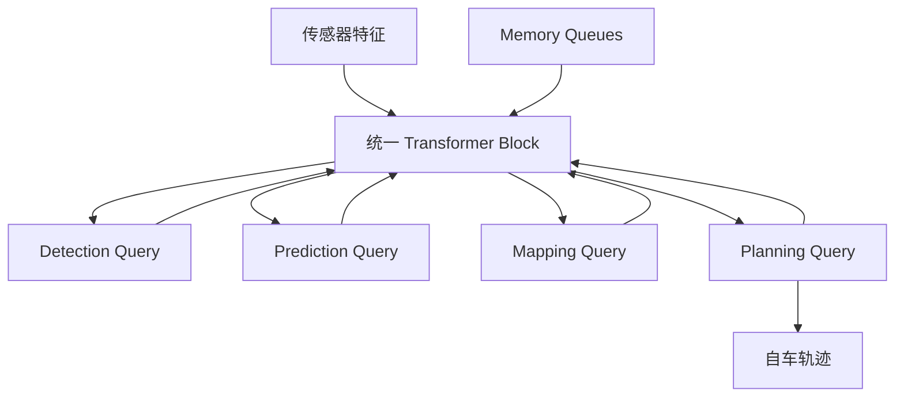
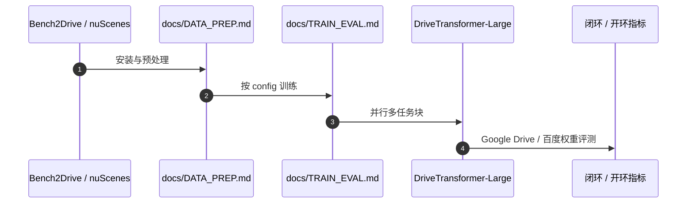

# DriveTransformer（DriveTransformer: Unified Transformer for Scalable End-to-End Autonomous Driving · arXiv:2503.07656）

**DriveTransformer**（*DriveTransformer: Unified Transformer for Scalable End-to-End Autonomous Driving*，[2503.07656](https://arxiv.org/abs/2503.07656)，ICLR 2025）由 **上海交通大学（SJTU）Thinklab** 提出，收录于深蓝AI《端到端自动驾驶：十大前沿算法盘点》**任务并行 Transformer** 线索代表作。

## 一句话定义

检测/预测/建图/规划 Query 在同一 Transformer 块内并行交互，打破感知→预测→规划级联，提升扩展性与训练稳定性。

## 英文缩写速查

| 缩写 | 英文全称 | 简要说明 |
|------|----------|----------|
| DriveTransformer | Driving Unified Transformer | 并行统一端到端 Transformer |
| E2E-AD | End-to-End Autonomous Driving | 端到端自动驾驶 |
| Bench2Drive | Bench2Drive Benchmark | 闭环驾驶仿真基准 |
| BEV | Bird's-Eye View | 对比的稠密时序融合对象 |
| ICLR | International Conference on Learning Representations | 发表 venue |

## 为什么重要

- UniAD 类级联限制并行效率与 scaling，且前序误差易放大。
- 任务自注意力 + 传感器交叉注意力 + 时序交叉注意力三操作统一，设计更简洁。
- Bench2Drive 闭环与 nuScenes 开环均报强结果，并给出可复现仓库与权重。

## 核心信息

| 字段 | 内容 |
|------|------|
| **机构** | 上海交通大学（SJTU）Thinklab |
| **arXiv** | [2503.07656](https://arxiv.org/abs/2503.07656) |
| Venue | ICLR 2025 |
| **演进线索** | 任务并行 Transformer |
| **开源** | **已开源** — [`Thinklab-SJTU/DriveTransformer`](https://github.com/Thinklab-SJTU/DriveTransformer) |
| **指标索引** | 官方 README：DriveTransformer-Large 在 Bench2Drive 报 Driving Score **63.46**、Success Rate **35.01%**、Latency **211.7 ms**（以仓库表为准）。 |

## 核心原理

### 三大特征

1. **Task Parallelism**：agent / map / planning queries 同层互相关注；
2. **Sparse Representation**：任务 query 直接与原始传感器特征交互；
3. **Streaming Processing**：Memory Queues 传递历史，轻量流式时序。

### 流程总览

## 源码运行时序图

关键复现路径：[`Thinklab-SJTU/DriveTransformer`](https://github.com/Thinklab-SJTU/DriveTransformer) 的 INSTALL → DATA_PREP → TRAIN_EVAL。

## 实验与评测

| 维度 | 记录 |
|------|------|
| 闭环 | Bench2Drive：Large 报 Driving Score **63.46**、Success **35.01%**、Latency **211.7 ms**（官方 README） |
| 开环 | nuScenes |
| 权重 | Google Drive / 百度网盘（仓库表） |

## 与相邻路线对比

| 路线 | 相对 DriveTransformer | 取舍 |
|------|----------------------|------|
| [UniAD](./paper-uniad.md) | 级联可解释模块 | 误差累积、难 scale |
| [SparseDrive](./paper-sparsedrive.md) | 稀疏实例算力 | 任务并行叙事弱 |
| [MomAD](./paper-momad.md) | 时序稳定 | 架构仍可级联 |

## 工程实践

| 维度 | 记录 |
|------|------|
| 典型评测 | nuScenes / NAVSIM / Bench2Drive / Waymo Open（依论文） |
| 开源状态 | **已开源** — [`Thinklab-SJTU/DriveTransformer`](https://github.com/Thinklab-SJTU/DriveTransformer) |
| 复现入口 | https://github.com/Thinklab-SJTU/DriveTransformer |
| 工程关注点 | 延迟、帧间一致性、可解释中间量表征、与模块化栈的接口 |

## 局限与风险

- 统一块的显存与调参复杂度随 query 种类上升。
- 闭环仿真成功不自动等于真机。
- 与稀疏实例路线的算力曲线不同，需按芯片选型。

## 关联页面

- [e2e-autonomous-driving-top10-algorithms](../overview/e2e-autonomous-driving-top10-algorithms.md) — 十大盘点父节点
- [自动驾驶核心算法盘点专辑](../overview/autonomous-driving-core-algorithms-series.md) — 模块化栈姊妹篇
- [生成式世界模型](../methods/generative-world-models.md)
- [S²-VLA](./paper-s-squared-vla.md) — 驾驶 VLA / NAVSIM 对照
- [M⁴World](./paper-m4world.md) — 驾驶世界模型后继
- [VLA](../methods/vla.md)

## 参考来源

- [深蓝AI：端到端自动驾驶十大前沿算法盘点](../../sources/blogs/wechat_shenlan_ai_ad_e2e_top10.md)
- [e2e_ad_drivetransformer.md](../../sources/papers/e2e_ad_drivetransformer.md) — 论文 source
- arXiv: [2503.07656](https://arxiv.org/abs/2503.07656)
- [repos/drivetransformer.md](../../sources/repos/drivetransformer.md)

## 推荐继续阅读

- 论文 PDF：<https://arxiv.org/pdf/2503.07656.pdf>
- 官方代码：<https://github.com/Thinklab-SJTU/DriveTransformer>
