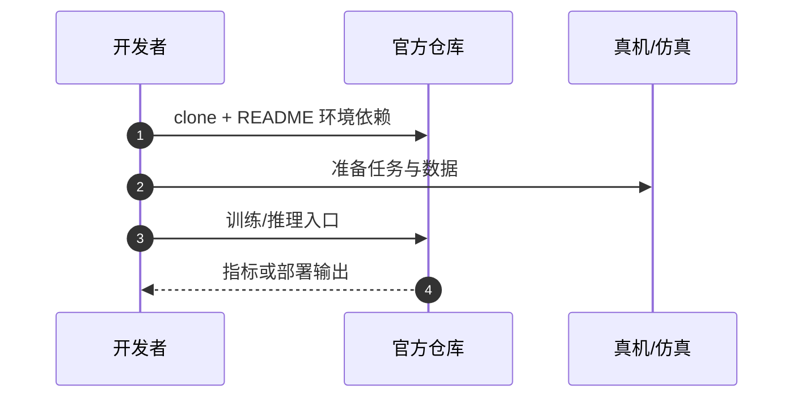

# DriveVLA-M0（arXiv:2608.10413）

**DriveVLA-M0**（*DriveVLA-M0: Failure-Aware Memory Augmentation for Autonomous Driving*，[arXiv:2608.10413](https://arxiv.org/abs/2608.10413)）收录于 [多模空间 · 一周 VLA 研究趋势简析（2026.08.10–08.16）第二篇](../../sources/blogs/wechat_duomo_vla_weekly_trends_2026-08-10_part2.md) **异常处理/智驾** 段。

## 一句话定义

**记录历史失败场景的道路结构与正确驾驶方式，遇相似情况检索案例并临时调整判断，不改全模型权重。**

## 英文缩写速查

| 缩写 | 英文全称 | 简要说明 |
|------|----------|----------|
| VLA | Vision-Language-Action | 视觉–语言–动作策略 |
| VLM | Vision-Language Model | 视觉–语言多模态模型 |
| RL | Reinforcement Learning | 强化学习 |
| CoT | Chain-of-Thought | 链式推理 |

## 为什么重要

- 智驾 VLA 缺失败经验复用；DriveVLA-M0 做 failure-aware 记忆增强（ACM MM 2026）。
- 策展机构：中国科学院自动化研究所；重庆长安科技有限责任公司
- 开源结论：**已开源**（步骤 2.5，2026-10-01）。

## 核心机制

| 项 | 内容 |
|----|------|
| **arXiv** | [2608.10413](https://arxiv.org/abs/2608.10413) |
| **开源** | **已开源** |
| **文内评测** | NAVSIM v1/v2 |

## 源码运行时序图

节点对齐 [`sources/repos/drivevla-m0-failure-aware-memory.md`](../../sources/repos/drivevla-m0-failure-aware-memory.md) 与 README 入口。

## 实验与评测

- **文内口径：** NAVSIM v1/v2
- **读法：** 本页为 [公众号策展](../../sources/blogs/wechat_duomo_vla_weekly_trends_2026-08-10_part2.md) 摘要；逐项指标以 **原文 PDF** 为准。

## 与其他工作对比

| 对照 | 差异读法 |
|------|----------|
| [第二篇技术地图](../overview/vla-weekly-trends-2026-08-10-part2-technology-map.md) | 同批 15 篇横向索引；本文属 **异常处理/智驾** |
| [VLA 方法页](../methods/vla.md) | 单篇机制细节以原文为准 |

## 结论

**DriveVLA-M0 适合作为本期「异常处理/智驾」路线的快速索引页。**

1. 核心贡献：记录历史失败场景的道路结构与正确驾驶方式，遇相似情况检索案例并临时调整判断，不改全模型权重。
2. 开源结论：**已开源** — 以项目页/仓库实际链接为准。
3. 横向对照见 [第二篇技术地图](../overview/vla-weekly-trends-2026-08-10-part2-technology-map.md)。

## 关联页面

- [VLA（Vision-Language-Action）](../methods/vla.md)
- [一周 VLA 趋势技术地图（第二篇）](../overview/vla-weekly-trends-2026-08-10-part2-technology-map.md)

## 参考来源

- [wechat_duomo_vla_weekly_trends_2026-08-10_part2.md](../../sources/blogs/wechat_duomo_vla_weekly_trends_2026-08-10_part2.md)
- [arXiv:2608.10413](https://arxiv.org/abs/2608.10413)

## 推荐继续阅读

- [VLA 方法页](../methods/vla.md)
- [arXiv PDF](https://arxiv.org/pdf/2608.10413)
