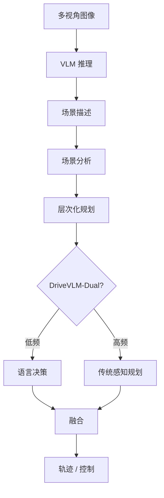

# DriveVLM（DriveVLM: The Convergence of Autonomous Driving and Large Vision-Language Models · arXiv:2402.12289）

**DriveVLM**（*DriveVLM: The Convergence of Autonomous Driving and Large Vision-Language Models*，[2402.12289](https://arxiv.org/abs/2402.12289)，CoRL 2025）由 **清华大学 MARS Lab（Tsinghua）；理想汽车（Li Auto）** 提出，收录于深蓝AI《端到端自动驾驶：十大前沿算法盘点》**VLM 链式思考** 线索代表作。

## 一句话定义

用 VLM 做场景描述→分析→层次化规划的类人 Chain-of-Thought，并以 Dual 架构把低频深度思考与高频控制结合。

## 英文缩写速查

| 缩写 | 英文全称 | 简要说明 |
|------|----------|----------|
| DriveVLM | Driving Vision-Language Model | 驾驶视觉语言模型系统 |
| VLM | Vision-Language Model | 视觉–语言模型 |
| CoT | Chain-of-Thought | 链式思考推理 |
| E2E | End-to-End | 端到端驾驶 |
| CoRL | Conference on Robot Learning | 发表 venue |

## 为什么重要

- 传统感知只认预定义类别，长尾（警车、锥桶、动物）缺乏开放世界常识。
- 把驾驶决策写成可审计的语言推理链，补模块化与纯数值 E2E 的语义缺口。
- DriveVLM-Dual 正视 VLM 延迟，给出可工程落地的快慢系统分工。

## 核心信息

| 字段 | 内容 |
|------|------|
| **机构** | 清华大学 MARS Lab（Tsinghua）；理想汽车（Li Auto） |
| **arXiv** | [2402.12289](https://arxiv.org/abs/2402.12289) |
| Venue | CoRL 2025 |
| **演进线索** | VLM 链式思考 |
| **开源** | **部分开放（项目页）** — 截至入库日项目页与 arXiv 提供论文与演示入口，未核到可运行官方训练/推理仓库。 |
| **指标索引** | 以论文 / 项目页表格为准；盘点强调长尾场景理解与 Dual 实时性权衡。 |

## 核心原理

### 三阶段 Chain-of-Thought

1. **场景描述**：环境、天气、路况与关键物体（如「前方闪灯警车」）。
2. **场景分析**：物体意图及其对自车影响。
3. **层次化规划**：高层决策（减速左偏）→ 轨迹航点。

**DriveVLM-Dual**：VLM 低频深度思考 + 传统感知规划高频实时控制。

### 流程总览

## 源码运行时序图

**不适用** — 截至入库日项目页与 arXiv 提供论文与演示入口，未核到可运行官方训练/推理仓库。。

## 实验与评测

| 维度 | 记录 |
|------|------|
| 重点 | 长尾场景理解 + Dual 延迟权衡 |
| 系统形态 | DriveVLM / DriveVLM-Dual |
| 对照定位 | 纯数值 E2E 与预定义类别感知 |

详细分表见论文与 [项目页](https://tsinghua-mars-lab.github.io/DriveVLM/)。

## 与相邻路线对比

| 路线 | 相对 DriveVLM | 取舍 |
|------|---------------|------|
| [EMMA](./paper-emma-waymo-e2e.md) | 表示层一切皆语言 | 闭源 + 专有数据 |
| [Senna](./paper-senna.md) | 决策/数值显式解耦 | 双模型调度 |
| [S²-VLA](./paper-s-squared-vla.md) | 驾驶 VLA 双流 | 更偏空间几何 |

## 工程实践

| 维度 | 记录 |
|------|------|
| 典型评测 | nuScenes / NAVSIM / Bench2Drive / Waymo Open（依论文） |
| 开源状态 | **部分开放（项目页）** — 截至入库日项目页与 arXiv 提供论文与演示入口，未核到可运行官方训练/推理仓库。 |
| 复现入口 | https://tsinghua-mars-lab.github.io/DriveVLM/ |
| 工程关注点 | 延迟、帧间一致性、可解释中间量表征、与模块化栈的接口 |

## 局限与风险

- VLM 推理延迟与幻觉风险；Dual 仍依赖传统栈兜底。
- 语言决策到数值轨迹的对齐误差需额外模块消化（见 Senna 解耦思路）。
- 开源边界以项目页为准，复现成本高。

## 关联页面

- [e2e-autonomous-driving-top10-algorithms](../overview/e2e-autonomous-driving-top10-algorithms.md) — 十大盘点父节点
- [自动驾驶核心算法盘点专辑](../overview/autonomous-driving-core-algorithms-series.md) — 模块化栈姊妹篇
- [生成式世界模型](../methods/generative-world-models.md)
- [S²-VLA](./paper-s-squared-vla.md) — 驾驶 VLA / NAVSIM 对照
- [M⁴World](./paper-m4world.md) — 驾驶世界模型后继
- [VLA](../methods/vla.md)

## 参考来源

- [深蓝AI：端到端自动驾驶十大前沿算法盘点](../../sources/blogs/wechat_shenlan_ai_ad_e2e_top10.md)
- [e2e_ad_drivevlm.md](../../sources/papers/e2e_ad_drivevlm.md) — 论文 source
- arXiv: [2402.12289](https://arxiv.org/abs/2402.12289)
- [sites/drivevlm-mars-lab.md](../../sources/sites/drivevlm-mars-lab.md)

## 推荐继续阅读

- 论文 PDF：<https://arxiv.org/pdf/2402.12289.pdf>
- 项目页/博客：<https://tsinghua-mars-lab.github.io/DriveVLM/>
