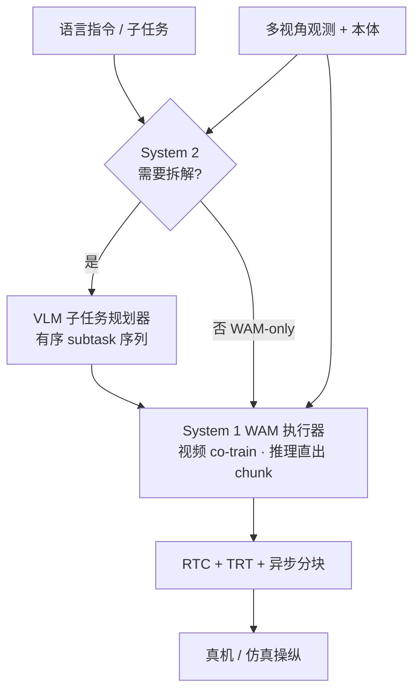

# DSWAM（Dual-System World Action Foundation Model · arXiv:2607.04927）

**DSWAM**（*DSWAM: A Dual-System World Action Foundation Model for Fine-Grained Robot Manipulation*，[arXiv:2607.04927](https://arxiv.org/abs/2607.04927)，AIRC / Midea Group + Tongji University，[项目页](https://ds-wam.github.io/)）提出 **语义规划与物理执行解耦** 的双系统 WAM：System 1 为默认 **世界动作执行器**，System 2 仅在粗粒度多步指令需要时才激活 **VLM 子任务规划器**；执行器 **视频协同训练、推理直出动作块**，并配合 TensorRT / RTC / 异步分块实现真机低延迟闭环。

## 一句话定义

**训练学未来视频动力学，部署不等去噪——双系统 WAM 把 VLM 级任务拆解与 WAM 级物理执行分开，并在 DeMaVLA 匹配协议下公平对照 VLA 执行能力。**

## 英文缩写速查

| 缩写 | 英文全称 | 简要说明 |
|------|----------|----------|
| WAM | World Action Model | 以视频/世界建模为密集监督的动作策略 |
| VLA | Vision-Language-Action | System 2 可选规划器所继承的语义接口 |
| RTC | Real-Time Chunking | 异步动作分块，避免策略查询阻塞控制环 |
| TRT | TensorRT | 真机推理加速栈 |
| DeMaVLA | Deformable Manipulation VLA | 匹配数据/平台/协议的可变形操纵 VLA 基线 |
| CFM | Conditional Flow Matching | 执行器连续动作块生成目标 |
| MoT | Mixture-of-Transformers | 视频骨干与动作专家的多模态解耦结构 |

## 为什么重要

- **填补 WAM「缺语言规划接口」的空白：** 现有 WAM 多聚焦物理执行，而 VLM-VLA 擅长粗指令语义分解；DSWAM 把 **System 2 设为可选模块**，原子指令或执行器已可靠的任务 **不强制走规划路径**，避免为已会做的动作引入额外延迟。
- **训练–部署解耦的清晰范例：** 与 [Fast-WAM](../methods/generative-world-models.md) / GigaWorld-Policy 同脉——**视频协同训练提供时序监督，推理接口仍为动作块**；策展文指出这是 WAM 能否上真机的关键工程分水岭。
- **首个匹配协议下的 WAM–VLA 真机对照：** 在 [DeMaVLA 设定](https://arxiv.org/abs/2607.04927) 下对齐 **同一机器人、预训练/后训练数据、任务协议与成功判据**，折叠 benchmark **禁用 System 2**，使增益可归因于 **执行器建模** 而非数据或平台差异。
- **与 [DynaWM](./paper-dynawm-vla-online-correction.md)、[DreamSteer](./paper-dreamsteer-vla-deployment-steering.md) 构成 WAM 职责三角**：直接执行 / 在线修正 / 部署筛选；DSWAM 代表 **第一类「接管动作后果预测并直出控制」** 的 foundation 路线。

## 核心结构与方法

| 模块 | 方法要点 |
|------|----------|
| **System 1 执行器** | 多视角 RGB + 语言/子任务 + 本体 $q_t$ 条件；基于预训练 **视频模型骨干 + 动作专家**；**动作预测 + 视频 co-training**，推理 **直接预测连续 action chunk**，不逐步生成未来视频 |
| **System 2 规划器（可选）** | 短程视觉历史 + 全局任务 prompt → **有序可执行子任务序列**；transition-aware 子任务监督；仅在粗粒度多步指令受益时激活 |
| **WAM-only 模式** | 原子指令或执行器已可靠任务：**跳过 System 2**，原始 prompt 直达 System 1 |
| **部署栈** | **RTC + 异步执行 + TensorRT**：policy query 不阻塞控制环；与 LingBot-VA / DreamZero 等异步 WAM 部署思路同族 |
| **规模化预训练** | 大规模真实机器人数据预训练执行器，再在任务数据上 SFT；折叠评测遵循 DeMaVLA 后训练协议 |

### 双系统控制流

### 与相邻 WAM 的方法分界

| 维度 | 典型 Joint WAM（Motus / DreamZero） | DSWAM |
|------|--------------------------------------|-------|
| **语言接口** | 多为单指令端到端 | **可选 System 2 显式子任务分解** |
| **推理输出** | 部分方法仍 imagine-then-execute | **默认直出 action chunk** |
| **对照设定** | 平台/数据常不一致 | **DeMaVLA 匹配 VLA 协议** |
| **主验证任务** | 通用桌面操纵 | **可变形折叠 + RoboTwin 2.0** |

## 实验要点（索引级）

| 轴 | 报告口径（以论文为准） |
|----|------------------------|
| **真机可变形折叠（DeMaVLA 匹配）** | 平均成功率 **92.5% → 96.3%**；完成时间 **2′18″ → 1′44″**；System 2 **关闭**，纯执行器对照 |
| **RoboTwin 2.0** | Clean 平均 **92.38%**；Randomized **91.90%** |
| **System 2 消融** | 受益于分解的粗粒度任务：**成功率上升、rollout 失误减少**（见论文 System 2 study） |
| **部署** | TensorRT + RTC；推理路径 **无显式未来视频去噪** |
| **机构** | AIRC Midea Group、同济大学 |
| **代码/权重** | [ds-wam.github.io](https://ds-wam.github.io/) |

## 与其他工作对比

| 工作 | 关系 |
|------|------|
| **[DynaWM](./paper-dynawm-vla-online-correction.md)** | 冻结 VLA + 世界模型 **在线重写** 动作；DSWAM **从零训练执行器** 并可选规划 |
| **[DreamSteer](./paper-dreamsteer-vla-deployment-steering.md)** | **部署时筛选** 候选块；DSWAM **端到端生成** 动作块 |
| **[MECo-WAM](./paper-meco-wam-4d-geometry-cotraining.md)** | 同 Midea 生态 WAM 线；MECo 加 **训练期 4D 几何**；DSWAM 加 **双系统语义–执行解耦** |
| **DeMaVLA / π 系 VLA** | 匹配协议下的 **VLA 执行基线**；DSWAM 在折叠任务上 **更快且更稳** |
| **Fast-WAM / GigaWorld-Policy** | 同 **训练学世界、部署不想象** 部署哲学 |

## 常见误区或局限

- **误区：** 把 DSWAM 等同于「WAM + 普通 VLM 串联」；关键是 **默认 WAM-only、规划可选、匹配协议对照**，而非任意两级堆叠。
- **误区：** 认为 RoboTwin 高分说明无需真机；**可变形折叠** 才是论文强调的 **公平 VLA 对照** 主战场。
- **局限：** System 2 增益依赖 **指令粒度与子任务标注质量**；跨本体/跨平台仍受 [Worldscape-MoE](./paper-worldscape-moe-heterogeneous-action.md) 所讨论的 **动作接口碎片化** 约束；长程误差与动作忠实度仍是开放问题（见策展导读）。

## 与其他页面的关系

- [wm-action-consequence-category-01-wam-action-prediction](../overview/wm-action-consequence-category-01-wam-action-prediction.md) — WAM 直接执行/修正/筛选分类 hub
- [动作后果技术地图](../overview/robot-world-models-action-consequence-technology-map.md) — 本专题总览
- [World Action Models](../concepts/world-action-models.md) — Joint WAM 概念坐标
- [VLA](../methods/vla.md) — DeMaVLA / π 系反应式对照
- [Generative World Models](../methods/generative-world-models.md) — 视频 co-training 与部署解耦语境

## 推荐继续阅读

- [DSWAM 论文（arXiv:2607.04927）](https://arxiv.org/abs/2607.04927)
- [DSWAM 项目页与演示](https://ds-wam.github.io/)
- [DynaWM 论文实体](./paper-dynawm-vla-online-correction.md) — 在线修正对照
- [DreamSteer 论文实体](./paper-dreamsteer-vla-deployment-steering.md) — 部署筛选对照
- [MECo-WAM 论文实体](./paper-meco-wam-4d-geometry-cotraining.md) — 同团队几何增强 WAM

## 参考来源

- [具身智能研究室 · 世界模型动作后果专题导读（2026-07）](../../sources/blogs/wechat_embodied_ai_lab_robot_world_models_action_consequence_2026.md)
- [DSWAM 论文（arXiv:2607.04927）](https://arxiv.org/abs/2607.04927)
