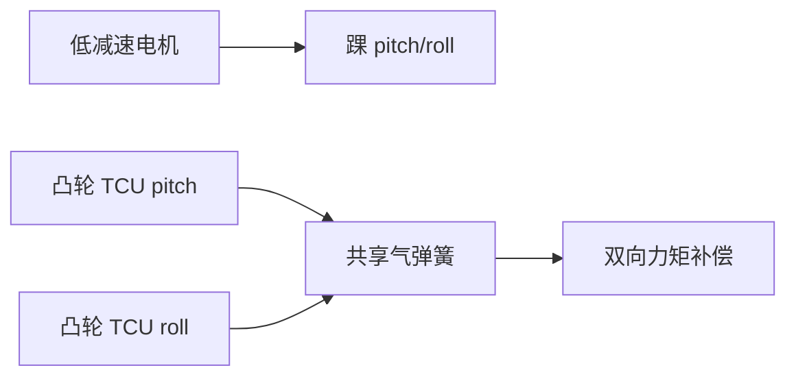

# 双凸轮共享气弹簧人形并联弹性踝

**Dual-Cam PEA Ankle**（[arXiv:2608.30832](https://arxiv.org/abs/2608.30832)）由 **意大利技术研究院（IIT）HHCM** 提出（公众号周更 ingest 见 [策展索引](../../sources/blogs/wechat_shenlan_weekly_papers_2026-09-04.md)）。

## 一句话定义

踝部两轴力矩辅助可以 **共用一个气弹簧**，靠双凸轮在紧凑空间内做 pitch/roll 补偿。

## 英文缩写速查

| 缩写 | 英文全称 | 简要说明 |
|------|----------|----------|
| PEA | Parallel Elastic Actuator | 并联弹性执行器 |
| SEA | Series Elastic Actuator | 串联弹性执行器对照 |
| FEA | Finite Element Analysis | 有限元静力分析 |
| TCU | Torque Compensation Unit | 单轴补偿单元模块 |

## 为什么重要

高人形踝扭矩需求与热/电流矛盾；PEA 可 **卸荷静态持姿** 但多轴常需多个弹性件占体积。

## 核心信息

| 项 | 内容 |
|----|------|
| **机构** | 意大利技术研究院（IIT）HHCM |
| **开源** | 见 [工程实践](#工程实践) |

## 核心原理

两个 TCU 共享一气弹簧；建立 **耦合 2-DoF 模型** 显式写弹簧力互耦；优化凸轮轮廓拟合目标力矩曲线；完整小腿 CAD 集成。

### 流程总览

## 源码运行时序图

**不适用** — 截至 **2026-09-07** 无可运行官方代码（或本文为硬件/协议类工作）。

## 工程实践

| 项 | 说明 |
|----|------|
| 开源状态 | 见论文摘录与项目页核查结论 |
| 复现入口 | 以 arXiv 为准 |

## 实验与评测

静力 FEA 与运动学仿真验证 **力矩卸荷** 与定制凸轮可行性（论文未给统一能效百分比表）。

## 结论

机构贡献是 **单弹簧双轴补偿 + 可定制凸轮优化链**；适合作为人形踝部 co-design 参考。

1. 对比每轴独立弹簧更 **紧凑**。
2. 气弹簧相对金属弹簧 **能量密度** 更高。
3. 优化从 **任务力矩曲线** 反求凸轮。
4. 硬件论文——**无运行时序图**。
5. 未见开源 CAD 包。

## 局限与风险

仿真/FEA 为主；未报告长时行走耐久与摩擦建模误差。

## 关联页面

- [humanoid-locomotion](../tasks/humanoid-locomotion.md)
- [paper-bridge-humanoid.md](./paper-bridge-humanoid.md)
- [具身基础模型硬件共设计](../concepts/embodied-foundation-model-hardware-codesign.md)

## 参考来源

- [dual_cam_parallel_elastic_ankle_arxiv_2608_30832.md](../../sources/papers/dual_cam_parallel_elastic_ankle_arxiv_2608_30832.md)
- [公众号周更策展](../../sources/blogs/wechat_shenlan_weekly_papers_2026-09-04.md)

## 推荐继续阅读

- [https://arxiv.org/abs/2608.30832](https://arxiv.org/abs/2608.30832)
