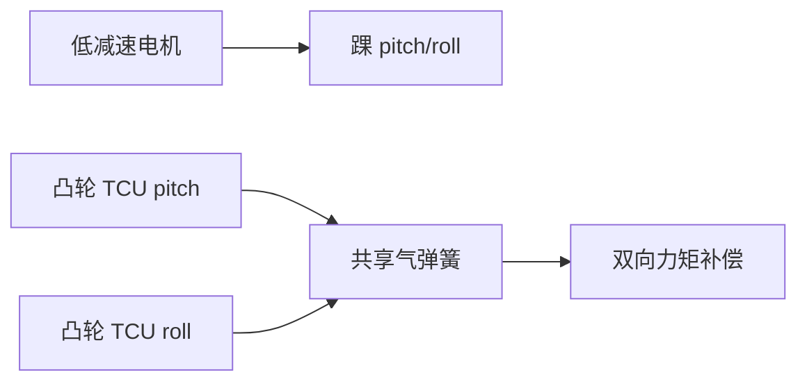

# 双凸轮共享气弹簧人形并联弹性踝

**Dual-Cam PEA Ankle**（[arXiv:2608.30832](https://arxiv.org/abs/2608.30832)）由 **意大利技术研究院（IIT）HHCM** 提出（公众号周更 ingest 见 [策展索引](../../sources/blogs/wechat_shenlan_weekly_papers_2026-09-04.md)）。

## 一句话定义

踝部两轴力矩辅助可以 **共用一个气弹簧**，靠双凸轮在紧凑空间内做 pitch/roll 补偿。

## 英文缩写速查

| 缩写 | 英文全称 | 简要说明 |
|------|----------|----------|
| PEA | Parallel Elastic Actuator | 并联弹性执行器 |
| SEA | Series Elastic Actuator | 串联弹性执行器对照 |
| FEA | Finite Element Analysis | 有限元静力分析 |
| TCU | Torque Compensation Unit | 单轴补偿单元模块 |

## 为什么重要

高人形踝扭矩需求与热/电流矛盾；PEA 可 **卸荷静态持姿** 但多轴常需多个弹性件占体积。

## 核心信息

| 项 | 内容 |
|----|------|
| **机构** | 意大利技术研究院（IIT）HHCM |
| **开源** | 见 [工程实践](#工程实践) |

## 核心原理

两个 TCU 共享一气弹簧；建立 **耦合 2-DoF 模型** 显式写弹簧力互耦；优化凸轮轮廓拟合目标力矩曲线；完整小腿 CAD 集成。

### 流程总览

## 源码运行时序图

**不适用** — 截至 **2026-09-07** 无可运行官方代码（或本文为硬件/协议类工作）。

## 工程实践

| 项 | 说明 |
|----|------|
| 开源状态 | 见论文摘录与项目页核查结论 |
| 复现入口 | 以 arXiv 为准 |

## 实验与评测

静力 FEA 与运动学仿真验证 **力矩卸荷** 与定制凸轮可行性（论文未给统一能效百分比表）。

## 结论

机构贡献是 **单弹簧双轴补偿 + 可定制凸轮优化链**；适合作为人形踝部 co-design 参考。

1. 对比每轴独立弹簧更 **紧凑**。
2. 气弹簧相对金属弹簧 **能量密度** 更高。
3. 优化从 **任务力矩曲线** 反求凸轮。
4. 硬件论文——**无运行时序图**。
5. 未见开源 CAD 包。

## 与其他工作对比

同样是「让踝/腿关节出得起力矩」，各路线把成本花在了不同地方：

| 路线 | 代表 | 弹性件放在哪 | 主要收益 | 代价 / 本文差异 |
|------|------|--------------|----------|-----------------|
| **双凸轮共享气弹簧 PEA** | 本文（IIT HHCM） | **并联**，pitch/roll **共用一个**气弹簧 | 静态持姿卸荷；2-DoF 只付 1 个弹性件的体积 | 两轴力矩互耦，必须显式建模；凸轮需按目标力矩曲线定制，换任务谱即换件 |
| 每轴独立 PEA | 常规双弹簧踝 | 并联，每轴一个 | 两轴解耦，建模简单 | 踝部体积/质量翻倍——正是本文要省的 |
| SEA 串联弹性 | ANYmal 一类（见 [接触力估计](../concepts/contact-estimation.md)） | **串联**在传动链中 | 形变直接测力，力控柔顺可测 | 降低力控带宽；卸荷静态负载的能力不如 PEA |
| QDD 准直驱 | [开源 QDD 执行器项目](../comparisons/open-source-qdd-actuator-projects.md) | 无弹性件 | 反驱性好、控制模型干净 | 静态持姿全靠电流，热/功耗正是本文动机中的矛盾 |
| 线性丝杠腿驱动 | [行星滚柱丝杠腿驱动](../concepts/planetary-roller-screw-humanoid-leg-actuation.md) | 无弹性件，改传动比 | 高推力密度 | 反驱差、结构耦合复杂；解决的是峰值力矩而非静态卸荷 |

**与建模侧的关系：** PEA 让关节力矩 = 电机力矩 + 位形相关的弹簧力矩，[理想力矩源抽象](../concepts/torque-source-abstraction-gap.md) 在此处显式破掉——策略下发的指令不再等于关节实际力矩。这属于 [执行器驱动链选型闭环](../queries/actuator-drive-chain-selection-loop.md) ③ 执行器建模层的问题：本文给出的是 **解析耦合模型**，与 [隐式/显式执行器建模](../concepts/implicit-explicit-actuator-modeling.md) 里「网络拟合」一路互为对照——解析式可外推但需精确凸轮几何，网络式省建模但分布外易漂。

## 局限与风险

仿真/FEA 为主；未报告长时行走耐久与摩擦建模误差。

## 关联页面

- [humanoid-locomotion](../tasks/humanoid-locomotion.md)
- [paper-bridge-humanoid.md](./paper-bridge-humanoid.md)
- [具身基础模型硬件共设计](../concepts/embodied-foundation-model-hardware-codesign.md)
- [执行器驱动链选型闭环](../queries/actuator-drive-chain-selection-loop.md) — 本文落在 ③ 执行器建模层：并联弹性使「理想力矩源」假设显式失效
- [理想力矩源抽象 gap](../concepts/torque-source-abstraction-gap.md) — PEA 让指令力矩 ≠ 关节力矩
- [开源 QDD 执行器项目](../comparisons/open-source-qdd-actuator-projects.md) — 无弹性件对照路线

## 参考来源

- [dual_cam_parallel_elastic_ankle_arxiv_2608_30832.md](../../sources/papers/dual_cam_parallel_elastic_ankle_arxiv_2608_30832.md)
- [公众号周更策展](../../sources/blogs/wechat_shenlan_weekly_papers_2026-09-04.md)

## 推荐继续阅读

- [https://arxiv.org/abs/2608.30832](https://arxiv.org/abs/2608.30832)
