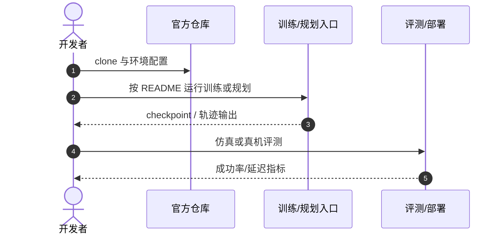

# Dual-Head Coordination

**Making two action heads agree: coordination mechanisms and a runtime collapse certificate for flow-matching policies**（[arXiv:2608.15748](https://arxiv.org/abs/2608.15748)，[项目页](https://github.com/kimo423/dual-head-coordination)）——（见论文作者列表）。

## 一句话定义

**机器人策略监测必须区分真异常与多模态任务下的合理分歧。**

## 英文缩写速查

| 缩写 | 英文全称 | 简要说明 |
|------|----------|----------|
| FM | Flow Matching | 流匹配动作策略 |
| EE | End-Effector | 末端执行器空间 |
| FK | Forward Kinematics | 关节到末端映射 |

## 为什么重要

- 纳入 [具身智能小站 2026-08-23 九篇盘点](../../sources/blogs/wechat_embodied_station_9_papers_open_source_2026-08-23.md) 的「长视野 VLA → 动作分布 → 真实交互」主线。
- 开源状态（入库日）：**已开源**。

## 核心信息

| 项 | 内容 |
|----|------|
| **机构** | （见论文作者列表） |
| **出处** | arXiv:2608.15748（2026-08） |
| **开源** | **已开源** |

### 流程总览

## 评测

| 项 | 内容 |
|----|------|
| **主结果** | 系统比较共享 latent、共享 source noise、一致性正则与 partition token；提出 collapse certificate 区分协调与坍缩。 |

- 数据出处：[ingest 摘录](../../sources/papers/dual_head_coordination_arxiv_2608_15748.md)。

## 结论

**双动作头残差可作物理可解释监测信号，但多模态下需要显式协调机制。**

- 共享辅助 latent 会在总体最优中被擦除
- partition token 稳健接近协调上限
- collapse certificate 无需真值标签
- 关节/末端双分支残差可解释
- 官方 GitHub 已链

## 源码运行时序图

## 与其他页面的关系

- [probability-flow](../formalizations/probability-flow.md)
- [manipulation](../tasks/manipulation.md)
- [online-vs-offline-rl](../comparisons/online-vs-offline-rl.md)
- [vla-robustness-9-papers-technology-map](../overview/vla-robustness-9-papers-technology-map.md)

## 参考来源

- [dual_head_coordination_arxiv_2608_15748](../../sources/papers/dual_head_coordination_arxiv_2608_15748.md)
- [dual-head-coordination](../../sources/repos/dual-head-coordination.md)
- [wechat_embodied_station_9_papers_open_source_2026-08-23](../../sources/blogs/wechat_embodied_station_9_papers_open_source_2026-08-23.md)

## 推荐继续阅读

- [arXiv:2608.15748](https://arxiv.org/abs/2608.15748)
- [官方代码](https://github.com/kimo423/dual-head-coordination)
