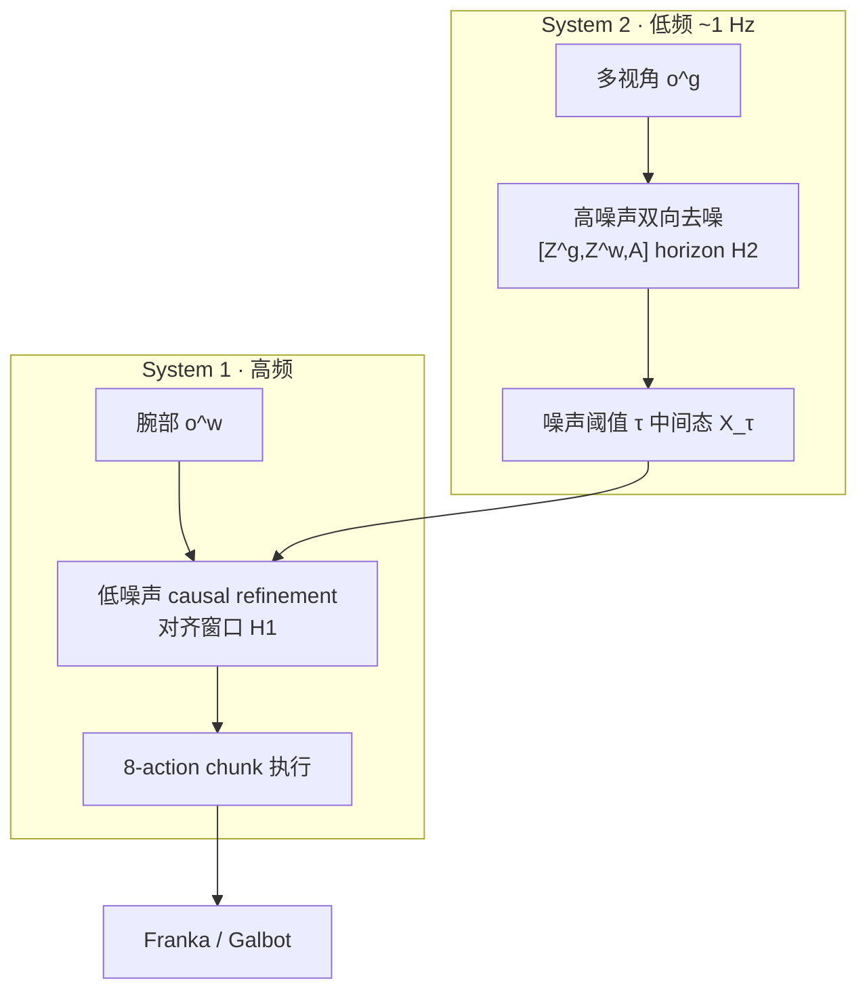

# DualWAM（arXiv:2609.24868）

**DualWAM**（*Dual-System World Action Models for Asynchronous Global Planning and Local Refinement*，[arXiv:2609.24868](https://arxiv.org/abs/2609.24868)，[项目页](https://steveouo.github.io/DualWAM-Web/)）把 **world–action 生成** 拆成 **低频 System 2 全局规划** 与 **高频 System 1 腕部局部 refinement**，沿 **共享去噪轨迹** 异步运行：S2 在高噪声段建立长 horizon 计划，S1 从中截取对齐窗口、用最新腕部观测完成低噪声段。

## 一句话定义

一条 world–action flow 上，大模型低频做全局双向去噪，小模型高频用腕部视图 refinement 短 action chunk，兼顾 WAM 长视野与闭环响应。

## 英文缩写速查

| 缩写 | 英文全称 | 简要说明 |
|------|----------|----------|
| WAM | World Action Model | 联合预测未来视觉与动作 |
| UMI | Universal Manipulation Interface | 腕部-centric 示范数据接口 |
| CFG | Classifier-Free Guidance | 文内 baseline 族常用推理技巧 |
| SR | Success Rate | 零样本任务成功率 |
| S2 / S1 | System 2 / System 1 | 全局规划 / 局部 refinement |

## 为什么重要

- **解 WAM latency 张力：** 长 action chunk 摊销推理 vs 闭环响应 — DualWAM 用 **异步双 WAM** 而非单纯缩 chunk 或砍视觉预测。
- **角色匹配数据：** egocentric 对齐 S2 全局预测，UMI 对齐 S1 局部几何/接触 — ablation **+14 pp**。
- **边云友好：** 平均下行流量约为最强 baseline **1/104.6**（项目页/log 尺度图）。

## 核心信息

| 字段 | 内容 |
|------|------|
| 机构 | 中科院自动化所（CASIA）、银河通用（Galbot）、北京大学、上海交通大学等 |
| 评测 | Franka FR3 + Galbot G1 各 10 零样本 unseen 任务 |
| 开源 | **待发布** — 项目页无训练/推理仓库（2026-09-24） |

## 流程总览

## 核心原理

- **Handoff：** S2 从 σ=1→τ；S1 从 τ→0，仅状态 `[Z^w, A]` 的 temporally aligned 窗口。
- **Attention 分工：** S2 bidirectional；S1 causal + 新鲜腕部观测。
- **复用：** 每个 S2 全局计划服务多次 S1 局部更新；S1 持续吸收交互反馈而无需整段重生成。

## 源码运行时序图

**不适用（待发布）** — 截至入库日无官方可运行仓库；公开后应对齐 S2 1 Hz 计划刷新与 S1 per-step refinement 入口。

## 工程实践

| 项 | 读法 |
|----|------|
| 观测分工 | S2 吃 head/external；S1 **仅 wrist** — 勿混用同一 camera 栈 |
| 数据配方 | egocentric + UMI 角色匹配是 **+14 pp** 级增益，非可有可无增广 |
| 延迟 | 报告 **critical-path 16.6×** speedup — 对比 WAM 时需同 CFG/量化设定 |
| 边云 | S2 可放 cloud、S1 贴边 — 流量模型与 baseline 差两个数量级 |

## 实验与评测

- 相对最强 evaluated baseline：**+4.5 pp** 平均 SR；**16.6×** critical-path speedup。
- 真机 zero-shot：Franka 单臂多样操作 + Galbot 双臂/contact-rich（扫、倒、解 ribbon 等）。
- 对比视频：vs π₀.₅ / Cosmos-Nano 等同 prompt 失败案例。

## 与其他工作对比

> 下表只做**定位对照**，不做跨设定横比：各行与本页不共享同一评测协议，数字不可直接相减。

| 对照 | 差异读法 |
|------|----------|
| [THAW-VLA](./paper-thaw-vla.md) | 同为「WAM 太慢、如何部署」，解法相反：THAW-VLA 把 WAM 特征**蒸馏**进紧凑 VLA、部署图与 baseline 相同；DualWAM **两端都保留 WAM**，靠异步分频拿延迟收益 |
| [WholeBodyWAM](./paper-wholebodywam.md) | 同为保留预训练 WAM 先验，但扩展轴不同：WholeBodyWAM 把桌面 WAM 泛化到**人形全身**（UWBC 语义接口）；DualWAM 在**机械臂**上解**长视野 vs 闭环响应**的时延张力 |
| [MAP-WAM](./paper-map-wam.md) | MAP-WAM 用情景记忆生成分段计划补**长程记忆**；DualWAM 的 S2 全局规划解决的是**低频规划与高频纠偏**的调度，二者正交 |
| [控制/推理频率解耦](../concepts/control-inference-frequency-decoupling.md) | 通用范式是「低频 VLA + 高频 PD/WBC」；DualWAM 把高频端也换成**小 WAM**，并沿共享去噪轨迹（τ handoff）交接，而非只交动作块 |
| [Action Chunking](../methods/action-chunking.md) | 单纯加长 chunk 能摊销推理但牺牲响应；DualWAM 保留 8-action 短 chunk，由 S1 高频刷新 |

## 结论

**DualWAM 代表「双 WAM、共享去噪轨迹、异步更新」路线 — 在保留 world–action 联合生成的同时把控制环 latency 拉下来；工程复现待官方代码。**

1. **分解轴对齐** — 时间（低/高频率）× 生成（高/低噪声）× 感知（global/wrist）三轴一致，而非简单大小模型 cascade。
2. **UMI 不是泛化增广** — 与 S1 角色绑定，ablation 幅度大。
3. **边云是副产品** — 全局计划可低频下发，局部 refinement 贴端。
4. **开源：** 项目页仅 demo — **待发布**。
5. 与 [AHA-WAM](../concepts/world-action-models.md) / X-WAM 等异步 WAM 对照：DualWAM **两端仍是 WAM**，共享 τ handoff。

## 关联页面

- [World Action Models](../concepts/world-action-models.md)
- [VLA](../methods/vla.md)
- [Manipulation](../tasks/manipulation.md)
- [THAW-VLA](./paper-thaw-vla.md) — 另一条 WAM→compact 部署路线（蒸馏而非异步双系统）

## 推荐继续阅读

- [DualWAM 项目页](https://steveouo.github.io/DualWAM-Web/)
- [arXiv:2609.24868](https://arxiv.org/abs/2609.24868)

## 参考来源

- [DualWAM 论文归档](../../sources/papers/dualwam_arxiv_2609_24868.md)
- [DualWAM 项目页归档](../../sources/sites/dualwam-steveouo-github-io.md)
