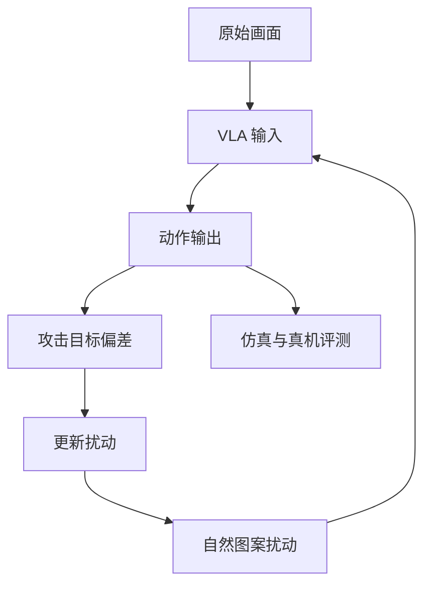

# DURA（arXiv:2608.10393）

**DURA**（*Hidden in Plain Sight: Diffusion-Based Unrestricted Robotic Attacks on Vision-Language-Action Models*，[arXiv:2608.10393](https://arxiv.org/abs/2608.10393)）收录于 [多模空间 · 一周 VLA 研究趋势简析（2026.08.10–08.16）第二篇](../../sources/blogs/wechat_duomo_vla_weekly_trends_2026-08-10_part2.md) **异常处理/安全** 段。

## 一句话定义

**画面中加入自然图案即可误导 VLA 输出攻击者期望动作，黑盒观察动作也可完成；仿真与真机均有效。**

## 英文缩写速查

| 缩写 | 英文全称 | 简要说明 |
|------|----------|----------|
| VLA | Vision-Language-Action | 视觉–语言–动作策略 |
| VLM | Vision-Language Model | 视觉–语言多模态模型 |
| RL | Reinforcement Learning | 强化学习 |
| CoT | Chain-of-Thought | 链式推理 |

## 为什么重要

- 除任务成功率外需测视觉对抗；DURA 用扩散生成不易察觉的干扰。
- 策展机构：西安交通大学；上海人工智能实验室；中国科学技术大学
- 开源结论：**待核实**（步骤 2.5，2026-10-01）。

## 流程总览

以下按本页已归纳的机制与资料绘制，表示模块或阅读路径关系。

## 核心机制

| 项 | 内容 |
|----|------|
| **arXiv** | [2608.10393](https://arxiv.org/abs/2608.10393) |
| **开源** | **待核实** |
| **文内评测** | LIBERO、BridgeData V2；Franka 实机 |

## 源码运行时序图

**不适用**（截至入库日未提供可运行官方代码入口，或仓库尚无可辨识训练/推理入口）。

## 实验与评测

- **文内口径：** LIBERO、BridgeData V2；Franka 实机
- **读法：** 本页为 [公众号策展](../../sources/blogs/wechat_duomo_vla_weekly_trends_2026-08-10_part2.md) 摘要；逐项指标以 **原文 PDF** 为准。

## 与其他工作对比

| 对照 | 差异读法 |
|------|----------|
| [第二篇技术地图](../overview/vla-weekly-trends-2026-08-10-part2-technology-map.md) | 同批 15 篇横向索引；本文属 **异常处理/安全** |
| [VLA 方法页](../methods/vla.md) | 单篇机制细节以原文为准 |

## 结论

**DURA 适合作为本期「异常处理/安全」路线的快速索引页。**

1. 核心贡献：画面中加入自然图案即可误导 VLA 输出攻击者期望动作，黑盒观察动作也可完成；仿真与真机均有效。
2. 开源结论：**待核实** — 以项目页/仓库实际链接为准。
3. 横向对照见 [第二篇技术地图](../overview/vla-weekly-trends-2026-08-10-part2-technology-map.md)。

## 关联页面

- [VLA（Vision-Language-Action）](../methods/vla.md)
- [一周 VLA 趋势技术地图（第二篇）](../overview/vla-weekly-trends-2026-08-10-part2-technology-map.md)

## 参考来源

- [wechat_duomo_vla_weekly_trends_2026-08-10_part2.md](../../sources/blogs/wechat_duomo_vla_weekly_trends_2026-08-10_part2.md)
- [arXiv:2608.10393](https://arxiv.org/abs/2608.10393)

## 推荐继续阅读

- [VLA 方法页](../methods/vla.md)
- [arXiv PDF](https://arxiv.org/pdf/2608.10393)
