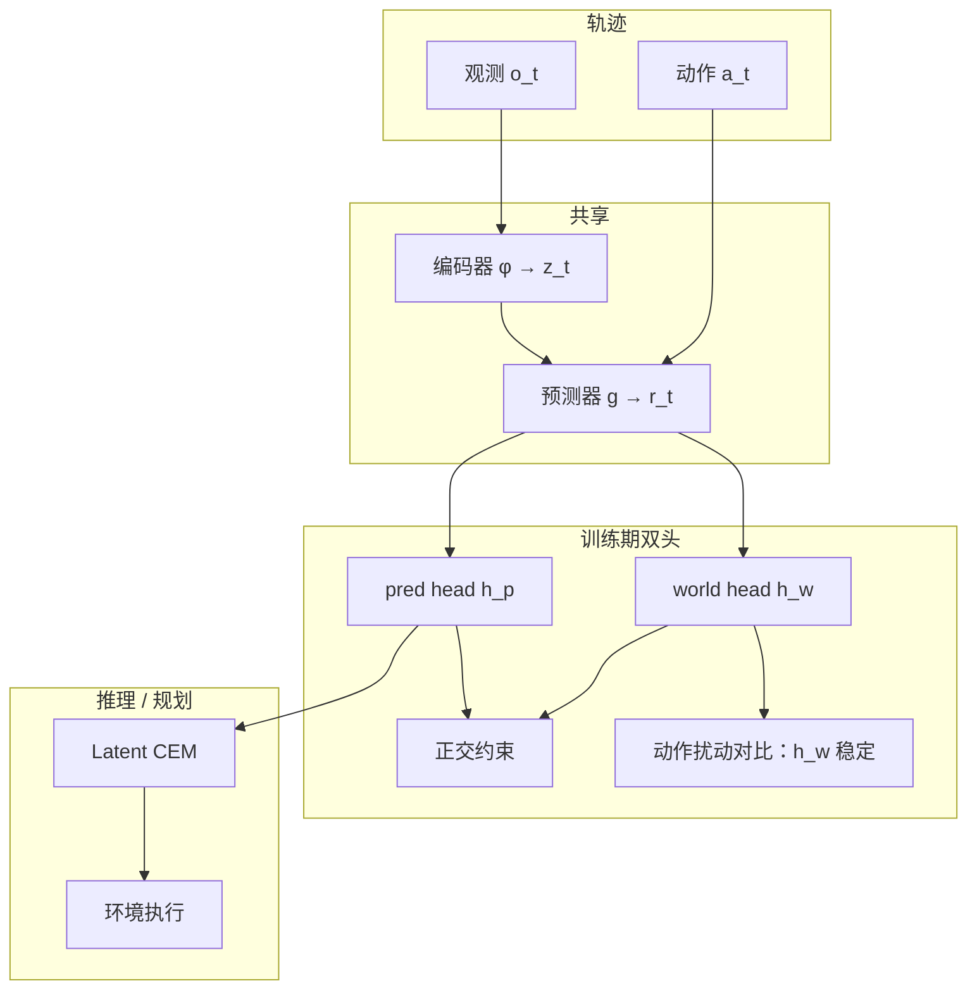

# DWM（Separating World Effects · arXiv:2607.18715）

> **命名消歧：** 本页 **DWM（Separating World Effects / Decomposed World Model）** 指 [arXiv:2607.18715](https://arxiv.org/abs/2607.18715)。它与本库已有的 [**Dexterous World Models（DWM，arXiv:2512.17907）**](../methods/dwm.md) **不是同一工作**——后者是场景–动作条件视频扩散的灵巧操作世界模型。下文「DWM」均指 **Separating World Effects**；链到 dexterous 页 **仅供消歧**。

**DWM**（*DWM: Separating World Effects from Actions in Latent World Models*，Yi-Ge Zhang / Tianqi Du / Qi Zhang / Yisen Wang · **北京大学（PKU）**）指出：现有动作条件 latent WM 用 **单一 next-latent 目标** 同时吞下「智能体造成的变化」与「环境自己会变的部分」（重力滑移、惯性、回弹、持续漂移），导致归因失败与规划滚出偏差。DWM 在 **监督层** 引入动作不变的 **world head** 与正交约束，把预测转移显式加成 **世界效应 + 动作效应**，**不改推理骨干与 CEM 管线**；在 PushT-W / Reacher-W / TwoRoom-W 上 CEM 成功率平均绝对提升 **13.1 pp**。

## 一句话定义

**一种 latent 世界模型训练框架：用辅助动作不变世界头与对比/正交约束，把转移拆成环境自主动态与动作诱导残差，从而提升自主动态环境下的 CEM 规划。**

## 英文缩写速查

| 缩写 | 英文全称 | 简要说明 |
|------|----------|----------|
| DWM | Decomposed World Model | 本文：分解世界/动作效应的训练框架（非 Dexterous WM） |
| LeWM | Latent Embedding World Model 类基线 | 文中单头动作条件 latent WM 代表 |
| CEM | Cross-Entropy Method | latent 空间模型预测规划 |
| W-variant | World-effect variant | PushT-W / Reacher-W / TwoRoom-W |
| \(\Delta z^{\mathrm{world}}\) | Action-invariant transition | 当前动作置零时仍会发生的潜空间变化 |
| \(\Delta z^{\mathrm{action}}\) | Action-driven residual | 总转移减去世界效应 |
| SigReg | Signal / representation regularizer | 防表征坍塌的常规正则 |

## 为什么重要

- **对准真实物理阅读轴：** 策展归入 [物理保真输出轴](../overview/world-model-physics-fidelity-outputs.md) 的 **「动作 vs 世界效应分解」**——直接回答「模型有没有把环境自己的动力学学出来」。
- **暴露平坦基准盲区：** PushT 等「物体几乎只对动作响应」的任务会掩盖纠缠；W-variant 一加重力/漂移，单头模型零动作滚出就崩。
- **训练期手术、推理零改：** 辅助头可丢弃；规划 API 与基座相同——对已有 LeWM 类系统可移植性高。
- **量化清晰：** 三环境 **+12.0 / +10.7 / +16.7 pp**，均值 **+13.1 pp**；Ball-in-Cup **+6.0%**；flat 对照不伤主性能。

## 核心信息

| 项 | 内容 |
|----|------|
| **机构** | 北京大学（PKU） |
| **层级** | **监督 / 训练目标**（非新骨干） |
| **推理** | 仅用原 **pred head**；架构与 CEM 不变 |
| **训练附加** | **world head** + world-contrastive + 正交约束 |
| **关键结果** | W-variant CEM 平均 **+13.1 pp** |
| **开源** | **未开源**（截至 2026-07-27） |
| **易混名** | ≠ [Dexterous DWM](../methods/dwm.md)（2512.17907） |

## 流程总览

## 核心原理

### 世界效应的反事实定义

固定历史 \((z_{t-h+1:t},a_{t-h+1:t-1})\)，把当前动作换成 \(\mathbf{0}\)：

\[
\Delta z^{\mathrm{world}}_{t}
:=\mathbb{E}[z_{t+1}\mid \ldots,a_t=\mathbf{0}]-z_t,\quad
\Delta z^{\mathrm{action}}_{t}:=\Delta z_t-\Delta z^{\mathrm{world}}_{t}.
\]

这是 **建模恒等式**，不假设真实物理严格可加；非线性耦合进入共享表征与残差。

### 为何单目标不够

单头 \(\hat z_{t+1}\) 只看见融合结果，没有信号说「哪部分与 \(a_t\) 无关」。补充「纯世界效应」数据也救不了——因为监督仍是未分解目标。DWM 把分解写进损失。

### 训练机制（概念）

| 组件 | 作用 |
|------|------|
| **pred head** | 预测完整下一 latent；**推理唯一出口** |
| **world head** | 逼近动作不变分量；对同状态不同动作扰动保持稳定，且仍区分不同状态 |
| **正交 / 残差** | 鼓励 \(\Delta z^{\mathrm{world}}\) 与 \(\Delta z^{\mathrm{action}}\) 互补，减少互相吸收 |

## 工程实践

| 项 | 实践要点 |
|----|----------|
| **开源状态** | **未开源**（截至 **2026-07-27**）：无项目页、无官方 GitHub、无权重；论文未给出可点 URL |
| **集成假设** | 可挂在 LeWM / 同类 action-conditioned latent WM 上；需自备 W-variant 环境 |
| **规划** | 标准 latent CEM：目标图像 → \(z_g\)；滚动优化动作序列 |
| **选型** | 环境有 **持续自主动态**（重力、漂移、惯性）时优先考虑本思想；纯静态桌面推动收益有限 |
| **消歧** | 检索「DWM 世界模型」时先看 arXiv 号：**2607.18715** vs **2512.17907** |

## 源码运行时序图

**不适用**（截至 **2026-07-27**）：官方 **无可运行代码或 checkpoint**；仅有论文方法描述。若后续开源，再按仓库入口补 sequenceDiagram。

## 实验与评测

| 环境 | 世界效应类型 | 报告要点 |
|------|--------------|----------|
| **PushT-W** | 重力方向持续滑移 | 零动作时块仍滑动；DWM 恢复滑移+推动，CEM **+12.0 pp** |
| **Reacher-W** | 竖直平面重力 | **+10.7 pp** |
| **TwoRoom-W** | 恒定环境漂移 | **+16.7 pp** |
| **三者平均** | — | 绝对提升 **13.1 pp** |
| **Flat 原版** | 弱自主动态 | 与强基线持平（不牺牲） |
| **Ball-in-Cup** | 状态相关摆动力学 | **+6.0%** |
| **诊断** | — | world head 动作不变性↑；多步 rollout 更准；OOD / 消融支持分解假说 |

## 结论

**DWM（Separating World Effects）证明：在自主动态环境下，把「世界自己会变」从动作条件目标里拆出来，能显著抬升 latent CEM，且不必改推理栈。**

1. **主病在监督而非必改骨干** — 单 next-latent 目标纠缠两源变化。
2. **W-variant 是必要压力测试** — flat 高分不等于会重力/漂移。
3. **+13.1 pp 是可引用数字** — 三环境均值；读表时看绝对成功率与基线。
4. **推理零改动** — 只训期双头；部署仍走 pred head + CEM。
5. **与 Dexterous DWM 严格分流** — 本页 arXiv **2607.18715**；视频灵巧 DWM 见 [methods/dwm.md](../methods/dwm.md)。
6. **未开源** — 思想可迁移，复现需自实现。

## 局限与风险

- **未开源：** 无法核对实现细节与超参敏感性。
- **可加分解是建模选择：** 强非线性耦合场景残差是否足够，仍依赖表征质量。
- **基准合成性：** W-variant 可控但非真实机器人全部自主动态。
- **名称碰撞风险高：** 内部链接与对外引用必须带副标题或 arXiv。

## 与其他工作对比

| 对比轴 | DWM（Separating · 2607.18715） | [Dexterous DWM](../methods/dwm.md)（2512.17907） | [V-JEPA 2-AC](./paper-vjepa2.md) | [IRASim](./paper-irasim.md) |
|--------|--------------------------------|--------------------------------------------------|----------------------------------|------------------------------|
| **对象** | Latent 转移 **监督分解** | 第一人称 **视频扩散** 灵巧交互 | JEPA latent 规划 | 轨迹条件 **视频生成** |
| **开源** | **未开源** | 见该页（有项目/仓） | MIT 已开源 | Apache 已开源 |
| **主收益** | CEM **+13.1 pp**（W-variant） | 交互视频真实性 | 少数据零样本抓放 | Push-T IoU 规划抬升 |
| **关系** | — | **仅消歧，非对照实验** | 同属 latent WM 族 | 像素族对照 |

## 关联页面

- [世界模型物理保真：输出阅读轴](../overview/world-model-physics-fidelity-outputs.md) — **动作 vs 世界效应分解** 代表
- [Dexterous World Models（DWM）](../methods/dwm.md) — **同名消歧（勿合并）**
- [V-JEPA 2](./paper-vjepa2.md) — latent 规划对照
- [INTACT](./paper-intact.md) — 意图→动作无搜索接口（LeWM 族对照，arXiv:2607.26056）
- [IRASim](./paper-irasim.md) / [Masked Visual Actions](./paper-masked-visual-actions.md) — 像素 WM 对照
- [RynnWorld-4D](./paper-rynnworld-4d-rgb-depth-flow.md) — 几何运动信号对照
- [WorldWeaver](./paper-worldweaver.md) — 持续状态对照
- [Generative World Models](../methods/generative-world-models.md)
- [Video-as-Simulation](../concepts/video-as-simulation.md)

## 参考来源

- [DWM Separating World Effects 论文归档（arXiv:2607.18715）](../../sources/papers/dwm_separating_world_effects_arxiv_2607_18715.md)
- [具身智能研究室：世界模型物理保真（微信）](../../sources/blogs/wechat_embodied_ai_lab_world_model_physics_fidelity.md)
- [Dexterous DWM 论文归档（arXiv:2512.17907，仅消歧）](../../sources/papers/dwm_arxiv_2512_17907.md)

## 推荐继续阅读

- [arXiv:2607.18715](https://arxiv.org/abs/2607.18715) — 本文全文
- [Dexterous DWM 方法页](../methods/dwm.md) — 确认未读错同名工作
- [V-JEPA 2](./paper-vjepa2.md) — 同属 latent WM 规划阅读
- [物理保真输出轴](../overview/world-model-physics-fidelity-outputs.md) — 四类测试优先序
