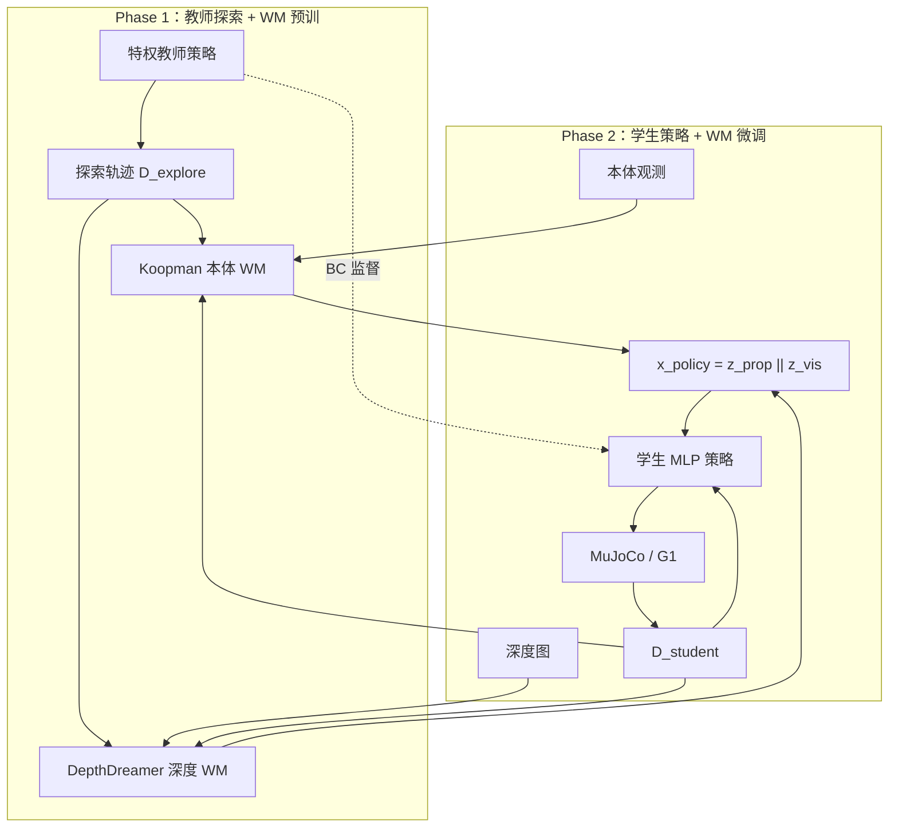

# DWMP：双世界模型人形越障

**DWMP**（*Leveraging Dual World Models for Humanoid Obstacle Traversal*，[arXiv:2609.12347](https://arxiv.org/abs/2609.12347)）由 **上海交通大学 / 同济大学 / 浙江大学 / 上海创智学院** Rongjun Jin、Jianming Ma、Yue Gao 提出：在 teacher-student 人形越障栈里，不把多模态观测简单拼接，而是用 **结构匹配模态特性** 的双世界模型——**Koopman Auto-Encoder** 把本体动力学线性化到潜空间，**DepthDreamer（RSSM）** 把头戴深度压成紧凑随机状态——再融合为策略输入。

## 一句话定义

**越障时本体与深度各走一条预测表征路：线性动力学 + 压缩障碍几何，再喂给学生策略。**

## 英文缩写速查

| 缩写 | 英文全称 | 简要说明 |
|------|----------|----------|
| DWMP | Dual World Model Policy | 本文：双世界模型策略框架 |
| RSSM | Recurrent State-Space Model | Dreamer 系视觉 WM 骨干；本文 DepthDreamer |
| WM | World Model | 预测性表征/动力学模型 |
| POMDP | Partially Observable MDP | 部分可观测马尔可夫决策过程形式化 |
| OFTL | Observation Function Transfer Layer | Koopman 编码器首层：sin/cos/exp 等基函数 |
| BC | Behavior Cloning | 学生策略对教师动作的行为克隆项 |
| G1 | Unitree G1 | 仿真与真机实验平台 |

## 为什么重要

- **模态分治而非硬拼：** 本体低维但强非线性、深度高维冗余——单路 RSSM 或 raw 拼接都难同时学好动力学与障碍几何。
- **复用教师探索数据：** Phase 1 用特权教师 rollout 预训双 WM，Phase 2 学生上线时编码器继续适配学生分布，缓解「学生早期访问状态未出现在教师数据」问题。
- **真机可部署：** 仅机载本体 + 头戴深度，随机障碍布局下 G1 三类地形通过率 **0.70–0.95**，高于 HumanoidPF 直接蒸馏。
- **与 [WM-LOCO](./paper-wm-loco.md) 对照：** 同属 RSSM+人形感知行走，但 DWMP **双模态异构 WM** + **越障场地形**（Ceil/Bar/Narrow 等），WM-LOCO 是 **单深度 RSSM 与 PPO 共训** + **落脚约束踏石/沟**。

## 核心信息

| 项 | 内容 |
|----|------|
| **机构** | 上海交通大学；同济大学；浙江大学；上海创智学院 |
| **平台** | Unitree G1；MuJoCo 仿真 |
| **感知** | 本体（关节、重力、基座速度、相对目标）+ 头戴 egocentric **深度图** |
| **动作** | 下半身关节目标位置 → PD 力矩 |
| **开源** | **未开源**（截至 2026-09-15 无项目页 / GitHub） |

## 流程总览

## 核心原理

1. **Koopman 本体 WM：** OFTL + 编码器 \(\phi\) 与线性矩阵 \(\mathbf{K}\) 使 \(\phi(o_{t+1}^{\mathrm{prop}})\approx \mathbf{K}\phi(o_t^{\mathrm{prop}})\)；重建 + 线性转移损失联合优化。
2. **DepthDreamer：** VAE 编码深度 → GRU 更新确定性状态 → 后验/先验高斯随机状态 → 解码重建深度与奖励；训练时 Koopman 潜状态作为动作条件信号。
3. **策略输入：** 融合 \([z_t^{\mathrm{prop}}, z_t^{\mathrm{vis}}]\) 后高斯策略输出关节目标；学生损失 = 折扣回报 + \(\lambda_{\mathrm{bc}}\) 教师行为克隆。
4. **教师–学生：** 教师可见特权障碍/地形信息；学生仅机载观测，WM 提供结构化预测特征而非 raw 拼接。

## 源码运行时序图

**不适用** — 截至 **2026-09-15** 论文与 arXiv 均未提供可运行官方代码或项目页入口。

## 实验与评测

### 仿真越障成功率（Table I，节选）

| 方法 | Ceil | Bar | Narrow | Mbar | Mceilbar |
|------|------|-----|--------|------|----------|
| **DWMP（本文）** | **0.95** | **0.85** | **0.90** | **0.90** | **0.85** |
| HumanoidPF | 0.90 | 0.85 | 0.85 | 0.80 | 0.90 |
| Dreamer-v3 | 0.85 | 0.65 | 0.75 | 0.70 | 0.85 |
| VAE | 0.80 | 0.80 | 0.85 | 0.80 | 0.70 |

### 真机通过率（Table III，随机布局）

| 方法 | Ceil | Mceilbar | Narrow |
|------|------|----------|--------|
| **DWMP** | **0.95** | **0.80** | **0.70** |
| HumanoidPF 直接蒸馏 | 0.80 | 0.60 | 0.65 |

- **读法：** 仿真布局与真机随机摆放不一致，通过率反映表征泛化而非记忆固定障碍位；具体 baseline 协议以 **原文 PDF** 为准。

## 与其他工作对比

| 对照 | 差异 |
|------|------|
| [WM-LOCO](./paper-wm-loco.md) | 单路 RSSM 与 PPO **联合更新**、落脚约束地形；DWMP **异构双 WM** + teacher-student，任务为 **场地越障** 而非踏石/沟 |
| [P³](./paper-p3.md) | 同组 G1 感知 locomotion 线；P³ 修 VAE-PPO 边缘似然，DWMP 修 **多模态预测表征** |
| HumanoidPF / VB-Com 类 | 空间关系编码或视觉–盲切换；DWMP 显式 **动力学线性化 + 深度预测压缩** |
| 纯 teacher-student 蒸馏 | 学生常成反应式模仿；DWMP 在输入侧插入 **可预测潜特征** |

## 结论

**DWMP 把「本体动力学可线性化、深度可预测压缩」写进 deployable student 的输入接口，在 G1 随机越障上优于直接蒸馏与单路 Dreamer 表征。**

1. **真影响指标：** 仿真五类障碍 SR 与真机三类通过率相对 HumanoidPF 直接蒸馏一致更高；Koopman 支路改善 Bar 地形速度/位置轨迹平滑性（文内 Fig. 6–7）。
2. **次要代价：** 双 WM 共训与在线微调增加训练复杂度；推理需同时跑 Koopman 编码与 DepthDreamer 后验，Table II 给出不同潜维下的重建损失与延迟权衡。
3. **部署读法：** 仅深度 + 本体，无离线地图；真机布局随机化通过仍建议核对障碍类型与 PD 增益是否与论文一致。
4. **复现边界：** **未开源** — 复现前只能依据 PDF 复现 MuJoCo 障碍生成与两阶段损失权重。

## 关联页面

- [Humanoid Locomotion](../tasks/humanoid-locomotion.md)
- [WM-LOCO](./paper-wm-loco.md)
- [P³](./paper-p3.md)
- [Teacher-Student + DAgger](../methods/teacher-student-dagger-training.md)
- [Generative World Models](../methods/generative-world-models.md)
- [Unitree G1](./unitree-g1.md)

## 参考来源

- [dwmp_arxiv_2609_12347.md](../../sources/papers/dwmp_arxiv_2609_12347.md)
- [arXiv:2609.12347](https://arxiv.org/abs/2609.12347)

## 推荐继续阅读

- [arXiv PDF](https://arxiv.org/pdf/2609.12347)
- [WM-LOCO 实体页](./paper-wm-loco.md) — 同人形 RSSM 感知行走对照
- [DreamerV3 实体页](./paper-shenlan-wm-13-dreamerv3.md) — RSSM 世界模型基础
