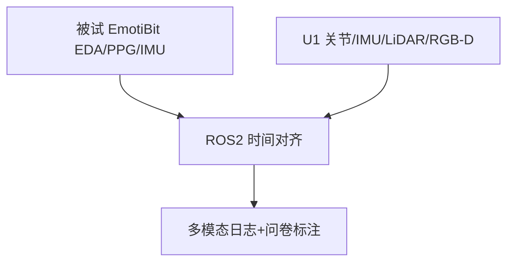

# 动态多模态 HRI 参与度数据集（Unitree U1）

**Dynamic Multimodal HRI Dataset Protocol**（[arXiv:2609.03255](https://arxiv.org/abs/2609.03255)）由 **仁川大学（Incheon National University）** 提出（公众号周更 ingest 见 [策展索引](../../sources/blogs/wechat_shenlan_weekly_papers_2026-09-04.md)）。

## 一句话定义

这是一份 **实验协议 + 多模态架构设计**，不是已发布数据集。

## 英文缩写速查

| 缩写 | 英文全称 | 简要说明 |
|------|----------|----------|
| HRI | Human-Robot Interaction | 人机交互 |
| EDA | Electrodermal Activity | 皮肤电活动生理信号 |
| PPG | Photoplethysmography | 光电容积脉搏波 |
| IMU | Inertial Measurement Unit | 惯性测量单元 |

## 为什么重要

参与度研究常缺 **任务复杂度梯度** 与 **生理+运动同步**；本文给出可复现采集框。

## 核心信息

| 项 | 内容 |
|----|------|
| **机构** | 仁川大学（Incheon National University） |
| **开源** | 见 [工程实践](#工程实践) |

### 数据集速查

| 维度 | 状态（截至 2026-09-07） |
|------|--------------------------|
| **规模** | 计划 **N=30** 被试（G\*Power 估算）× 三档复杂度分区；**尚无已采集条目/时长统计**——论文停在协议阶段 |
| **模态** | 人侧 EmotiBit **EDA / PPG / IMU**；机侧 U1 **关节 / IMU / LiDAR / RGB-D**；每区后 15 项 Likert 自报告 |
| **许可证** | **未声明** — 数据未发布，无协议、无下载入口 |
| **重定向就绪度** | **不适用（且不宜误用）** — 采集的是 **生理 + 参与度标注 + 机器人本体感知**，不含人体全身动捕 / SMPL / 骨架序列，因此 **无法作动作重定向源，也不能直接当策略输入**；可复用的是「多模态同步 + 复杂度分区」这套采集框，而非轨迹本身 |

## 核心原理

被试内三区：A 高复杂（逐步指令+纠错）、B 中复杂（属性描述）、C 低复杂（闲聊+明确指令）。ROS2 统一时钟对齐人机双流；每区后 15 项 Likert 问卷。

### 流程总览

## 源码运行时序图

**不适用** — 截至 **2026-09-07** 无可运行官方代码（或本文为硬件/协议类工作）。

## 工程实践

| 项 | 说明 |
|----|------|
| 开源状态 | 见论文摘录与项目页核查结论 |
| 复现入口 | 以 arXiv 为准 |

## 实验与评测

| 维度 | 设计 |
|------|------|
| 被试 | 计划 **N=30**（G*Power） |
| 平台 | **Unitree U1** 腿式人形 |
| 对比表 | 相对 UE-HRI/MHHRI 等补 **IMU+三档复杂度** |

## 结论

协议价值在 **结构化复杂度 × 多模态同步**；待未来工作发布数据后再做模型基准。

1. 生理+机器人 IMU **双侧** 同步是相对既有数据集的增量。
2. 三档任务刻意改变指令–响应密度。
3. 预处理保留 raw+filtered 生理。
4. 数据 **尚未公开**。
5. 论文阶段为 **设计**，非 benchmark 结果。

## 与其他工作对比

同样围绕「人形机器人前的人」，各工作切的是不同环节——本文只占 **采集协议** 一格：

| 工作 | 落点 | 人侧信号 | 机器人侧 | 与本文 |
|------|------|----------|----------|--------|
| **本文（U1 HRI 协议）** | 采集协议设计 | EDA/PPG/IMU + 15 项 Likert | Unitree U1 关节/IMU/LiDAR/RGB-D，ROS2 同步 | 本页；**无数据、无模型、无基准结果** |
| UE-HRI / MHHRI（外部既有数据集） | 已发布参与度数据集 | 音视频 + 部分生理 | 多为固定/桌面平台 | 本文相对增量是 **机器人侧 IMU** 与 **三档复杂度梯度**；但那两者 **已有数据可下载**，本文没有 |
| [PAMoR](./paper-pamor.md) | 情感 **动作生成** | 无（人只做感知评分） | Unitree G1 实时全身运动 | 同属社交 HRI，方向相反：本文 **读人**，PAMoR **演给人看** |
| [SHRIMP](./paper-shrimp.md) | LLM 任务规划 + HRI 评估 | 交互指令 | Isaac Sim 仿真 | 同为交互侧，但落在 **规划/仿真评测**，不涉生理信号 |
| [人形语音交互流水线](../queries/humanoid-voice-interaction-pipeline.md) | 交互工程链路 | 语音 | 语音→动作下发 | 本文的问卷/生理标注可作该链路的 **效果度量来源**，前提是数据发布 |

**选型读法：** 现在需要可训练的参与度数据，本文 **不是候选**（未发布）；需要设计自己的采集协议，本文的 **三档复杂度 × 人机双流 ROS2 对齐** 是可直接抄的骨架。

## 局限与风险

无已采集规模统计；U1 可用性与泛化待验证。

## 关联页面

- [humanoid-locomotion](../tasks/humanoid-locomotion.md)
- [paper-pamor.md](./paper-pamor.md)
- [loco-manipulation](../tasks/loco-manipulation.md)
- [SHRIMP](./paper-shrimp.md) — LLM 任务规划侧的 HRI 评估对照
- [人形语音交互流水线](../queries/humanoid-voice-interaction-pipeline.md) — 下游交互链路消费方

## 参考来源

- [dynamic_multimodal_hri_dataset_arxiv_2609_03255.md](../../sources/papers/dynamic_multimodal_hri_dataset_arxiv_2609_03255.md)
- [公众号周更策展](../../sources/blogs/wechat_shenlan_weekly_papers_2026-09-04.md)

## 推荐继续阅读

- [https://arxiv.org/abs/2609.03255](https://arxiv.org/abs/2609.03255)
