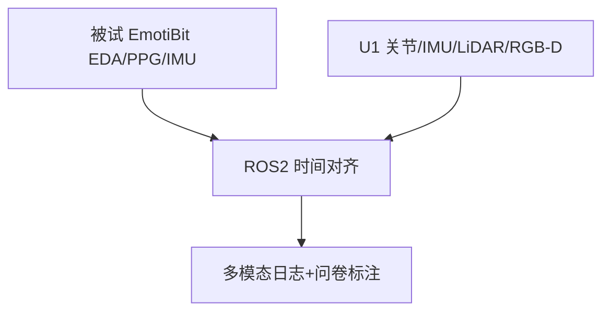

# 动态多模态 HRI 参与度数据集（Unitree U1）

**Dynamic Multimodal HRI Dataset Protocol**（[arXiv:2609.03255](https://arxiv.org/abs/2609.03255)）由 **仁川大学（Incheon National University）** 提出（公众号周更 ingest 见 [策展索引](../../sources/blogs/wechat_shenlan_weekly_papers_2026-09-04.md)）。

## 一句话定义

这是一份 **实验协议 + 多模态架构设计**，不是已发布数据集。

## 英文缩写速查

| 缩写 | 英文全称 | 简要说明 |
|------|----------|----------|
| HRI | Human-Robot Interaction | 人机交互 |
| EDA | Electrodermal Activity | 皮肤电活动生理信号 |
| PPG | Photoplethysmography | 光电容积脉搏波 |
| IMU | Inertial Measurement Unit | 惯性测量单元 |

## 为什么重要

参与度研究常缺 **任务复杂度梯度** 与 **生理+运动同步**；本文给出可复现采集框。

## 核心信息

| 项 | 内容 |
|----|------|
| **机构** | 仁川大学（Incheon National University） |
| **开源** | 见 [工程实践](#工程实践) |

## 核心原理

被试内三区：A 高复杂（逐步指令+纠错）、B 中复杂（属性描述）、C 低复杂（闲聊+明确指令）。ROS2 统一时钟对齐人机双流；每区后 15 项 Likert 问卷。

### 流程总览

## 源码运行时序图

**不适用** — 截至 **2026-09-07** 无可运行官方代码（或本文为硬件/协议类工作）。

## 工程实践

| 项 | 说明 |
|----|------|
| 开源状态 | 见论文摘录与项目页核查结论 |
| 复现入口 | 以 arXiv 为准 |

## 实验与评测

| 维度 | 设计 |
|------|------|
| 被试 | 计划 **N=30**（G*Power） |
| 平台 | **Unitree U1** 腿式人形 |
| 对比表 | 相对 UE-HRI/MHHRI 等补 **IMU+三档复杂度** |

## 结论

协议价值在 **结构化复杂度 × 多模态同步**；待未来工作发布数据后再做模型基准。

1. 生理+机器人 IMU **双侧** 同步是相对既有数据集的增量。
2. 三档任务刻意改变指令–响应密度。
3. 预处理保留 raw+filtered 生理。
4. 数据 **尚未公开**。
5. 论文阶段为 **设计**，非 benchmark 结果。

## 局限与风险

无已采集规模统计；U1 可用性与泛化待验证。

## 关联页面

- [humanoid-locomotion](../tasks/humanoid-locomotion.md)
- [paper-pamor.md](./paper-pamor.md)
- [loco-manipulation](../tasks/loco-manipulation.md)

## 参考来源

- [dynamic_multimodal_hri_dataset_arxiv_2609_03255.md](../../sources/papers/dynamic_multimodal_hri_dataset_arxiv_2609_03255.md)
- [公众号周更策展](../../sources/blogs/wechat_shenlan_weekly_papers_2026-09-04.md)

## 推荐继续阅读

- [https://arxiv.org/abs/2609.03255](https://arxiv.org/abs/2609.03255)
