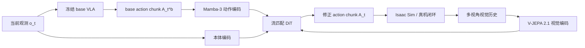

# DynaWM（Dynamic World Model for VLA Action Correction · arXiv:2607.02604）

**DynaWM**（*DynaWM: A Base-VLA-Guided World Foundation Model for Moving-Object Manipulation*，[arXiv:2607.02604](https://arxiv.org/abs/2607.02604)，清华大学 THUAI）提出 **冻结基础 VLA、外挂世界基础模型** 的移动目标操纵范式：基础 VLA 从 **当前帧** 输出 action chunk，DynaWM 读取 **base chunk + 多视角观测历史 + 臂本体状态**，用流匹配 DiT **重生成运动感知轨迹**，补偿观测–执行延迟中的目标位移。

## 一句话定义

**不改 VLA 权重：把 base action chunk 当「语义初稿」，用连续视觉历史估计目标运动趋势并在线改写动作块——面向移动目标拦截而非静态抓取。**

## 英文缩写速查

| 缩写 | 英文全称 | 简要说明 |
|------|----------|----------|
| WAM | World Action Model | 本文为 **base-action-conditioned** 世界基础模型 |
| VLA | Vision-Language-Action | **冻结** 的基础策略，输出 $A_t^b$ |
| V-JEPA | Video Joint Embedding Predictive Architecture | 2.1 版多视角 **历史** 视觉编码器 |
| DiT | Diffusion Transformer | 流匹配动作重生成骨干 |
| CFM | Conditional Flow Matching | 修正后 action chunk 的生成目标 |
| DynaGrasp-32 | — | 32 任务、六类诊断族的移动目标 benchmark |
| Mamba-3 | — | 编码 base action chunk 时序结构的动作编码器 |

## 为什么重要

- **解决「单帧 VLA 看不见速度」的核心缺口：** 移动目标拦截需要 **未来位置外推**；仅当前观测只能定位 $p_t$，无法估计 **方向与速度**；DynaWM 用 **多视角历史** 提供场景变化证据（策展文强调的移动目标在线修正设定）。
- **避免「把世界模型焊进每个 VLA」的重复工程：** 直接微调 VLA 集成动力学可能 **损害已预训练 checkpoint**；DynaWM 作为 **独立世界基础模型**，适配 SmolVLA / X-VLA / $\pi_0$ / $\pi_{0.5}$ 等 **异构冻结 VLA**，无需访问其 hidden state 或梯度。
- **代表 WAM 第二类职责——修正已有动作：** 与 [DSWAM](./paper-dswam-dual-system-wam.md)（直接执行）、[DreamSteer](./paper-dreamsteer-vla-deployment-steering.md)（部署筛选）形成 **执行 / 修正 / 筛选** 三角。
- **贡献可复现 benchmark：** [DynaGrasp-32](../tasks/manipulation.md) + DynaGrasp-1600（1600 条遥操作、~1.53M 三视角图像）把 **速度变化、碰撞改道、多物体序贯** 等动态难度源 **可控隔离**。

## 核心结构与方法

| 模块 | 方法要点 |
|------|----------|
| **冻结 base VLA $\pi_b$** | $A_t^b = \pi_b(o_t, \ell_t, s_t) \in \mathbb{R}^{H \times D_a}$（$H{=}10$, $D_a{=}7$）；训练与评测 **均不更新** |
| **Mamba-3 动作编码器** | 将 base chunk 编码为 **动作条件表征**，保留序列结构；消融：去掉则成功率跌至 **29%**（远低于 base **72.56%**） |
| **V-JEPA 2.1 视觉编码器** | 从 **多视角观测历史** 提取运动特征；**不 rollout 未来像素**；300M 版较 80M 平均 **+12.44pp** |
| **本体编码器** | 机械臂 proprioceptive state 条件化 |
| **流匹配 DiT $g_\theta$** | 三条件联合生成 motion-aware chunk $A_t$；**不读取 VLA 语言/视觉 token** |
| **问题形式化** | 动态拦截：目标独立运动 + 观测–动作–执行延迟 → 需 **持续轨迹更新** |

### 在线修正闭环

### DynaGrasp-32 六类诊断族

| 家族 | 考察的动态源 |
|------|----------------|
| Basic interception | 基础移动拦截 |
| Appearance / geometry transfer | 外观与几何迁移 |
| Collision response | 碰撞驱动轨迹改变 |
| Visual variation | 视觉域变化 |
| Multi-object sequencing | 多物体 + 语言绑定序贯 |
| Velocity variation | 目标速度变化 |

## 实验要点（索引级）

| 轴 | 报告口径（以论文为准） |
|----|------------------------|
| **DynaGrasp-32 宏平均（32×50 episodes）** | 八组 VLA×checkpoint：**50.36% → 76.15%**（+25.79pp） |
| **Fine-tuned checkpoints** | 平均 **59.06% → 75.39%**（+16.33pp）；X-VLA **+45.31pp** 最大 |
| **Coarse-tuned checkpoints** | 平均 **41.66% → 76.91%**（+35.25pp）；四组均 **≥31/32 任务提升** |
| **单模型峰值** | X-VLA fine-tuned：**36.56% → 81.88%** |
| **消融** | 去视觉历史：**−27.50%** 量级；去 action conditioning：**−45.44%** |
| **数据** | DynaGrasp-1600：1600 traj / ~510K steps / 1.53M images |

## 与其他工作对比

| 工作 | 关系 |
|------|------|
| **[DSWAM](./paper-dswam-dual-system-wam.md)** | **端到端 WAM 执行器**；DynaWM **保留 VLA、外挂修正** |
| **[DreamSteer](./paper-dreamsteer-vla-deployment-steering.md)** | **多样本想象 + 价值排序**；DynaWM **单路径确定性重生成** |
| **DynamicVLA / PUMA / AHEAD** | 同类动态操纵；DynaWM 强调 **跨 VLA 架构的 base-chunk 条件** |
| **Streaming Flow / RTC** | 侧重 **chunk 时序衔接**；DynaWM 侧重 **运动趋势估计** |
| **π₀.7 + world subgoals** | VLA 内部集成世界信号；DynaWM **模块外置、零 VLA 改动** |

## 常见误区或局限

- **误区：** 认为 DynaWM 替换 VLA；实际是 **VLA 出初稿 + WM 改写**，两者 checkpoint 独立。
- **误区：** 把增益等同于「VLA 变强」；八组实验 **base VLA 冻结**，增益来自 **外挂模块**。
- **局限：** 已很强的 fine-tuned $\pi_0$（72.56%）仅 **+1.88pp**，多物体 Amount 任务甚至 **14 任务退步**——局部修正可能 **扰动已有序贯绑定**；仍限于 **仿真 benchmark + 单臂 Franka** 为主；未覆盖全身 loco-manip。

## 与其他页面的关系

- [wm-action-consequence-category-01-wam-action-prediction](../overview/wm-action-consequence-category-01-wam-action-prediction.md) — WAM 修正类代表
- [动作后果技术地图](../overview/robot-world-models-action-consequence-technology-map.md) — 专题总览
- [World Action Models](../concepts/world-action-models.md) — 世界模型条件化动作生成
- [VLA](../methods/vla.md) — 被修正的冻结基础策略族
- [Manipulation](../tasks/manipulation.md) — 动态抓取与拦截任务语境

## 推荐继续阅读

- [DynaWM 论文（arXiv:2607.02604）](https://arxiv.org/abs/2607.02604)
- [DSWAM 论文实体](./paper-dswam-dual-system-wam.md) — 直接执行 WAM 对照
- [DreamSteer 论文实体](./paper-dreamsteer-vla-deployment-steering.md) — 部署筛选对照
- [Generative World Models](../methods/generative-world-models.md) — V-JEPA / 流匹配 WAM 脉络

## 参考来源

- [具身智能研究室 · 世界模型动作后果专题导读（2026-07）](../../sources/blogs/wechat_embodied_ai_lab_robot_world_models_action_consequence_2026.md)
- [DynaWM 论文（arXiv:2607.02604）](https://arxiv.org/abs/2607.02604)
