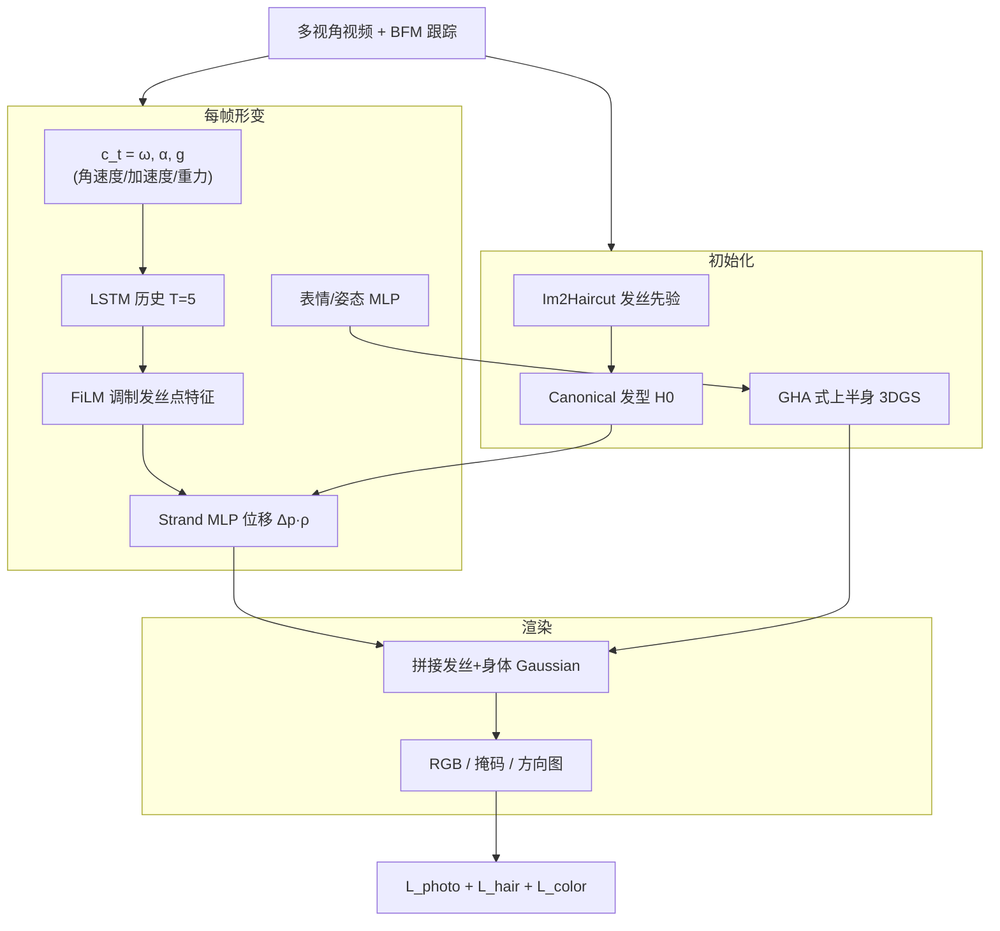

# DynHair：显式动态发丝人头化身

**DynHair**（*Head Avatars with Dynamic Explicit Hair*，[arXiv:2607.23861](https://arxiv.org/abs/2607.23861)，[项目页](https://dynhair.is.tue.mpg.de/)，**ECCV 2026**，[GitHub](https://github.com/Vanessik/DynHair)）由 **苏黎世联邦理工（ETH Zürich）**、**马克斯·普朗克研究所（MPI）**、**慕尼黑工业大学（TUM）**、**达姆施塔特工业大学（TU Darmstadt）**、**微软（Microsoft）** 等（Vanessa Sklyarova / Haonan Chen / Berna Kabadayi / Tobias Kirschstein / Zicong Fan / Xi Wang / Gerard Pons-Moll / Matthias Nießner / Marc Pollefeys / Michael J. Black / Justus Thies）提出：从 **多视角视频** 端到端学习 **发丝级** 动态头发，并与 **上半身 3D Gaussian Splatting** 人脸/躯干区域联合可微渲染，得到可动画、可跨主体驱动的动态人头化身。

## 一句话定义

**把头发从「头部 Gaussian 纹理」拆成显式发丝 + 发丝对齐 3DGS，用头部角速度、加速度与相对重力条件 LSTM–FiLM 形变器，在 photometric 与物理弹性约束下学出甩动、滞后与回落。**

## 英文缩写速查

| 缩写 | 英文全称 | 简要说明 |
|------|----------|----------|
| DynHair | Dynamic Explicit Hair | 本文框架：显式发丝动力学 + Gaussian 化身 |
| 3DGS | 3D Gaussian Splatting | 可微光栅化外观表示；发丝与上半身各用一套 Gaussian |
| GHA | Gaussian Head Avatar | 主要基线；BFM 条件上半身 Gaussian，头发未解耦 |
| BFM | Basel Face Model | 参数化头模型；提取全局位姿与表情条件 |
| FiLM | Feature-wise Linear Modulation | 用运动嵌入调制每点发丝特征 |
| LSTM | Long Short-Term Memory | 编码过去 T=5 帧头部运动历史 |
| tLPIPS_ex | Excess temporal LPIPS | 相对 GT 的额外时序闪烁；接近 0 为优 |
| IoU_hair | Hair silhouette IoU | 头发区域掩码重叠；跨帧版为 tIoU_hair |

## 为什么重要

- **数字人真实感的关键缺口：** 头部化身已能高保真表情，但 **刚性/模糊头发** 破坏 telepresence 与 AR/VR 沉浸感；DynHair 针对 **动力学** 而非仅静态重建。
- **显式发丝 + 学习动力学：** 相对物理仿真（Maya）避免手工调参；相对 HHAvatar 等非结构化 Gaussian，保留 **strand 几何** 与 **可编辑发型**（修剪、改色）。
- **物理启发条件与损失：** 显式输入 **角速度、加速度、相对重力**；弹性拉伸损失抑制发丝不合理伸长（去掉后 VER 从 ~27 飙到 **283**）。
- **新采集基准：** 15 相机 **72 FPS 4K**、统一 22 动作协议（10 项头发动力学），补充 HHAvatar 数据。
- **机器人/具身关联：** 作 **telepresence 数字人资产管线** 与多视角人体/头部重建上游，与 [SHELLS](./paper-shells-layered-surface-sampling.md)、[UMA](./paper-uma.md) 等多视角人头路线互补。

## 核心信息

| 项 | 内容 |
|----|------|
| **机构** | 苏黎世联邦理工（ETH Zürich）；马克斯·普朗克研究所（MPI）；慕尼黑工业大学（TUM）；达姆施塔特工业大学（TU Darmstadt）；微软（Microsoft）等 |
| **venue** | ECCV 2026；arXiv:2607.23861（2026-07-26） |
| **输入** | 多视角同步视频（HHAvatar 4 机位 + 自采 15 机位）；BFM 跟踪 |
| **表示** | ~11k 缕 × 40 点发丝；Im2Haircut 初始化；上半身非结构化 3DGS |
| **训练** | 1024²；A100 单卡 320k iter；历史窗 T=5 |
| **开源** | **部分开源** — [GitHub](https://github.com/Vanessik/DynHair) MIT 占位仓（截至 **2026-09-16** 无训练脚本）；项目页承诺 data/code |

## 流程总览

## 核心原理

### 头发 vs 上半身解耦

| 区域 | 表示 | 形变条件 |
|------|------|----------|
| 头发 | 显式多段线 + 发丝对齐 Gaussian | LSTM(ω, α, g) → FiLM → 每点位移 |
| 上半身/脸 | 非结构化 3DGS（沿 GHA） | BFM 表情与姿态 MLP |

### 动力学网络

- 从 BFM 全局位姿算 **头局部** 角速度 \(\omega_t\) 与加速度 \(\alpha_t\)，以及相对重力 \(\mathbf{g}_t\)。
- LSTM 输出 \(\mathbf{z}_t\) 经 FiLM 调制发丝点 positional encoding，MLP 预测位移；**根部衰减** \(\rho_j\) 编码「发根几乎不动」先验。
- 全局刚体变换后再与世界坐标系对齐。

### 损失设计

- **光度：** L1 RGB + SSIM + VGG/LPIPS（末 80k iter 加大感知权重）。
- **几何：** 头发轮廓（recall 偏重）、2D 发丝方向（180° 模糊）、穿透头皮惩罚。
- **物理：** 相邻发丝段 **弹性拉伸** 保持 rest 长度。
- **外观：** 沿缕/空间 KNN/缕内均值的发色一致性。

## 评测

### 自重演（表 1，3 被试平均）

| 方法 | PSNR↑ | FID↓ | hair IoU↑ | tIoU_hair↑ | tLPIPS_ex | vel×10³↑ |
|------|-------|------|-----------|------------|-----------|----------|
| GaussianAvatars | 20.17 | 45.73 | — | — | -0.0230 | 0.40 |
| GHA | **22.33** | 36.25 | — | — | -0.0127 | 2.17 |
| Maya 仿真* | 19.39 | 62.64 | 0.776 | 0.925 | 0.0183 | 2.38 |
| **DynHair** | 21.60 | **30.06** | **0.878** | **0.936** | **0.0045** | **2.41** |

\*Maya 仅输出几何，外观用本文估计颜色驱动 Gaussian。

### 消融（表 2 要点）

| 变体 | 主要退化 |
|------|----------|
| w/o 加速度 | 表达性下降 |
| w/o 重力 | 点头时发丝不自然下垂 |
| w/o 弹性损失 | VER **283**、位移尖峰暴增 |
| w/o FiLM / MLP 编码器 | 运动僵硬、tLPIPS_ex ≤ 0 |
| 无形变模块 | 头发随头刚性运动（图 5） |

## 结论

**DynHair 用显式发丝 + 物理启发条件，把头发动力学从「头部 Gaussian 副产品」变成可学习、可编辑的主模块；评测上优先看 FID/tLPIPS_ex/头发速度，而非 PSNR  alone。**

1. **PSNR 低于 GHA 是设计权衡** — strand 约束阻止任意平滑高频；读论文应连 **FID 30.06** 与 **tLPIPS_ex 0.0045** 一起看。
2. **基线负 tLPIPS_ex = 过度平滑** — GA/GHA 头发像「贴图晃动」；DynHair 更接近 GT 时序变化。
3. **条件信号缺一不可** — 重力负责下垂，加速度负责甩动惯性；消融会同时伤 IoU 与物理指标。
4. **弹性损失是稳定器** — 去掉后数值爆炸，不是可选正则。
5. **跨主体重演可行** — 相对运动条件 + 显式发型，可把 A 的动作驱动 B 的化身（肩部未跟踪会有轻微模糊）。
6. **单目需可靠 tracker** — 项目页展示 4/1 视角；遮挡面部时 BFM 跟踪失败会连累重建。
7. **复现：仓已建、代码未齐** — GitHub 截至 2026-09-16 为占位 README；完整管线待官方更新。

## 源码运行时序图

**不适用** — [Vanessik/DynHair](https://github.com/Vanessik/DynHair) 截至 **2026-09-16** 仅含 README/LICENSE，无可对齐的训练或推理脚本；项目页虽写 data and code available，运行时模块边界（静态 Im2Haircut 阶段 / 动态 320k iter / 渲染）以论文 §III–§IV 为准，待仓库更新后补序图。

## 工程实践

| 项 | 内容 |
|----|------|
| 仓库 | [Vanessik/DynHair](https://github.com/Vanessik/DynHair)（MIT，**占位**） |
| 依赖组件 | Im2Haircut 发丝先验；BFM 跟踪；可微 3DGS 渲染器 |
| 数据 | HHAvatar 子集 + 自采 15×72FPS 4K（论文描述；下载入口待仓更新） |
| 算力 | 单 A100；320k iterations @ 1024² |
| 局限 | 无显式发–身碰撞；依赖头发分割；发–脸边界 Gaussian 接缝 artifact |
| 源码运行时序图 | **不适用**（见上节） |

## 与其他页面的关系

- Telepresence / 数字人任务：[Teleoperation](../tasks/teleoperation.md)
- 多视角人头重建：[SHELLS](./paper-shells-layered-surface-sampling.md)、[UMA](./paper-uma.md)
- 单目 4D 脸：[Face Anything](./paper-face-anything-4d-face-reconstruction.md)
- 3DGS 世界模型语境：[Generative World Models](../methods/generative-world-models.md)

## 局限与风险

- **头发–身体碰撞** 仅数据驱动隐式处理，快速肩部运动可能模糊。
- **分割与跟踪依赖** 复杂发型或面部遮挡时 silhouette/BFM 误差会传播。
- **开源不完整** 占位 GitHub 不足以复现；生产集成需等待完整发布或联系作者。
- **评测协议** 头发动力学尚无统一公开 leaderboard；对比 GHA/GA/Maya 需读表 1 指标语义（tLPIPS_ex 符号含义）。

## 参考来源

- [dynhair_arxiv_2607_23861.md](../../sources/papers/dynhair_arxiv_2607_23861.md) — arXiv 深读归档（主来源）
- [dynhair 项目页](../../sources/sites/dynhair.md) — 开源核查与演示
- [dynhair 仓库](../../sources/repos/dynhair.md) — GitHub 占位状态

## 推荐继续阅读

- 项目页视频与消融：<https://dynhair.is.tue.mpg.de/>
- Gaussian Head Avatar 基线：<https://arxiv.org/abs/2311.08581>
- Im2Haircut 发丝先验：<https://arxiv.org/abs/2305.06464>
