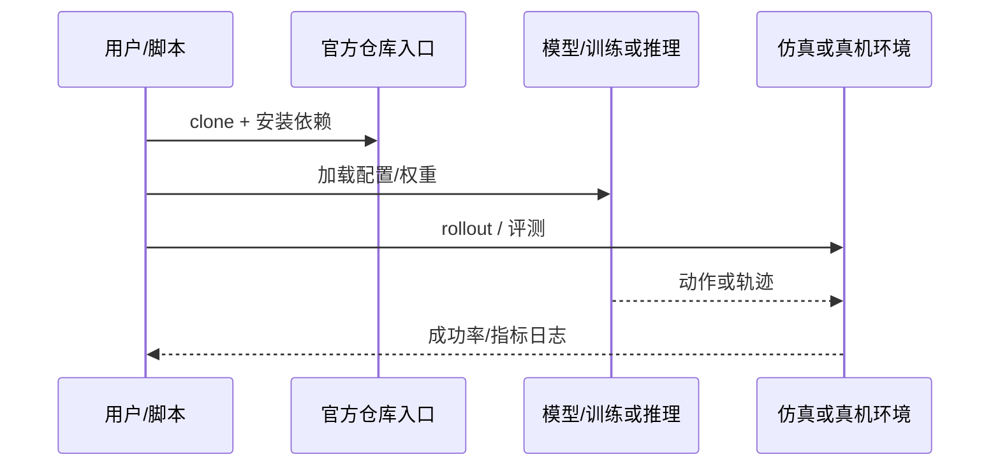

# Dynin-Robotics（arXiv:2609.13053）

**Dynin-Robotics**（[Dynin-Robotics: Omnimodal Unified Diffusion Vision-Language-Action Model](https://arxiv.org/abs/2609.13053)）来自 [具身智能小站 11 篇 VLA/TAMP 盘点](../../sources/blogs/wechat_embodied_station_11_papers_vla_tamp_planning_2026-09-14.md)。把动作生成、未来状态预测与任务理解放进同一离散轨迹与掩码扩散接口，推理时可组合目标引导、联合去噪与候选重排。

## 一句话定义

**统一掩码扩散 VLA：策略、世界建模、目标预测与轨迹理解同骨干。**

## 英文缩写速查

| 缩写 | 英文全称 | 简要说明 |
|------|----------|----------|
| VLA | Vision-Language-Action | 视觉-语言-动作策略 |
| VLM | Vision-Language Model | 视觉-语言多模态模型 |
| WM | World Model | 预测未来观测或表征的动力学模型 |
| TAMP | Task and Motion Planning | 任务与运动规划 |
| OOD | Out-of-Distribution | 分布外泛化评测 |

## 为什么重要

- 把动作生成、未来状态预测与任务理解放进同一离散轨迹与掩码扩散接口，推理时可组合目标引导、联合去噪与候选重排。
- 开源状态：**已开源**（步骤 2.5 核查，2026-09-14）。
- 与 [11 篇技术地图](../overview/vla-tamp-planning-11-papers-technology-map.md) 中同类工作可横向对照。

## 核心机制

| 项 | 内容 |
|----|------|
| **arXiv** | [2609.13053](https://arxiv.org/abs/2609.13053) |
| **项目页** | https://dynin.ai/robotics/ |
| **代码** | https://github.com/AIDASLab/Dynin-Robotics |
| **开源** | **已开源** |
| **文内指标** | LIBERO 平均 98.1%；零样本 LIBERO-Plus 73.0%；Franka Research 3 四条件平均 78.4%；dInfer 动作解码最高 29.2× 提速。 |

## 源码运行时序图

## 实验与评测

| 项 | 文内口径 |
|----|----------|
| 要点 | LIBERO 平均 98.1%；零样本 LIBERO-Plus 73.0%；Franka Research 3 四条件平均 78.4%；dInfer 动作解码最高 29.2× 提速。 |

- **读法：** 本页为索引级摘要，上表取自 [公众号盘点](../../sources/blogs/wechat_embodied_station_11_papers_vla_tamp_planning_2026-09-14.md) 与项目页；具体对照方法、任务集与逐项指标以 **原文 PDF** 为准。

## 与其他工作对比

- **[Diffusion Policy](../methods/diffusion-policy.md)** — 同为扩散生成动作，但 Diffusion Policy 在 **连续动作空间** 上去噪、只承担策略头；Dynin 用 **离散轨迹 token + 掩码扩散**，同一骨干上再挂世界建模、目标预测与轨迹理解三个任务头。
- **[LIT](./paper-lit-latent-interface-training.md)（同批）** — 两篇都报 LIBERO-Plus，但口径不同：LIT 报的是相对基线的 **增量 3.87–10.70 pt**，Dynin 报的是 **绝对值 73.0%**；底座与评测协议不同，两个数字不可直接横比。
- **[Generative World Models](../methods/generative-world-models.md)** — Dynin 把世界建模收进 **策略骨干内部的辅助任务**，而不是外挂一个独立 WM 再做规划；这决定了它的推理期组合（目标引导、联合去噪、候选重排）能在一次前向里完成。
- **[Pelican-Sim 1.0](./paper-pelican-sim.md)（同批）** — 同样含世界模型，但角色相反：Pelican-Sim 的 WM 是 **外部仿真器/评测器**，Dynin 的 WM 是 **策略内部的表征约束**。
- **[VLA](../methods/vla.md)** — 该页给出 VLA 的骨干–动作头分层；Dynin 属其中「统一离散接口、动作与预测同构」一支，dInfer 解码提速（最高 29.2×）是该接口选择的直接收益。

- **读法：** 以上为知识库内 **路线级** 对照；与原文 baseline 的逐项定量比较以 **原文 PDF** 为准（[参考来源](#参考来源)）。

## 结论

**Dynin-Robotics 适合作为本期「已开源」边界下的快速索引页，部署前请核对项目页/仓库可运行性。**

1. 核心贡献：把动作生成、未来状态预测与任务理解放进同一离散轨迹与掩码扩散接口，推理时可组合目标引导、联合去噪与候选重排。
2. 开源结论：**已开源** — 以项目页实际链接为准（入库日 2026-09-14）。
3. 横向对照见 [11 篇技术地图](../overview/vla-tamp-planning-11-papers-technology-map.md)，避免与同 arXiv 重复造页。

## 关联页面

- [11 篇技术地图](../overview/vla-tamp-planning-11-papers-technology-map.md)
- [VLA（Vision-Language-Action）](../methods/vla.md)
- [Generative World Models](../methods/generative-world-models.md)
- [Manipulation](../tasks/manipulation.md)

## 参考来源

- [dynin-robotics_arxiv_2609_13053.md](../../sources/papers/dynin-robotics_arxiv_2609_13053.md)
- [wechat_embodied_station_11_papers_vla_tamp_planning_2026-09-14.md](../../sources/blogs/wechat_embodied_station_11_papers_vla_tamp_planning_2026-09-14.md)
- [arXiv:2609.13053](https://arxiv.org/abs/2609.13053)

## 推荐继续阅读

- [arXiv PDF](https://arxiv.org/pdf/2609.13053)
- [项目页](https://dynin.ai/robotics/)
- [https://github.com/AIDASLab/Dynin-Robotics](https://github.com/AIDASLab/Dynin-Robotics)
