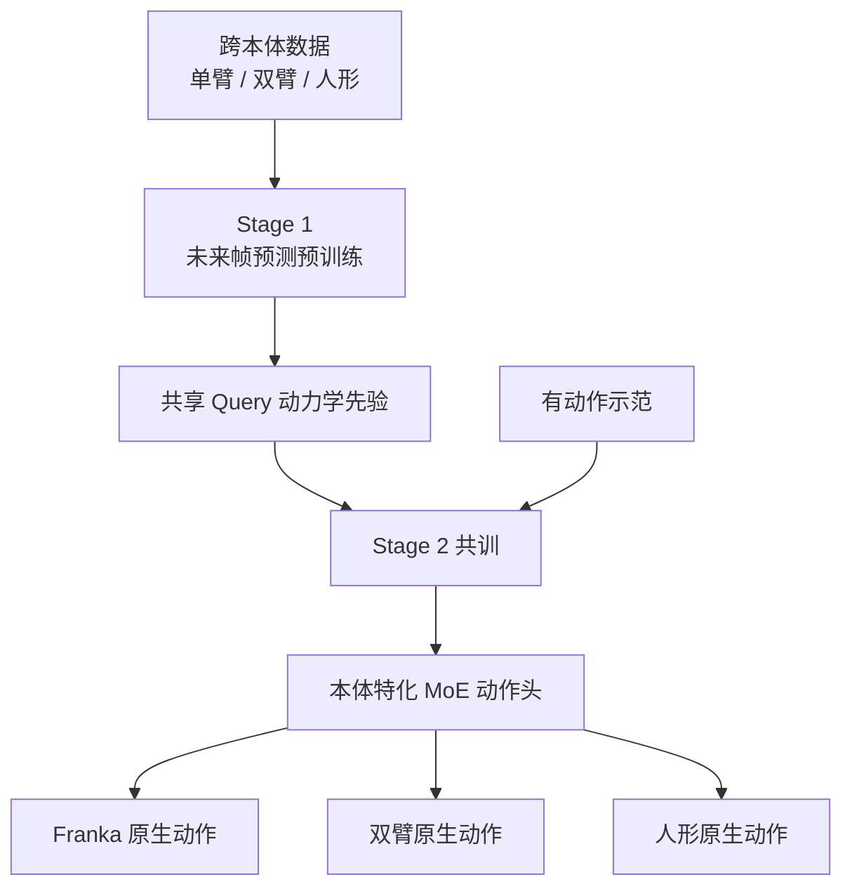

# DyPES-VLA：共享动力学先验 + 本体特化控制

**DyPES-VLA**（*Learning Shared Dynamics Priors and Embodiment-Specific Control for Cross-Embodiment Manipulation*，[arXiv:2608.06374](https://arxiv.org/abs/2608.06374)，[项目页](https://livfour.github.io/DyPES-VLA_RELEASE/)）由 **香港科技大学广州校区 / 可可矩阵（COCO Matrix）** 提出：在跨本体数据上用 **未来帧预测** 驱动共享 query 表示（物体运动、接触、场景演化），再用 **本体特化 MoE 动作头** 直接在各机器人原生动作空间出控，避免手工统一动作格式。

## 一句话定义

**先学「跨身体都成立的交互动力学」，再为每个身体配专家动作头——共享的是先验，特化的是控制，而不是把所有机器人硬拧进同一动作坐标系。**

## 英文缩写速查

| 缩写 | 英文全称 | 简要说明 |
|------|----------|----------|
| DyPES | Dynamics Priors + Embodiment-Specific | 本文范式缩写 |
| VLA | Vision-Language-Action | 视觉–语言–动作策略 |
| MoE | Mixture-of-Experts | 本体特化 FFN / 编解码专家 |
| VLM | Vision-Language Model | 骨干：Qwen3-VL-2B |
| LIBERO | Lifelong Robot Learning benchmark | 单臂仿真操作榜 |
| GR-1 | Fourier GR-1 Humanoid | 人形仿真/具身族之一 |

## 为什么重要

- **跨本体两难被显式拆开：** 共享什么（动力学规律）vs 保留什么（运动学/控制语义）。
- **不用手工动作对齐：** 相对「映到统一 EE/latent 再训」路线，扩展新本体时主要加专家而非重做全库变换。
- **与 WAM 分工清晰：** 未来预测只塑造共享 query，**不**在测试时生成视频再反演动作；动作交给 MoE head。
- **榜 + 真机都有：** 仿真三榜达到论文（2026-08）所列最强对照的同级数字；真机 Franka FR3 / AgileX 双臂 / G1 单 checkpoint **75.6%**。

## 核心信息

| 项 | 内容 |
|----|------|
| **机构** | 香港科技大学广州校区（HKUST-GZ）；可可矩阵（COCO Matrix，上海） |
| **本体族** | 单臂 Franka；双臂 ALOHA-AgileX / COBOT Magic；人形 Fourier GR-1 / Unitree G1+Inspire |
| **骨干** | Qwen3-VL-2B；未来头 SANA-600M；flow matching 4 Euler steps |
| **开源** | **宣称将开源 / coming soon**（项目页按钮禁用；截至 2026-08-08 无仓） |

## 核心原理

### 方法栈

| 模块 | 机制 |
|------|------|
| 共享接口 | VLM 编码视觉、语言、本体 metadata + learnable query → \(Z\) |
| Stage 1 | 无动作人/机器人视频上未来帧预测，塑造动力学先验 |
| Stage 2 | 多本体示范共训：未来头 + MoE 动作头；动作在原生空间 |
| MoE 头 | 共享 attention；静态 router 选本体 encoder / FFN expert / decoder |
| 推理 | 一次 VLM 前向 → MoE 积分出动作 chunk（无测试时视频生成） |

### 流程总览

## 源码运行时序图

**不适用（官方可运行代码尚未发布）。** 截至 2026-08-08：项目页标注 **Code (coming soon)**。发布后应补：Stage1 视频预训 → Stage2 跨本体共训 → 分本体推理部署的 `sequenceDiagram`。

## 工程实践

| 项 | 建议 / 论文设定 |
|----|----------------|
| 何时用 | 要在 **异构动作空间** 上共训 generalist，且不愿维护统一动作预处理时 |
| 视图 | 单臂 main+wrist；人形 ego；双臂 ego+双腕；统一 resize 256 |
| Chunk | 单臂 H=8；人形 16；双臂 50（按控制频率） |
| 真机迁移 | 仿真共训 checkpoint → 三本体 1800 demos 联合微调，保持单策略 |
| 复现现状 | **等官方代码**；读消融与接触探针即可做选型 |

## 实验与评测

| 基准 | DyPES-VLA | 读点 |
|------|-----------|------|
| LIBERO | **98.0%** | 略超 Fast-WAM / OpenVLA-OFT |
| RoboCasa-GR1 | **59.25%** | 超 Qwen-VLA 56.7%、LDA-1B 55.4% |
| RoboTwin 2.0 | **89.02%** | 超 Qwen-VLA ~2.4 pt |
| 真机 3×3 | **75.6%** 均值 | vs ACT 32.4%、GR00T-N1.6 59.6% |

- **消融：** 去未来监督、或 MoE→共享 dense 头，均掉点。
- **探针：** 未来监督显著提升接触 onset/release 的线性可解性（LIBERO）。

## 结论

**DyPES-VLA 的可迁移主张是「动力学先验共享、控制语义特化」：未来预测用来喂 query，不是用来当测试时规划器；MoE 让原生动作空间共存于同一 generalist。**

1. **真影响：解耦共享/特化** — 避免统一动作格式的扩展税与语义纠缠。
2. **真影响：未来监督进表示** — 接触事件探针证明先验不是空喊。
3. **真影响：单 checkpoint 跨榜** — 仿真三形态 + 真机三本体同一套读法。
4. **次要代价：专家路由静态** — 新本体需新增 expert，而非零样本长出控制头。
5. **部署读法：** 先看目标本体是否已在共训族；真机仍需少量联合微调。
6. **工程读法：代码未发** — 适合与统一动作空间 VLA / WAM 对照选型。

## 与其他工作对比

| 对照 | 差异读法 |
|------|----------|
| 统一动作空间 VLA（X-Embodiment 等） | 先对齐动作再共享；本文不对齐，改共享 query + MoE |
| [UCAG-P](./paper-ucag-p.md) | 对齐的是 **相机系腕/抓取锚点**，翻译器再出 80-d 命令；本文拒绝统一动作格式 |
| [Any2Any](./paper-any2any-cross-embodiment-wbt.md) | WBT 跟踪专家的低成本迁移；本文是操作 VLA generalist 共训 |
| WAM（Fast-WAM / [ω-0](./paper-omega-0.md)） | WAM 常耦合未来与动作生成；本文未来只塑先验 |
| [Qwen-VLA](./qwen-vla.md) | 同场 generalist 对照；本文在 RoboCasa/RoboTwin 报优势 |

## 局限与风险

- **开源未落地：** 无法复核 router、数据配比与 SANA 未来头实现。
- **本体族有限：** 三族实例化 ≠ 任意形态零成本接入。
- **真机任务窄：** 三任务 × 三本体，难外推长程家务。
- **无本体感进 VLM：** 论文强调视觉–语言–metadata；高频力/本体融合不在主叙事。

## 关联页面

- [VLA](../methods/vla.md) — 方法母页
- [Any2Any](./paper-any2any-cross-embodiment-wbt.md) — 跨具身另一条（WBT 迁移）
- [Qwen-VLA](./qwen-vla.md) — 文内 generalist 对照
- [UCAG-P](./paper-ucag-p.md) — 对称选型：统一相机几何 vs 本文 MoE 原生动作
- [ω-0](./paper-omega-0.md) — 同期动力学/未来信号用法对照
- [Manipulation](../tasks/manipulation.md) — 操作任务背景
- [Unitree G1](./unitree-g1.md) — 真机人形平台之一

## 参考来源

- [dypes_vla_arxiv_2608_06374.md](../../sources/papers/dypes_vla_arxiv_2608_06374.md) — 论文摘录与开源核查
- [dypes-vla-github-io.md](../../sources/sites/dypes-vla-github-io.md) — 项目页核查
- [ucag_p_arxiv_2608_26058.md](../../sources/papers/ucag_p_arxiv_2608_26058.md) — 统一相机几何的对称对照
- [arXiv:2608.06374](https://arxiv.org/abs/2608.06374) — 原文

## 推荐继续阅读

- [DyPES-VLA 项目页](https://livfour.github.io/DyPES-VLA_RELEASE/)
- [DyPES-VLA PDF](https://arxiv.org/pdf/2608.06374)
- [Qwen3-VL technical report](https://arxiv.org/abs/2511.21631) — 骨干 VLM
